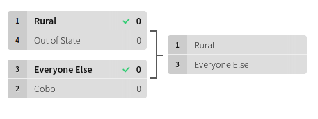

```{r setup, include=FALSE}
knitr::opts_chunk$set(echo = TRUE)
```

- [Syllabus](syllabus.pdf)

- [Course Notes](https://bcallaway11.github.io/econ_4750_notes/)

- [Course Schedule](https://bcallaway11.github.io/Courses/ECON_4750_Fall_2021/tentative_schedule.html)

# Homeworks

- [HW 1](hw1.html), due Friday Sept. 10, [solutions](hw1_sol.html)

- [HW 2](hw2.html), due Friday Sept. 24, [solutions](hw2_sol.html)

- [HW 3](hw3.html), due Friday Oct. 15, [solutions](hw3_sol.html)

- [HW 4](hw4.html), due Monday Nov. 1, [solutions](hw4_sol.html)

- [HW 5](hw5.html), due Tuesday Dec. 7

# Projects

- [Project 1](project1.html), due Friday, Nov. 19

   - [house_price_train.csv](house_price_train.csv)
   
   - [house_price_test.csv](house_price_test.csv)
   
   - [data_description.txt](data_description.txt)
   
   - Code for predicting diamond prices: [[1:50pm code](predicting_diamond_prices150.html)] [[3:00pm code](predicting_diamond_prices300.html)]

- [Project 2](project2.html), due Tuesday, Dec. 7

    - [jtrain_observational.dta](jtrain_observational.dta)   [[description](jtrain_observational_description.txt)]
    
    - [jtrain_experimental.dta](jtrain_experimental.dta)    [[description](jtrain_experimental_description.txt)]
   
# Slides

- First Week: [What is Econometrics?](l1.html)

# Additional materials for Midterm 1

- [Study Guide](midterm1_study_guide.html)

- [Extra Questions/Practice Exam](midterm1_extra_questions.pdf)

# Additional materials for Midterm 2

- [Study Guide](midterm2_study_guide.html)

- [Extra Questions](midterm2_extra_questions.html), [Solutions](midterm2_extra_questions_sol.html)

# Additional materials for Final Exam

- [Study Guide](final_study_guide.html)

- [Extra Questions](final_extra_questions.html)

# Data

This list only includes data that needs to be downloaded from the course website.  Other data is listed in the Course Notes along with steps to access the data and a link to a description of the data.

- [acs](data/acs.RData) [[description](data/acs_description.txt)]

- [banks](data/banks.RData) [[description](data/banks_description.txt)]

- [Birthweight_Smoking](data/birthweight_smoking.dta) [[description](https://www.princeton.edu/~mwatson/Stock-Watson_3u/Students/EE_Datasets/Birthweight_Smoking_Description.pdf)]

- [diamond_train](data/diamond_train.RData) [[description](https://www.kaggle.com/shivam2503/diamonds/)]

- [diamond_test](data/diamond_test.RData) [[description](https://www.kaggle.com/shivam2503/diamonds/)]

- [fertilizer_2000](data/fertilizer_2000.RData) [[description](data/fertilizer_description.txt)]

- [fertilizer_panel](data/fertilizer_panel.RData) [[description](data/fertilizer_description.txt)]

- [house](data/house.RData) [[description](data/house_description.txt)]

- [intergenerational_mobility](data/intergenerational_mobility.RData) [[description](data/intergenerational_mobility_description.txt)]

- [Lead_Mortality](data/Lead_Mortality.RData) [[description](http://www.princeton.edu/~mwatson/Stock-Watson_3u/Students/EE_Datasets/Lead_Mortality_Description.pdf)]

- [mlda](data/mlda.RData) [[description](data/mlda_description.txt)]

- [mutual_funds](data/mutual_funds.RData) [[description](data/mutual_funds_description.txt)]

- [rand_hie](data/rand_hie.RData) [[description](data/rand_hie_description.txt)]

- [titanic_training](data/titanic_training.csv) [[description](https://www.kaggle.com/c/titanic/data)]

- [titanic_testing](data/titanic_testing.csv) [[description](https://www.kaggle.com/c/titanic/data)]

- [us_data](data/us_data.RData)

# Code Challenges

- [Aug 27](code_challenge1.html)
- [Sep 3](code_challenge2.html)
- [Sep 10](code_challenge3.html)
- [Sep 17](code_challenge4.html)
- [Sep 24](code_challenge5.html)
- [Oct 1](code_challenge6.html)
- [Oct 15](code_challenge7.html)
- [Oct 22](code_challenge8.html)
- [Nov 5](code_challenge9.html)
- [Nov 12](code_challenge10.html)

## 1:50pm Standings

```{r echo=FALSE}
library(fontawesome)
regular_season_champ <- fa(name = "award", fill="red")
```

`r regular_season_champ` = regular season champ

| Out of State | Rural | Forsyth/Gwinnet | Cobb | Everyone Else | Professor `r regular_season_champ`|
|:--------:|:--------:|:--------:|:--------:|:--------:|:--------:|:--------:|
| 1 | 2 | 1 | 2 | 1 | 4 |

<center></center>

## 3:00pm Standings

`r regular_season_champ` = regular season champ

| Golf | Tennis | Basketball | Other | Professor `r regular_season_champ`|
|:--------:|:--------:|:--------:|:--------:|:--------:|:--------:|:--------:|
| 3 | 2 | 0 | 3 | 3 |

<center></center>