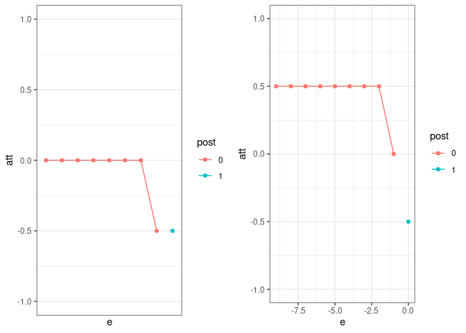

Introduction
------------

Here are the main reasons that I get for wanting a universal base
period:

-   In order to directly compare an event study regression to the
    results from the `did` package

-   

As far as I know, it's not possible to write down an event study
regression with a varying base period (unless you do some kind of
post-processing of the regression). On the other hand. In my view, that
you can't do this for an event study regression does not seem like much
of a good reason to choose a universal base period in the `did` package.

Here are my main reasons why I prefer the varying base period:

-   The varying base period mimics this idea: it is a placebo estimate
    of the effect of participating in the treatment if you act like the
    treatment had been enacted in an earlier period

-   It is also just easier to interpret --- leading example coming.

Parallel trends is not violated
-------------------------------

``` {.r}
library(did)
library(plm)
library(ggplot2)
library(tidyr)

# time periods
time.periods <- 10
# number of treated units
nt <- 1000
# time fixed effect
thet <<- seq(1:time.periods)
# number of untreated units
nu <- 1000
#-----------------------------------------------------------------------------
# parameters for treated potential outcomes
#-----------------------------------------------------------------------------
dynamics <- rep(0,time.periods) # no dynamic effects
te <- -1 # overall basic effect
timing <- 10

build_sim_dataset <- function() {
  #-----------------------------------------------------------------------------
  # build dataset
  #-----------------------------------------------------------------------------
  
  # draw individual fixed effect for treated group
  Ct <- rep(1,nt) #+ rnorm(nt, mean=1)
  G <- rep(timing, 5)
  
  # generate untreated potential outcomes in each time period
  Ynames <- paste0("Y",1:time.periods)
  Ynames <- paste0(1:time.periods)
  Y0tmat <- sapply(1:time.periods, function(t) {
    thet[t] + Ct + dynamics[t] #+ rnorm(nt)
  })
  Y0tdf <- as.data.frame(Y0tmat)
  
  # generate treated potential outcomes
  Y1tdf <- sapply(1:time.periods, function(t) {
    thet[t] + Ct + te + dynamics[t] #+ rnorm(nt)# + (G <= t)*te.e[sapply(1:nt, function(i) max(t-G[i]+1,1))] + te + rnorm(nt) # hack for the dynamic effects but ok
  })

  # generate observed data
  Ytdf <- sapply(1:time.periods, function(t) {
    (G<=t)*Y1tdf[,t] + (G>t)*Y0tdf[,t]
  })
  colnames(Ytdf) <- Ynames

  # store observed data for treated group
  dft <- cbind.data.frame(G,Ytdf)

  # untreated units


  # draw untreated fixed effect
  Cu <- rep(0, nu) #+ rnorm(nu)


  # generate untreated potential outcomes
  Y0umat <- sapply(1:time.periods, function(t) {
    thet[t] + Cu #+ rnorm(nu)
  })
  Y0udf <- as.data.frame(Y0umat)
  colnames(Y0udf) <- Ynames

  # store dataset of observed outcomes for untreated units
  dfu <- cbind.data.frame(G=0,Y0udf)

  # store overall dataset
  df <- rbind.data.frame(dft, dfu)

  # generate id variable
  df$id <- 1:nrow(df)

  # convert data from wide to long format
  ddf <- gather(df, period, Y, -G, -id)
  ddf$period <- as.numeric(ddf$period)
  ddf$treat <- 1*(ddf$G > 0)
  ddf <- ddf[order(ddf$id, ddf$period),] # reorder data

  ddf
}
```

``` {.r}
did_and_reg_es <- function() {
  data <- build_sim_dataset()
  data$e <- ifelse(data$G > 0, data$period - data$G, -Inf)
  relative_time_df <- model.matrix(~-1 + as.factor(e), data=data)
  colnames(relative_time_df) = c("nevertreated", "pre9", "pre8", "pre7", "pre6",
                                 "pre5", "pre4", "pre3", "pre2", "pre1", "post0")
  relative_time_df <- dplyr::select(as.data.frame(relative_time_df), -nevertreated, -pre1)
  data <- cbind.data.frame(data, relative_time_df)
  es_reg <- plm(Y ~ pre9 + pre8 + pre7 + pre6 + pre5 + pre4 + pre3 + pre2 + post0, effect="twoways", model="within", data=data, index=c("id","period"))

  reg_es <- coef(es_reg)
  reg_es <- append(reg_es, 0, after=(timing-2))
  reg_es <- tibble(e=seq(-9,0), atte=reg_es)
  
  attgt_res <- att_gt(yname="Y",
                      tname="period",
                      idname="id",
                      gname="G",
                      data=data)
  did_es <- aggte(attgt_res, type="dynamic")
  did_es <- tibble(e=did_es$egt, atte=did_es$att.egt)
  
  did_es$post <- as.factor(1*(did_es$e >= 0))
  reg_es$post <- as.factor(1*(reg_es$e >= 0))
  
  did_plot <- ggplot(did_es, aes(x=e, y=atte, color=post)) + 
    geom_line() + 
    geom_point() +
    xlab("e") +
    ylab("att") +
    scale_x_discrete(labels=seq(-4,5)) + 
    ylim(c(-1,1)) + 
    theme_bw()

  reg_plot <- ggplot(reg_es, aes(x=e, y=atte, color=post)) + 
    geom_line() + 
    geom_point() +
    xlab("e") +
    ylab("att") +
    ylim(c(-1,1)) + 
    theme_bw()

  ggpubr::ggarrange(did_plot,reg_plot)
}

#dare <- did_and_reg_es()
#did_es <- dare$did_es
```

``` {.r}
did_and_reg_es()
```

    ## No pre-treatment periods to test

    ## Warning in max(abs(b/bSigma), na.rm = TRUE): no non-missing arguments to max;
    ## returning -Inf

    ## Warning in max(abs(b/bSigma), na.rm = TRUE): no non-missing arguments to max;
    ## returning -Inf

    ## Warning in max(abs(b/bSigma), na.rm = TRUE): no non-missing arguments to max;
    ## returning -Inf

    ## Warning in max(abs(b/bSigma), na.rm = TRUE): no non-missing arguments to max;
    ## returning -Inf

    ## Warning in max(abs(b/bSigma), na.rm = TRUE): no non-missing arguments to max;
    ## returning -Inf

    ## Warning in max(abs(b/bSigma), na.rm = TRUE): no non-missing arguments to max;
    ## returning -Inf

    ## Warning in max(abs(b/bSigma), na.rm = TRUE): no non-missing arguments to max;
    ## returning -Inf

    ## Warning in max(abs(b/bSigma), na.rm = TRUE): no non-missing arguments to max;
    ## returning -Inf

    ## Warning in max(abs(b/bSigma), na.rm = TRUE): no non-missing arguments to max;
    ## returning -Inf

    ## Warning in max(abs(b/bSigma), na.rm = TRUE): no non-missing arguments to max;
    ## returning -Inf

    ## Warning in max(abs(b/bSigma), na.rm = TRUE): no non-missing arguments to max;
    ## returning -Inf

    ## Warning in max(abs(b/bSigma), na.rm = TRUE): no non-missing arguments to max;
    ## returning -Inf

    ## Warning in max(abs(b/bSigma), na.rm = TRUE): no non-missing arguments to max;
    ## returning -Inf

    ## Warning in max(abs(b/bSigma), na.rm = TRUE): no non-missing arguments to max;
    ## returning -Inf

    ## Warning in max(abs(b/bSigma), na.rm = TRUE): no non-missing arguments to max;
    ## returning -Inf

    ## Warning in max(abs(b/bSigma), na.rm = TRUE): no non-missing arguments to max;
    ## returning -Inf

    ## Warning in max(abs(b/bSigma), na.rm = TRUE): no non-missing arguments to max;
    ## returning -Inf

    ## Warning in max(abs(b/bSigma), na.rm = TRUE): no non-missing arguments to max;
    ## returning -Inf

    ## Warning in max(abs(b/bSigma), na.rm = TRUE): no non-missing arguments to max;
    ## returning -Inf

    ## Warning in max(abs(b/bSigma), na.rm = TRUE): no non-missing arguments to max;
    ## returning -Inf

    ## Warning in max(abs(b/bSigma), na.rm = TRUE): no non-missing arguments to max;
    ## returning -Inf

    ## Warning in max(abs(b/bSigma), na.rm = TRUE): no non-missing arguments to max;
    ## returning -Inf

    ## Warning in max(abs(b/bSigma), na.rm = TRUE): no non-missing arguments to max;
    ## returning -Inf

    ## Warning in max(abs(b/bSigma), na.rm = TRUE): no non-missing arguments to max;
    ## returning -Inf

    ## Warning in max(abs(b/bSigma), na.rm = TRUE): no non-missing arguments to max;
    ## returning -Inf

    ## Warning in max(abs(b/bSigma), na.rm = TRUE): no non-missing arguments to max;
    ## returning -Inf

    ## Warning in max(abs(b/bSigma), na.rm = TRUE): no non-missing arguments to max;
    ## returning -Inf

    ## Warning in max(abs(b/bSigma), na.rm = TRUE): no non-missing arguments to max;
    ## returning -Inf

    ## Warning in max(abs(b/bSigma), na.rm = TRUE): no non-missing arguments to max;
    ## returning -Inf

    ## Warning in max(abs(b/bSigma), na.rm = TRUE): no non-missing arguments to max;
    ## returning -Inf

    ## Warning in max(abs(b/bSigma), na.rm = TRUE): no non-missing arguments to max;
    ## returning -Inf

    ## Warning in max(abs(b/bSigma), na.rm = TRUE): no non-missing arguments to max;
    ## returning -Inf

    ## Warning in max(abs(b/bSigma), na.rm = TRUE): no non-missing arguments to max;
    ## returning -Inf

    ## Warning in max(abs(b/bSigma), na.rm = TRUE): no non-missing arguments to max;
    ## returning -Inf

    ## Warning in max(abs(b/bSigma), na.rm = TRUE): no non-missing arguments to max;
    ## returning -Inf

    ## Warning in max(abs(b/bSigma), na.rm = TRUE): no non-missing arguments to max;
    ## returning -Inf

    ## Warning in max(abs(b/bSigma), na.rm = TRUE): no non-missing arguments to max;
    ## returning -Inf

    ## Warning in max(abs(b/bSigma), na.rm = TRUE): no non-missing arguments to max;
    ## returning -Inf

    ## Warning in max(abs(b/bSigma), na.rm = TRUE): no non-missing arguments to max;
    ## returning -Inf

    ## Warning in max(abs(b/bSigma), na.rm = TRUE): no non-missing arguments to max;
    ## returning -Inf

    ## Warning in max(abs(b/bSigma), na.rm = TRUE): no non-missing arguments to max;
    ## returning -Inf

    ## Warning in max(abs(b/bSigma), na.rm = TRUE): no non-missing arguments to max;
    ## returning -Inf

    ## Warning in max(abs(b/bSigma), na.rm = TRUE): no non-missing arguments to max;
    ## returning -Inf

    ## Warning in max(abs(b/bSigma), na.rm = TRUE): no non-missing arguments to max;
    ## returning -Inf

    ## Warning in max(abs(b/bSigma), na.rm = TRUE): no non-missing arguments to max;
    ## returning -Inf

    ## Warning in max(abs(b/bSigma), na.rm = TRUE): no non-missing arguments to max;
    ## returning -Inf

    ## Warning in max(abs(b/bSigma), na.rm = TRUE): no non-missing arguments to max;
    ## returning -Inf

    ## Warning in max(abs(b/bSigma), na.rm = TRUE): no non-missing arguments to max;
    ## returning -Inf

    ## Warning in max(abs(b/bSigma), na.rm = TRUE): no non-missing arguments to max;
    ## returning -Inf

    ## Warning in max(abs(b/bSigma), na.rm = TRUE): no non-missing arguments to max;
    ## returning -Inf

    ## Warning in max(abs(b/bSigma), na.rm = TRUE): no non-missing arguments to max;
    ## returning -Inf

    ## Warning in max(abs(b/bSigma), na.rm = TRUE): no non-missing arguments to max;
    ## returning -Inf

    ## Warning in max(abs(b/bSigma), na.rm = TRUE): no non-missing arguments to max;
    ## returning -Inf

    ## Warning in max(abs(b/bSigma), na.rm = TRUE): no non-missing arguments to max;
    ## returning -Inf

    ## Warning in max(abs(b/bSigma), na.rm = TRUE): no non-missing arguments to max;
    ## returning -Inf

    ## Warning in max(abs(b/bSigma), na.rm = TRUE): no non-missing arguments to max;
    ## returning -Inf

    ## Warning in max(abs(b/bSigma), na.rm = TRUE): no non-missing arguments to max;
    ## returning -Inf

    ## Warning in max(abs(b/bSigma), na.rm = TRUE): no non-missing arguments to max;
    ## returning -Inf

    ## Warning in max(abs(b/bSigma), na.rm = TRUE): no non-missing arguments to max;
    ## returning -Inf

    ## Warning in max(abs(b/bSigma), na.rm = TRUE): no non-missing arguments to max;
    ## returning -Inf

    ## Warning in max(abs(b/bSigma), na.rm = TRUE): no non-missing arguments to max;
    ## returning -Inf

    ## Warning in max(abs(b/bSigma), na.rm = TRUE): no non-missing arguments to max;
    ## returning -Inf

    ## Warning in max(abs(b/bSigma), na.rm = TRUE): no non-missing arguments to max;
    ## returning -Inf

    ## Warning in max(abs(b/bSigma), na.rm = TRUE): no non-missing arguments to max;
    ## returning -Inf

    ## Warning in max(abs(b/bSigma), na.rm = TRUE): no non-missing arguments to max;
    ## returning -Inf

    ## Warning in max(abs(b/bSigma), na.rm = TRUE): no non-missing arguments to max;
    ## returning -Inf

    ## Warning in max(abs(b/bSigma), na.rm = TRUE): no non-missing arguments to max;
    ## returning -Inf

    ## Warning in max(abs(b/bSigma), na.rm = TRUE): no non-missing arguments to max;
    ## returning -Inf

    ## Warning in max(abs(b/bSigma), na.rm = TRUE): no non-missing arguments to max;
    ## returning -Inf

    ## Warning in max(abs(b/bSigma), na.rm = TRUE): no non-missing arguments to max;
    ## returning -Inf

    ## Warning in max(abs(b/bSigma), na.rm = TRUE): no non-missing arguments to max;
    ## returning -Inf

    ## Warning in max(abs(b/bSigma), na.rm = TRUE): no non-missing arguments to max;
    ## returning -Inf

    ## Warning in max(abs(b/bSigma), na.rm = TRUE): no non-missing arguments to max;
    ## returning -Inf

    ## Warning in max(abs(b/bSigma), na.rm = TRUE): no non-missing arguments to max;
    ## returning -Inf

    ## Warning in max(abs(b/bSigma), na.rm = TRUE): no non-missing arguments to max;
    ## returning -Inf

    ## Warning in max(abs(b/bSigma), na.rm = TRUE): no non-missing arguments to max;
    ## returning -Inf

    ## Warning in max(abs(b/bSigma), na.rm = TRUE): no non-missing arguments to max;
    ## returning -Inf

    ## Warning in max(abs(b/bSigma), na.rm = TRUE): no non-missing arguments to max;
    ## returning -Inf

    ## Warning in max(abs(b/bSigma), na.rm = TRUE): no non-missing arguments to max;
    ## returning -Inf

    ## Warning in max(abs(b/bSigma), na.rm = TRUE): no non-missing arguments to max;
    ## returning -Inf

    ## Warning in max(abs(b/bSigma), na.rm = TRUE): no non-missing arguments to max;
    ## returning -Inf

    ## Warning in max(abs(b/bSigma), na.rm = TRUE): no non-missing arguments to max;
    ## returning -Inf

    ## Warning in max(abs(b/bSigma), na.rm = TRUE): no non-missing arguments to max;
    ## returning -Inf

    ## Warning in max(abs(b/bSigma), na.rm = TRUE): no non-missing arguments to max;
    ## returning -Inf

    ## Warning in max(abs(b/bSigma), na.rm = TRUE): no non-missing arguments to max;
    ## returning -Inf

    ## Warning in max(abs(b/bSigma), na.rm = TRUE): no non-missing arguments to max;
    ## returning -Inf

    ## Warning in max(abs(b/bSigma), na.rm = TRUE): no non-missing arguments to max;
    ## returning -Inf

    ## Warning in max(abs(b/bSigma), na.rm = TRUE): no non-missing arguments to max;
    ## returning -Inf

    ## Warning in max(abs(b/bSigma), na.rm = TRUE): no non-missing arguments to max;
    ## returning -Inf

    ## Warning in max(abs(b/bSigma), na.rm = TRUE): no non-missing arguments to max;
    ## returning -Inf

    ## Warning in max(abs(b/bSigma), na.rm = TRUE): no non-missing arguments to max;
    ## returning -Inf

    ## Warning in max(abs(b/bSigma), na.rm = TRUE): no non-missing arguments to max;
    ## returning -Inf

    ## Warning in max(abs(b/bSigma), na.rm = TRUE): no non-missing arguments to max;
    ## returning -Inf

    ## Warning in max(abs(b/bSigma), na.rm = TRUE): no non-missing arguments to max;
    ## returning -Inf

    ## Warning in max(abs(b/bSigma), na.rm = TRUE): no non-missing arguments to max;
    ## returning -Inf

    ## Warning in max(abs(b/bSigma), na.rm = TRUE): no non-missing arguments to max;
    ## returning -Inf

    ## Warning in max(abs(b/bSigma), na.rm = TRUE): no non-missing arguments to max;
    ## returning -Inf

    ## Warning in max(abs(b/bSigma), na.rm = TRUE): no non-missing arguments to max;
    ## returning -Inf

    ## Warning in max(abs(b/bSigma), na.rm = TRUE): no non-missing arguments to max;
    ## returning -Inf

    ## Warning in max(abs(b/bSigma), na.rm = TRUE): no non-missing arguments to max;
    ## returning -Inf

    ## Warning in max(abs(b/bSigma), na.rm = TRUE): no non-missing arguments to max;
    ## returning -Inf

    ## Warning in max(abs(b/bSigma), na.rm = TRUE): no non-missing arguments to max;
    ## returning -Inf

    ## Warning in max(abs(b/bSigma), na.rm = TRUE): no non-missing arguments to max;
    ## returning -Inf

    ## Warning in max(abs(b/bSigma), na.rm = TRUE): no non-missing arguments to max;
    ## returning -Inf

    ## Warning in max(abs(b/bSigma), na.rm = TRUE): no non-missing arguments to max;
    ## returning -Inf

    ## Warning in max(abs(b/bSigma), na.rm = TRUE): no non-missing arguments to max;
    ## returning -Inf

    ## Warning in max(abs(b/bSigma), na.rm = TRUE): no non-missing arguments to max;
    ## returning -Inf

    ## Warning in max(abs(b/bSigma), na.rm = TRUE): no non-missing arguments to max;
    ## returning -Inf

    ## Warning in max(abs(b/bSigma), na.rm = TRUE): no non-missing arguments to max;
    ## returning -Inf

    ## Warning in max(abs(b/bSigma), na.rm = TRUE): no non-missing arguments to max;
    ## returning -Inf

    ## Warning in max(abs(b/bSigma), na.rm = TRUE): no non-missing arguments to max;
    ## returning -Inf

    ## Warning in max(abs(b/bSigma), na.rm = TRUE): no non-missing arguments to max;
    ## returning -Inf

    ## Warning in max(abs(b/bSigma), na.rm = TRUE): no non-missing arguments to max;
    ## returning -Inf

    ## Warning in max(abs(b/bSigma), na.rm = TRUE): no non-missing arguments to max;
    ## returning -Inf

    ## Warning in max(abs(b/bSigma), na.rm = TRUE): no non-missing arguments to max;
    ## returning -Inf

    ## Warning in max(abs(b/bSigma), na.rm = TRUE): no non-missing arguments to max;
    ## returning -Inf

    ## Warning in max(abs(b/bSigma), na.rm = TRUE): no non-missing arguments to max;
    ## returning -Inf

    ## Warning in max(abs(b/bSigma), na.rm = TRUE): no non-missing arguments to max;
    ## returning -Inf

    ## Warning in max(abs(b/bSigma), na.rm = TRUE): no non-missing arguments to max;
    ## returning -Inf

    ## Warning in max(abs(b/bSigma), na.rm = TRUE): no non-missing arguments to max;
    ## returning -Inf

    ## Warning in max(abs(b/bSigma), na.rm = TRUE): no non-missing arguments to max;
    ## returning -Inf

    ## Warning in max(abs(b/bSigma), na.rm = TRUE): no non-missing arguments to max;
    ## returning -Inf

    ## Warning in max(abs(b/bSigma), na.rm = TRUE): no non-missing arguments to max;
    ## returning -Inf

    ## Warning in max(abs(b/bSigma), na.rm = TRUE): no non-missing arguments to max;
    ## returning -Inf

    ## Warning in max(abs(b/bSigma), na.rm = TRUE): no non-missing arguments to max;
    ## returning -Inf

    ## Warning in max(abs(b/bSigma), na.rm = TRUE): no non-missing arguments to max;
    ## returning -Inf

    ## Warning in max(abs(b/bSigma), na.rm = TRUE): no non-missing arguments to max;
    ## returning -Inf

    ## Warning in max(abs(b/bSigma), na.rm = TRUE): no non-missing arguments to max;
    ## returning -Inf

    ## Warning in max(abs(b/bSigma), na.rm = TRUE): no non-missing arguments to max;
    ## returning -Inf

    ## Warning in max(abs(b/bSigma), na.rm = TRUE): no non-missing arguments to max;
    ## returning -Inf

    ## Warning in max(abs(b/bSigma), na.rm = TRUE): no non-missing arguments to max;
    ## returning -Inf

    ## Warning in max(abs(b/bSigma), na.rm = TRUE): no non-missing arguments to max;
    ## returning -Inf

    ## Warning in max(abs(b/bSigma), na.rm = TRUE): no non-missing arguments to max;
    ## returning -Inf

    ## Warning in max(abs(b/bSigma), na.rm = TRUE): no non-missing arguments to max;
    ## returning -Inf

    ## Warning in max(abs(b/bSigma), na.rm = TRUE): no non-missing arguments to max;
    ## returning -Inf

    ## Warning in max(abs(b/bSigma), na.rm = TRUE): no non-missing arguments to max;
    ## returning -Inf

    ## Warning in max(abs(b/bSigma), na.rm = TRUE): no non-missing arguments to max;
    ## returning -Inf

    ## Warning in max(abs(b/bSigma), na.rm = TRUE): no non-missing arguments to max;
    ## returning -Inf

    ## Warning in max(abs(b/bSigma), na.rm = TRUE): no non-missing arguments to max;
    ## returning -Inf

    ## Warning in max(abs(b/bSigma), na.rm = TRUE): no non-missing arguments to max;
    ## returning -Inf

    ## Warning in max(abs(b/bSigma), na.rm = TRUE): no non-missing arguments to max;
    ## returning -Inf

    ## Warning in max(abs(b/bSigma), na.rm = TRUE): no non-missing arguments to max;
    ## returning -Inf

    ## Warning in max(abs(b/bSigma), na.rm = TRUE): no non-missing arguments to max;
    ## returning -Inf

    ## Warning in max(abs(b/bSigma), na.rm = TRUE): no non-missing arguments to max;
    ## returning -Inf

    ## Warning in max(abs(b/bSigma), na.rm = TRUE): no non-missing arguments to max;
    ## returning -Inf

    ## Warning in max(abs(b/bSigma), na.rm = TRUE): no non-missing arguments to max;
    ## returning -Inf

    ## Warning in max(abs(b/bSigma), na.rm = TRUE): no non-missing arguments to max;
    ## returning -Inf

    ## Warning in max(abs(b/bSigma), na.rm = TRUE): no non-missing arguments to max;
    ## returning -Inf

    ## Warning in max(abs(b/bSigma), na.rm = TRUE): no non-missing arguments to max;
    ## returning -Inf

    ## Warning in max(abs(b/bSigma), na.rm = TRUE): no non-missing arguments to max;
    ## returning -Inf

    ## Warning in max(abs(b/bSigma), na.rm = TRUE): no non-missing arguments to max;
    ## returning -Inf

    ## Warning in max(abs(b/bSigma), na.rm = TRUE): no non-missing arguments to max;
    ## returning -Inf

    ## Warning in max(abs(b/bSigma), na.rm = TRUE): no non-missing arguments to max;
    ## returning -Inf

    ## Warning in max(abs(b/bSigma), na.rm = TRUE): no non-missing arguments to max;
    ## returning -Inf

    ## Warning in max(abs(b/bSigma), na.rm = TRUE): no non-missing arguments to max;
    ## returning -Inf

    ## Warning in max(abs(b/bSigma), na.rm = TRUE): no non-missing arguments to max;
    ## returning -Inf

    ## Warning in max(abs(b/bSigma), na.rm = TRUE): no non-missing arguments to max;
    ## returning -Inf

    ## Warning in max(abs(b/bSigma), na.rm = TRUE): no non-missing arguments to max;
    ## returning -Inf

    ## Warning in max(abs(b/bSigma), na.rm = TRUE): no non-missing arguments to max;
    ## returning -Inf

    ## Warning in max(abs(b/bSigma), na.rm = TRUE): no non-missing arguments to max;
    ## returning -Inf

    ## Warning in max(abs(b/bSigma), na.rm = TRUE): no non-missing arguments to max;
    ## returning -Inf

    ## Warning in max(abs(b/bSigma), na.rm = TRUE): no non-missing arguments to max;
    ## returning -Inf

    ## Warning in max(abs(b/bSigma), na.rm = TRUE): no non-missing arguments to max;
    ## returning -Inf

    ## Warning in max(abs(b/bSigma), na.rm = TRUE): no non-missing arguments to max;
    ## returning -Inf

    ## Warning in max(abs(b/bSigma), na.rm = TRUE): no non-missing arguments to max;
    ## returning -Inf

    ## Warning in max(abs(b/bSigma), na.rm = TRUE): no non-missing arguments to max;
    ## returning -Inf

    ## Warning in max(abs(b/bSigma), na.rm = TRUE): no non-missing arguments to max;
    ## returning -Inf

    ## Warning in max(abs(b/bSigma), na.rm = TRUE): no non-missing arguments to max;
    ## returning -Inf

    ## Warning in max(abs(b/bSigma), na.rm = TRUE): no non-missing arguments to max;
    ## returning -Inf

    ## Warning in max(abs(b/bSigma), na.rm = TRUE): no non-missing arguments to max;
    ## returning -Inf

    ## Warning in max(abs(b/bSigma), na.rm = TRUE): no non-missing arguments to max;
    ## returning -Inf

    ## Warning in max(abs(b/bSigma), na.rm = TRUE): no non-missing arguments to max;
    ## returning -Inf

    ## Warning in max(abs(b/bSigma), na.rm = TRUE): no non-missing arguments to max;
    ## returning -Inf

    ## Warning in max(abs(b/bSigma), na.rm = TRUE): no non-missing arguments to max;
    ## returning -Inf

    ## Warning in max(abs(b/bSigma), na.rm = TRUE): no non-missing arguments to max;
    ## returning -Inf

    ## Warning in max(abs(b/bSigma), na.rm = TRUE): no non-missing arguments to max;
    ## returning -Inf

    ## Warning in max(abs(b/bSigma), na.rm = TRUE): no non-missing arguments to max;
    ## returning -Inf

    ## Warning in max(abs(b/bSigma), na.rm = TRUE): no non-missing arguments to max;
    ## returning -Inf

    ## Warning in max(abs(b/bSigma), na.rm = TRUE): no non-missing arguments to max;
    ## returning -Inf

    ## Warning in max(abs(b/bSigma), na.rm = TRUE): no non-missing arguments to max;
    ## returning -Inf

    ## Warning in max(abs(b/bSigma), na.rm = TRUE): no non-missing arguments to max;
    ## returning -Inf

    ## Warning in max(abs(b/bSigma), na.rm = TRUE): no non-missing arguments to max;
    ## returning -Inf

    ## Warning in max(abs(b/bSigma), na.rm = TRUE): no non-missing arguments to max;
    ## returning -Inf

    ## Warning in max(abs(b/bSigma), na.rm = TRUE): no non-missing arguments to max;
    ## returning -Inf

    ## Warning in max(abs(b/bSigma), na.rm = TRUE): no non-missing arguments to max;
    ## returning -Inf

    ## Warning in max(abs(b/bSigma), na.rm = TRUE): no non-missing arguments to max;
    ## returning -Inf

    ## Warning in max(abs(b/bSigma), na.rm = TRUE): no non-missing arguments to max;
    ## returning -Inf

    ## Warning in max(abs(b/bSigma), na.rm = TRUE): no non-missing arguments to max;
    ## returning -Inf

    ## Warning in max(abs(b/bSigma), na.rm = TRUE): no non-missing arguments to max;
    ## returning -Inf

    ## Warning in max(abs(b/bSigma), na.rm = TRUE): no non-missing arguments to max;
    ## returning -Inf

    ## Warning in max(abs(b/bSigma), na.rm = TRUE): no non-missing arguments to max;
    ## returning -Inf

    ## Warning in max(abs(b/bSigma), na.rm = TRUE): no non-missing arguments to max;
    ## returning -Inf

    ## Warning in max(abs(b/bSigma), na.rm = TRUE): no non-missing arguments to max;
    ## returning -Inf

    ## Warning in max(abs(b/bSigma), na.rm = TRUE): no non-missing arguments to max;
    ## returning -Inf

    ## Warning in max(abs(b/bSigma), na.rm = TRUE): no non-missing arguments to max;
    ## returning -Inf

    ## Warning in max(abs(b/bSigma), na.rm = TRUE): no non-missing arguments to max;
    ## returning -Inf

    ## Warning in max(abs(b/bSigma), na.rm = TRUE): no non-missing arguments to max;
    ## returning -Inf

    ## Warning in max(abs(b/bSigma), na.rm = TRUE): no non-missing arguments to max;
    ## returning -Inf

    ## Warning in max(abs(b/bSigma), na.rm = TRUE): no non-missing arguments to max;
    ## returning -Inf

    ## Warning in max(abs(b/bSigma), na.rm = TRUE): no non-missing arguments to max;
    ## returning -Inf

    ## Warning in max(abs(b/bSigma), na.rm = TRUE): no non-missing arguments to max;
    ## returning -Inf

    ## Warning in max(abs(b/bSigma), na.rm = TRUE): no non-missing arguments to max;
    ## returning -Inf

    ## Warning in max(abs(b/bSigma), na.rm = TRUE): no non-missing arguments to max;
    ## returning -Inf

    ## Warning in max(abs(b/bSigma), na.rm = TRUE): no non-missing arguments to max;
    ## returning -Inf

    ## Warning in max(abs(b/bSigma), na.rm = TRUE): no non-missing arguments to max;
    ## returning -Inf

    ## Warning in max(abs(b/bSigma), na.rm = TRUE): no non-missing arguments to max;
    ## returning -Inf

    ## Warning in max(abs(b/bSigma), na.rm = TRUE): no non-missing arguments to max;
    ## returning -Inf

    ## Warning in max(abs(b/bSigma), na.rm = TRUE): no non-missing arguments to max;
    ## returning -Inf

    ## Warning in max(abs(b/bSigma), na.rm = TRUE): no non-missing arguments to max;
    ## returning -Inf

    ## Warning in max(abs(b/bSigma), na.rm = TRUE): no non-missing arguments to max;
    ## returning -Inf

    ## Warning in max(abs(b/bSigma), na.rm = TRUE): no non-missing arguments to max;
    ## returning -Inf

    ## Warning in max(abs(b/bSigma), na.rm = TRUE): no non-missing arguments to max;
    ## returning -Inf

    ## Warning in max(abs(b/bSigma), na.rm = TRUE): no non-missing arguments to max;
    ## returning -Inf

    ## Warning in max(abs(b/bSigma), na.rm = TRUE): no non-missing arguments to max;
    ## returning -Inf

    ## Warning in max(abs(b/bSigma), na.rm = TRUE): no non-missing arguments to max;
    ## returning -Inf

    ## Warning in max(abs(b/bSigma), na.rm = TRUE): no non-missing arguments to max;
    ## returning -Inf

    ## Warning in max(abs(b/bSigma), na.rm = TRUE): no non-missing arguments to max;
    ## returning -Inf

    ## Warning in max(abs(b/bSigma), na.rm = TRUE): no non-missing arguments to max;
    ## returning -Inf

    ## Warning in max(abs(b/bSigma), na.rm = TRUE): no non-missing arguments to max;
    ## returning -Inf

    ## Warning in max(abs(b/bSigma), na.rm = TRUE): no non-missing arguments to max;
    ## returning -Inf

    ## Warning in max(abs(b/bSigma), na.rm = TRUE): no non-missing arguments to max;
    ## returning -Inf

    ## Warning in max(abs(b/bSigma), na.rm = TRUE): no non-missing arguments to max;
    ## returning -Inf

    ## Warning in max(abs(b/bSigma), na.rm = TRUE): no non-missing arguments to max;
    ## returning -Inf

    ## Warning in max(abs(b/bSigma), na.rm = TRUE): no non-missing arguments to max;
    ## returning -Inf

    ## Warning in max(abs(b/bSigma), na.rm = TRUE): no non-missing arguments to max;
    ## returning -Inf

    ## Warning in max(abs(b/bSigma), na.rm = TRUE): no non-missing arguments to max;
    ## returning -Inf

    ## Warning in max(abs(b/bSigma), na.rm = TRUE): no non-missing arguments to max;
    ## returning -Inf

    ## Warning in max(abs(b/bSigma), na.rm = TRUE): no non-missing arguments to max;
    ## returning -Inf

    ## Warning in max(abs(b/bSigma), na.rm = TRUE): no non-missing arguments to max;
    ## returning -Inf

    ## Warning in max(abs(b/bSigma), na.rm = TRUE): no non-missing arguments to max;
    ## returning -Inf

    ## Warning in max(abs(b/bSigma), na.rm = TRUE): no non-missing arguments to max;
    ## returning -Inf

    ## Warning in max(abs(b/bSigma), na.rm = TRUE): no non-missing arguments to max;
    ## returning -Inf

    ## Warning in max(abs(b/bSigma), na.rm = TRUE): no non-missing arguments to max;
    ## returning -Inf

    ## Warning in max(abs(b/bSigma), na.rm = TRUE): no non-missing arguments to max;
    ## returning -Inf

    ## Warning in max(abs(b/bSigma), na.rm = TRUE): no non-missing arguments to max;
    ## returning -Inf

    ## Warning in max(abs(b/bSigma), na.rm = TRUE): no non-missing arguments to max;
    ## returning -Inf

    ## Warning in max(abs(b/bSigma), na.rm = TRUE): no non-missing arguments to max;
    ## returning -Inf

    ## Warning in max(abs(b/bSigma), na.rm = TRUE): no non-missing arguments to max;
    ## returning -Inf

    ## Warning in max(abs(b/bSigma), na.rm = TRUE): no non-missing arguments to max;
    ## returning -Inf

    ## Warning in max(abs(b/bSigma), na.rm = TRUE): no non-missing arguments to max;
    ## returning -Inf

    ## Warning in max(abs(b/bSigma), na.rm = TRUE): no non-missing arguments to max;
    ## returning -Inf

    ## Warning in max(abs(b/bSigma), na.rm = TRUE): no non-missing arguments to max;
    ## returning -Inf

    ## Warning in max(abs(b/bSigma), na.rm = TRUE): no non-missing arguments to max;
    ## returning -Inf

    ## Warning in max(abs(b/bSigma), na.rm = TRUE): no non-missing arguments to max;
    ## returning -Inf

    ## Warning in max(abs(b/bSigma), na.rm = TRUE): no non-missing arguments to max;
    ## returning -Inf

    ## Warning in max(abs(b/bSigma), na.rm = TRUE): no non-missing arguments to max;
    ## returning -Inf

    ## Warning in max(abs(b/bSigma), na.rm = TRUE): no non-missing arguments to max;
    ## returning -Inf

    ## Warning in max(abs(b/bSigma), na.rm = TRUE): no non-missing arguments to max;
    ## returning -Inf

    ## Warning in max(abs(b/bSigma), na.rm = TRUE): no non-missing arguments to max;
    ## returning -Inf

    ## Warning in max(abs(b/bSigma), na.rm = TRUE): no non-missing arguments to max;
    ## returning -Inf

    ## Warning in max(abs(b/bSigma), na.rm = TRUE): no non-missing arguments to max;
    ## returning -Inf

    ## Warning in max(abs(b/bSigma), na.rm = TRUE): no non-missing arguments to max;
    ## returning -Inf

    ## Warning in max(abs(b/bSigma), na.rm = TRUE): no non-missing arguments to max;
    ## returning -Inf

    ## Warning in max(abs(b/bSigma), na.rm = TRUE): no non-missing arguments to max;
    ## returning -Inf

    ## Warning in max(abs(b/bSigma), na.rm = TRUE): no non-missing arguments to max;
    ## returning -Inf

    ## Warning in max(abs(b/bSigma), na.rm = TRUE): no non-missing arguments to max;
    ## returning -Inf

    ## Warning in max(abs(b/bSigma), na.rm = TRUE): no non-missing arguments to max;
    ## returning -Inf

    ## Warning in max(abs(b/bSigma), na.rm = TRUE): no non-missing arguments to max;
    ## returning -Inf

    ## Warning in max(abs(b/bSigma), na.rm = TRUE): no non-missing arguments to max;
    ## returning -Inf

    ## Warning in max(abs(b/bSigma), na.rm = TRUE): no non-missing arguments to max;
    ## returning -Inf

    ## Warning in max(abs(b/bSigma), na.rm = TRUE): no non-missing arguments to max;
    ## returning -Inf

    ## Warning in max(abs(b/bSigma), na.rm = TRUE): no non-missing arguments to max;
    ## returning -Inf

    ## Warning in max(abs(b/bSigma), na.rm = TRUE): no non-missing arguments to max;
    ## returning -Inf

    ## Warning in max(abs(b/bSigma), na.rm = TRUE): no non-missing arguments to max;
    ## returning -Inf

    ## Warning in max(abs(b/bSigma), na.rm = TRUE): no non-missing arguments to max;
    ## returning -Inf

    ## Warning in max(abs(b/bSigma), na.rm = TRUE): no non-missing arguments to max;
    ## returning -Inf

    ## Warning in max(abs(b/bSigma), na.rm = TRUE): no non-missing arguments to max;
    ## returning -Inf

    ## Warning in max(abs(b/bSigma), na.rm = TRUE): no non-missing arguments to max;
    ## returning -Inf

    ## Warning in max(abs(b/bSigma), na.rm = TRUE): no non-missing arguments to max;
    ## returning -Inf

    ## Warning in max(abs(b/bSigma), na.rm = TRUE): no non-missing arguments to max;
    ## returning -Inf

    ## Warning in max(abs(b/bSigma), na.rm = TRUE): no non-missing arguments to max;
    ## returning -Inf

    ## Warning in max(abs(b/bSigma), na.rm = TRUE): no non-missing arguments to max;
    ## returning -Inf

    ## Warning in max(abs(b/bSigma), na.rm = TRUE): no non-missing arguments to max;
    ## returning -Inf

    ## Warning in max(abs(b/bSigma), na.rm = TRUE): no non-missing arguments to max;
    ## returning -Inf

    ## Warning in max(abs(b/bSigma), na.rm = TRUE): no non-missing arguments to max;
    ## returning -Inf

    ## Warning in max(abs(b/bSigma), na.rm = TRUE): no non-missing arguments to max;
    ## returning -Inf

    ## Warning in max(abs(b/bSigma), na.rm = TRUE): no non-missing arguments to max;
    ## returning -Inf

    ## Warning in max(abs(b/bSigma), na.rm = TRUE): no non-missing arguments to max;
    ## returning -Inf

    ## Warning in max(abs(b/bSigma), na.rm = TRUE): no non-missing arguments to max;
    ## returning -Inf

    ## Warning in max(abs(b/bSigma), na.rm = TRUE): no non-missing arguments to max;
    ## returning -Inf

    ## Warning in max(abs(b/bSigma), na.rm = TRUE): no non-missing arguments to max;
    ## returning -Inf

    ## Warning in max(abs(b/bSigma), na.rm = TRUE): no non-missing arguments to max;
    ## returning -Inf

    ## Warning in max(abs(b/bSigma), na.rm = TRUE): no non-missing arguments to max;
    ## returning -Inf

    ## Warning in max(abs(b/bSigma), na.rm = TRUE): no non-missing arguments to max;
    ## returning -Inf

    ## Warning in max(abs(b/bSigma), na.rm = TRUE): no non-missing arguments to max;
    ## returning -Inf

    ## Warning in max(abs(b/bSigma), na.rm = TRUE): no non-missing arguments to max;
    ## returning -Inf

    ## Warning in max(abs(b/bSigma), na.rm = TRUE): no non-missing arguments to max;
    ## returning -Inf

    ## Warning in max(abs(b/bSigma), na.rm = TRUE): no non-missing arguments to max;
    ## returning -Inf

    ## Warning in max(abs(b/bSigma), na.rm = TRUE): no non-missing arguments to max;
    ## returning -Inf

    ## Warning in max(abs(b/bSigma), na.rm = TRUE): no non-missing arguments to max;
    ## returning -Inf

    ## Warning in max(abs(b/bSigma), na.rm = TRUE): no non-missing arguments to max;
    ## returning -Inf

    ## Warning in max(abs(b/bSigma), na.rm = TRUE): no non-missing arguments to max;
    ## returning -Inf

    ## Warning in max(abs(b/bSigma), na.rm = TRUE): no non-missing arguments to max;
    ## returning -Inf

    ## Warning in max(abs(b/bSigma), na.rm = TRUE): no non-missing arguments to max;
    ## returning -Inf

    ## Warning in max(abs(b/bSigma), na.rm = TRUE): no non-missing arguments to max;
    ## returning -Inf

    ## Warning in max(abs(b/bSigma), na.rm = TRUE): no non-missing arguments to max;
    ## returning -Inf

    ## Warning in max(abs(b/bSigma), na.rm = TRUE): no non-missing arguments to max;
    ## returning -Inf

    ## Warning in max(abs(b/bSigma), na.rm = TRUE): no non-missing arguments to max;
    ## returning -Inf

    ## Warning in max(abs(b/bSigma), na.rm = TRUE): no non-missing arguments to max;
    ## returning -Inf

    ## Warning in max(abs(b/bSigma), na.rm = TRUE): no non-missing arguments to max;
    ## returning -Inf

    ## Warning in max(abs(b/bSigma), na.rm = TRUE): no non-missing arguments to max;
    ## returning -Inf

    ## Warning in max(abs(b/bSigma), na.rm = TRUE): no non-missing arguments to max;
    ## returning -Inf

    ## Warning in max(abs(b/bSigma), na.rm = TRUE): no non-missing arguments to max;
    ## returning -Inf

    ## Warning in max(abs(b/bSigma), na.rm = TRUE): no non-missing arguments to max;
    ## returning -Inf

    ## Warning in max(abs(b/bSigma), na.rm = TRUE): no non-missing arguments to max;
    ## returning -Inf

    ## Warning in max(abs(b/bSigma), na.rm = TRUE): no non-missing arguments to max;
    ## returning -Inf

    ## Warning in max(abs(b/bSigma), na.rm = TRUE): no non-missing arguments to max;
    ## returning -Inf

    ## Warning in max(abs(b/bSigma), na.rm = TRUE): no non-missing arguments to max;
    ## returning -Inf

    ## Warning in max(abs(b/bSigma), na.rm = TRUE): no non-missing arguments to max;
    ## returning -Inf

    ## Warning in max(abs(b/bSigma), na.rm = TRUE): no non-missing arguments to max;
    ## returning -Inf

    ## Warning in max(abs(b/bSigma), na.rm = TRUE): no non-missing arguments to max;
    ## returning -Inf

    ## Warning in max(abs(b/bSigma), na.rm = TRUE): no non-missing arguments to max;
    ## returning -Inf

    ## Warning in max(abs(b/bSigma), na.rm = TRUE): no non-missing arguments to max;
    ## returning -Inf

    ## Warning in max(abs(b/bSigma), na.rm = TRUE): no non-missing arguments to max;
    ## returning -Inf

    ## Warning in max(abs(b/bSigma), na.rm = TRUE): no non-missing arguments to max;
    ## returning -Inf

    ## Warning in max(abs(b/bSigma), na.rm = TRUE): no non-missing arguments to max;
    ## returning -Inf

    ## Warning in max(abs(b/bSigma), na.rm = TRUE): no non-missing arguments to max;
    ## returning -Inf

    ## Warning in max(abs(b/bSigma), na.rm = TRUE): no non-missing arguments to max;
    ## returning -Inf

    ## Warning in max(abs(b/bSigma), na.rm = TRUE): no non-missing arguments to max;
    ## returning -Inf

    ## Warning in max(abs(b/bSigma), na.rm = TRUE): no non-missing arguments to max;
    ## returning -Inf

    ## Warning in max(abs(b/bSigma), na.rm = TRUE): no non-missing arguments to max;
    ## returning -Inf

    ## Warning in max(abs(b/bSigma), na.rm = TRUE): no non-missing arguments to max;
    ## returning -Inf

    ## Warning in max(abs(b/bSigma), na.rm = TRUE): no non-missing arguments to max;
    ## returning -Inf

    ## Warning in max(abs(b/bSigma), na.rm = TRUE): no non-missing arguments to max;
    ## returning -Inf

    ## Warning in max(abs(b/bSigma), na.rm = TRUE): no non-missing arguments to max;
    ## returning -Inf

    ## Warning in max(abs(b/bSigma), na.rm = TRUE): no non-missing arguments to max;
    ## returning -Inf

    ## Warning in max(abs(b/bSigma), na.rm = TRUE): no non-missing arguments to max;
    ## returning -Inf

    ## Warning in max(abs(b/bSigma), na.rm = TRUE): no non-missing arguments to max;
    ## returning -Inf

    ## Warning in max(abs(b/bSigma), na.rm = TRUE): no non-missing arguments to max;
    ## returning -Inf

    ## Warning in max(abs(b/bSigma), na.rm = TRUE): no non-missing arguments to max;
    ## returning -Inf

    ## Warning in max(abs(b/bSigma), na.rm = TRUE): no non-missing arguments to max;
    ## returning -Inf

    ## Warning in max(abs(b/bSigma), na.rm = TRUE): no non-missing arguments to max;
    ## returning -Inf

    ## Warning in max(abs(b/bSigma), na.rm = TRUE): no non-missing arguments to max;
    ## returning -Inf

    ## Warning in max(abs(b/bSigma), na.rm = TRUE): no non-missing arguments to max;
    ## returning -Inf

    ## Warning in max(abs(b/bSigma), na.rm = TRUE): no non-missing arguments to max;
    ## returning -Inf

    ## Warning in max(abs(b/bSigma), na.rm = TRUE): no non-missing arguments to max;
    ## returning -Inf

    ## Warning in max(abs(b/bSigma), na.rm = TRUE): no non-missing arguments to max;
    ## returning -Inf

    ## Warning in max(abs(b/bSigma), na.rm = TRUE): no non-missing arguments to max;
    ## returning -Inf

    ## Warning in max(abs(b/bSigma), na.rm = TRUE): no non-missing arguments to max;
    ## returning -Inf

    ## Warning in max(abs(b/bSigma), na.rm = TRUE): no non-missing arguments to max;
    ## returning -Inf

    ## Warning in max(abs(b/bSigma), na.rm = TRUE): no non-missing arguments to max;
    ## returning -Inf

    ## Warning in max(abs(b/bSigma), na.rm = TRUE): no non-missing arguments to max;
    ## returning -Inf

    ## Warning in max(abs(b/bSigma), na.rm = TRUE): no non-missing arguments to max;
    ## returning -Inf

    ## Warning in max(abs(b/bSigma), na.rm = TRUE): no non-missing arguments to max;
    ## returning -Inf

    ## Warning in max(abs(b/bSigma), na.rm = TRUE): no non-missing arguments to max;
    ## returning -Inf

    ## Warning in max(abs(b/bSigma), na.rm = TRUE): no non-missing arguments to max;
    ## returning -Inf

    ## Warning in max(abs(b/bSigma), na.rm = TRUE): no non-missing arguments to max;
    ## returning -Inf

    ## Warning in max(abs(b/bSigma), na.rm = TRUE): no non-missing arguments to max;
    ## returning -Inf

    ## Warning in max(abs(b/bSigma), na.rm = TRUE): no non-missing arguments to max;
    ## returning -Inf

    ## Warning in max(abs(b/bSigma), na.rm = TRUE): no non-missing arguments to max;
    ## returning -Inf

    ## Warning in max(abs(b/bSigma), na.rm = TRUE): no non-missing arguments to max;
    ## returning -Inf

    ## Warning in max(abs(b/bSigma), na.rm = TRUE): no non-missing arguments to max;
    ## returning -Inf

    ## Warning in max(abs(b/bSigma), na.rm = TRUE): no non-missing arguments to max;
    ## returning -Inf

    ## Warning in max(abs(b/bSigma), na.rm = TRUE): no non-missing arguments to max;
    ## returning -Inf

    ## Warning in max(abs(b/bSigma), na.rm = TRUE): no non-missing arguments to max;
    ## returning -Inf

    ## Warning in max(abs(b/bSigma), na.rm = TRUE): no non-missing arguments to max;
    ## returning -Inf

    ## Warning in max(abs(b/bSigma), na.rm = TRUE): no non-missing arguments to max;
    ## returning -Inf

    ## Warning in max(abs(b/bSigma), na.rm = TRUE): no non-missing arguments to max;
    ## returning -Inf

    ## Warning in max(abs(b/bSigma), na.rm = TRUE): no non-missing arguments to max;
    ## returning -Inf

    ## Warning in max(abs(b/bSigma), na.rm = TRUE): no non-missing arguments to max;
    ## returning -Inf

    ## Warning in max(abs(b/bSigma), na.rm = TRUE): no non-missing arguments to max;
    ## returning -Inf

    ## Warning in max(abs(b/bSigma), na.rm = TRUE): no non-missing arguments to max;
    ## returning -Inf

    ## Warning in max(abs(b/bSigma), na.rm = TRUE): no non-missing arguments to max;
    ## returning -Inf

    ## Warning in max(abs(b/bSigma), na.rm = TRUE): no non-missing arguments to max;
    ## returning -Inf

    ## Warning in max(abs(b/bSigma), na.rm = TRUE): no non-missing arguments to max;
    ## returning -Inf

    ## Warning in max(abs(b/bSigma), na.rm = TRUE): no non-missing arguments to max;
    ## returning -Inf

    ## Warning in max(abs(b/bSigma), na.rm = TRUE): no non-missing arguments to max;
    ## returning -Inf

    ## Warning in max(abs(b/bSigma), na.rm = TRUE): no non-missing arguments to max;
    ## returning -Inf

    ## Warning in max(abs(b/bSigma), na.rm = TRUE): no non-missing arguments to max;
    ## returning -Inf

    ## Warning in max(abs(b/bSigma), na.rm = TRUE): no non-missing arguments to max;
    ## returning -Inf

    ## Warning in max(abs(b/bSigma), na.rm = TRUE): no non-missing arguments to max;
    ## returning -Inf

    ## Warning in max(abs(b/bSigma), na.rm = TRUE): no non-missing arguments to max;
    ## returning -Inf

    ## Warning in max(abs(b/bSigma), na.rm = TRUE): no non-missing arguments to max;
    ## returning -Inf

    ## Warning in max(abs(b/bSigma), na.rm = TRUE): no non-missing arguments to max;
    ## returning -Inf

    ## Warning in max(abs(b/bSigma), na.rm = TRUE): no non-missing arguments to max;
    ## returning -Inf

    ## Warning in max(abs(b/bSigma), na.rm = TRUE): no non-missing arguments to max;
    ## returning -Inf

    ## Warning in max(abs(b/bSigma), na.rm = TRUE): no non-missing arguments to max;
    ## returning -Inf

    ## Warning in max(abs(b/bSigma), na.rm = TRUE): no non-missing arguments to max;
    ## returning -Inf

    ## Warning in max(abs(b/bSigma), na.rm = TRUE): no non-missing arguments to max;
    ## returning -Inf

    ## Warning in max(abs(b/bSigma), na.rm = TRUE): no non-missing arguments to max;
    ## returning -Inf

    ## Warning in max(abs(b/bSigma), na.rm = TRUE): no non-missing arguments to max;
    ## returning -Inf

    ## Warning in max(abs(b/bSigma), na.rm = TRUE): no non-missing arguments to max;
    ## returning -Inf

    ## Warning in max(abs(b/bSigma), na.rm = TRUE): no non-missing arguments to max;
    ## returning -Inf

    ## Warning in max(abs(b/bSigma), na.rm = TRUE): no non-missing arguments to max;
    ## returning -Inf

    ## Warning in max(abs(b/bSigma), na.rm = TRUE): no non-missing arguments to max;
    ## returning -Inf

    ## Warning in max(abs(b/bSigma), na.rm = TRUE): no non-missing arguments to max;
    ## returning -Inf

    ## Warning in max(abs(b/bSigma), na.rm = TRUE): no non-missing arguments to max;
    ## returning -Inf

    ## Warning in max(abs(b/bSigma), na.rm = TRUE): no non-missing arguments to max;
    ## returning -Inf

    ## Warning in max(abs(b/bSigma), na.rm = TRUE): no non-missing arguments to max;
    ## returning -Inf

    ## Warning in max(abs(b/bSigma), na.rm = TRUE): no non-missing arguments to max;
    ## returning -Inf

    ## Warning in max(abs(b/bSigma), na.rm = TRUE): no non-missing arguments to max;
    ## returning -Inf

    ## Warning in max(abs(b/bSigma), na.rm = TRUE): no non-missing arguments to max;
    ## returning -Inf

    ## Warning in max(abs(b/bSigma), na.rm = TRUE): no non-missing arguments to max;
    ## returning -Inf

    ## Warning in max(abs(b/bSigma), na.rm = TRUE): no non-missing arguments to max;
    ## returning -Inf

    ## Warning in max(abs(b/bSigma), na.rm = TRUE): no non-missing arguments to max;
    ## returning -Inf

    ## Warning in max(abs(b/bSigma), na.rm = TRUE): no non-missing arguments to max;
    ## returning -Inf

    ## Warning in max(abs(b/bSigma), na.rm = TRUE): no non-missing arguments to max;
    ## returning -Inf

    ## Warning in max(abs(b/bSigma), na.rm = TRUE): no non-missing arguments to max;
    ## returning -Inf

    ## Warning in max(abs(b/bSigma), na.rm = TRUE): no non-missing arguments to max;
    ## returning -Inf

    ## Warning in max(abs(b/bSigma), na.rm = TRUE): no non-missing arguments to max;
    ## returning -Inf

    ## Warning in max(abs(b/bSigma), na.rm = TRUE): no non-missing arguments to max;
    ## returning -Inf

    ## Warning in max(abs(b/bSigma), na.rm = TRUE): no non-missing arguments to max;
    ## returning -Inf

    ## Warning in max(abs(b/bSigma), na.rm = TRUE): no non-missing arguments to max;
    ## returning -Inf

    ## Warning in max(abs(b/bSigma), na.rm = TRUE): no non-missing arguments to max;
    ## returning -Inf

    ## Warning in max(abs(b/bSigma), na.rm = TRUE): no non-missing arguments to max;
    ## returning -Inf

    ## Warning in max(abs(b/bSigma), na.rm = TRUE): no non-missing arguments to max;
    ## returning -Inf

    ## Warning in max(abs(b/bSigma), na.rm = TRUE): no non-missing arguments to max;
    ## returning -Inf

    ## Warning in max(abs(b/bSigma), na.rm = TRUE): no non-missing arguments to max;
    ## returning -Inf

    ## Warning in max(abs(b/bSigma), na.rm = TRUE): no non-missing arguments to max;
    ## returning -Inf

    ## Warning in max(abs(b/bSigma), na.rm = TRUE): no non-missing arguments to max;
    ## returning -Inf

    ## Warning in max(abs(b/bSigma), na.rm = TRUE): no non-missing arguments to max;
    ## returning -Inf

    ## Warning in max(abs(b/bSigma), na.rm = TRUE): no non-missing arguments to max;
    ## returning -Inf

    ## Warning in max(abs(b/bSigma), na.rm = TRUE): no non-missing arguments to max;
    ## returning -Inf

    ## Warning in max(abs(b/bSigma), na.rm = TRUE): no non-missing arguments to max;
    ## returning -Inf

    ## Warning in max(abs(b/bSigma), na.rm = TRUE): no non-missing arguments to max;
    ## returning -Inf

    ## Warning in max(abs(b/bSigma), na.rm = TRUE): no non-missing arguments to max;
    ## returning -Inf

    ## Warning in max(abs(b/bSigma), na.rm = TRUE): no non-missing arguments to max;
    ## returning -Inf

    ## Warning in max(abs(b/bSigma), na.rm = TRUE): no non-missing arguments to max;
    ## returning -Inf

    ## Warning in max(abs(b/bSigma), na.rm = TRUE): no non-missing arguments to max;
    ## returning -Inf

    ## Warning in max(abs(b/bSigma), na.rm = TRUE): no non-missing arguments to max;
    ## returning -Inf

    ## Warning in max(abs(b/bSigma), na.rm = TRUE): no non-missing arguments to max;
    ## returning -Inf

    ## Warning in max(abs(b/bSigma), na.rm = TRUE): no non-missing arguments to max;
    ## returning -Inf

    ## Warning in max(abs(b/bSigma), na.rm = TRUE): no non-missing arguments to max;
    ## returning -Inf

    ## Warning in max(abs(b/bSigma), na.rm = TRUE): no non-missing arguments to max;
    ## returning -Inf

    ## Warning in max(abs(b/bSigma), na.rm = TRUE): no non-missing arguments to max;
    ## returning -Inf

    ## Warning in max(abs(b/bSigma), na.rm = TRUE): no non-missing arguments to max;
    ## returning -Inf

    ## Warning in max(abs(b/bSigma), na.rm = TRUE): no non-missing arguments to max;
    ## returning -Inf

    ## Warning in max(abs(b/bSigma), na.rm = TRUE): no non-missing arguments to max;
    ## returning -Inf

    ## Warning in max(abs(b/bSigma), na.rm = TRUE): no non-missing arguments to max;
    ## returning -Inf

    ## Warning in max(abs(b/bSigma), na.rm = TRUE): no non-missing arguments to max;
    ## returning -Inf

    ## Warning in max(abs(b/bSigma), na.rm = TRUE): no non-missing arguments to max;
    ## returning -Inf

    ## Warning in max(abs(b/bSigma), na.rm = TRUE): no non-missing arguments to max;
    ## returning -Inf

    ## Warning in max(abs(b/bSigma), na.rm = TRUE): no non-missing arguments to max;
    ## returning -Inf

    ## Warning in max(abs(b/bSigma), na.rm = TRUE): no non-missing arguments to max;
    ## returning -Inf

    ## Warning in max(abs(b/bSigma), na.rm = TRUE): no non-missing arguments to max;
    ## returning -Inf

    ## Warning in max(abs(b/bSigma), na.rm = TRUE): no non-missing arguments to max;
    ## returning -Inf

    ## Warning in max(abs(b/bSigma), na.rm = TRUE): no non-missing arguments to max;
    ## returning -Inf

    ## Warning in max(abs(b/bSigma), na.rm = TRUE): no non-missing arguments to max;
    ## returning -Inf

    ## Warning in max(abs(b/bSigma), na.rm = TRUE): no non-missing arguments to max;
    ## returning -Inf

    ## Warning in max(abs(b/bSigma), na.rm = TRUE): no non-missing arguments to max;
    ## returning -Inf

    ## Warning in max(abs(b/bSigma), na.rm = TRUE): no non-missing arguments to max;
    ## returning -Inf

    ## Warning in max(abs(b/bSigma), na.rm = TRUE): no non-missing arguments to max;
    ## returning -Inf

    ## Warning in max(abs(b/bSigma), na.rm = TRUE): no non-missing arguments to max;
    ## returning -Inf

    ## Warning in max(abs(b/bSigma), na.rm = TRUE): no non-missing arguments to max;
    ## returning -Inf

    ## Warning in max(abs(b/bSigma), na.rm = TRUE): no non-missing arguments to max;
    ## returning -Inf

    ## Warning in max(abs(b/bSigma), na.rm = TRUE): no non-missing arguments to max;
    ## returning -Inf

    ## Warning in max(abs(b/bSigma), na.rm = TRUE): no non-missing arguments to max;
    ## returning -Inf

    ## Warning in max(abs(b/bSigma), na.rm = TRUE): no non-missing arguments to max;
    ## returning -Inf

    ## Warning in max(abs(b/bSigma), na.rm = TRUE): no non-missing arguments to max;
    ## returning -Inf

    ## Warning in max(abs(b/bSigma), na.rm = TRUE): no non-missing arguments to max;
    ## returning -Inf

    ## Warning in max(abs(b/bSigma), na.rm = TRUE): no non-missing arguments to max;
    ## returning -Inf

    ## Warning in max(abs(b/bSigma), na.rm = TRUE): no non-missing arguments to max;
    ## returning -Inf

    ## Warning in max(abs(b/bSigma), na.rm = TRUE): no non-missing arguments to max;
    ## returning -Inf

    ## Warning in max(abs(b/bSigma), na.rm = TRUE): no non-missing arguments to max;
    ## returning -Inf

    ## Warning in max(abs(b/bSigma), na.rm = TRUE): no non-missing arguments to max;
    ## returning -Inf

    ## Warning in max(abs(b/bSigma), na.rm = TRUE): no non-missing arguments to max;
    ## returning -Inf

    ## Warning in max(abs(b/bSigma), na.rm = TRUE): no non-missing arguments to max;
    ## returning -Inf

    ## Warning in max(abs(b/bSigma), na.rm = TRUE): no non-missing arguments to max;
    ## returning -Inf

    ## Warning in max(abs(b/bSigma), na.rm = TRUE): no non-missing arguments to max;
    ## returning -Inf

    ## Warning in max(abs(b/bSigma), na.rm = TRUE): no non-missing arguments to max;
    ## returning -Inf

    ## Warning in max(abs(b/bSigma), na.rm = TRUE): no non-missing arguments to max;
    ## returning -Inf

    ## Warning in max(abs(b/bSigma), na.rm = TRUE): no non-missing arguments to max;
    ## returning -Inf

    ## Warning in max(abs(b/bSigma), na.rm = TRUE): no non-missing arguments to max;
    ## returning -Inf

    ## Warning in max(abs(b/bSigma), na.rm = TRUE): no non-missing arguments to max;
    ## returning -Inf

    ## Warning in max(abs(b/bSigma), na.rm = TRUE): no non-missing arguments to max;
    ## returning -Inf

    ## Warning in max(abs(b/bSigma), na.rm = TRUE): no non-missing arguments to max;
    ## returning -Inf

    ## Warning in max(abs(b/bSigma), na.rm = TRUE): no non-missing arguments to max;
    ## returning -Inf

    ## Warning in max(abs(b/bSigma), na.rm = TRUE): no non-missing arguments to max;
    ## returning -Inf

    ## Warning in max(abs(b/bSigma), na.rm = TRUE): no non-missing arguments to max;
    ## returning -Inf

    ## Warning in max(abs(b/bSigma), na.rm = TRUE): no non-missing arguments to max;
    ## returning -Inf

    ## Warning in max(abs(b/bSigma), na.rm = TRUE): no non-missing arguments to max;
    ## returning -Inf

    ## Warning in max(abs(b/bSigma), na.rm = TRUE): no non-missing arguments to max;
    ## returning -Inf

    ## Warning in max(abs(b/bSigma), na.rm = TRUE): no non-missing arguments to max;
    ## returning -Inf

    ## Warning in max(abs(b/bSigma), na.rm = TRUE): no non-missing arguments to max;
    ## returning -Inf

    ## Warning in max(abs(b/bSigma), na.rm = TRUE): no non-missing arguments to max;
    ## returning -Inf

    ## Warning in max(abs(b/bSigma), na.rm = TRUE): no non-missing arguments to max;
    ## returning -Inf

    ## Warning in max(abs(b/bSigma), na.rm = TRUE): no non-missing arguments to max;
    ## returning -Inf

    ## Warning in max(abs(b/bSigma), na.rm = TRUE): no non-missing arguments to max;
    ## returning -Inf

    ## Warning in max(abs(b/bSigma), na.rm = TRUE): no non-missing arguments to max;
    ## returning -Inf

    ## Warning in max(abs(b/bSigma), na.rm = TRUE): no non-missing arguments to max;
    ## returning -Inf

    ## Warning in max(abs(b/bSigma), na.rm = TRUE): no non-missing arguments to max;
    ## returning -Inf

    ## Warning in max(abs(b/bSigma), na.rm = TRUE): no non-missing arguments to max;
    ## returning -Inf

    ## Warning in max(abs(b/bSigma), na.rm = TRUE): no non-missing arguments to max;
    ## returning -Inf

    ## Warning in max(abs(b/bSigma), na.rm = TRUE): no non-missing arguments to max;
    ## returning -Inf

    ## Warning in max(abs(b/bSigma), na.rm = TRUE): no non-missing arguments to max;
    ## returning -Inf

    ## Warning in max(abs(b/bSigma), na.rm = TRUE): no non-missing arguments to max;
    ## returning -Inf

    ## Warning in max(abs(b/bSigma), na.rm = TRUE): no non-missing arguments to max;
    ## returning -Inf

    ## Warning in max(abs(b/bSigma), na.rm = TRUE): no non-missing arguments to max;
    ## returning -Inf

    ## Warning in max(abs(b/bSigma), na.rm = TRUE): no non-missing arguments to max;
    ## returning -Inf

    ## Warning in max(abs(b/bSigma), na.rm = TRUE): no non-missing arguments to max;
    ## returning -Inf

    ## Warning in max(abs(b/bSigma), na.rm = TRUE): no non-missing arguments to max;
    ## returning -Inf

    ## Warning in max(abs(b/bSigma), na.rm = TRUE): no non-missing arguments to max;
    ## returning -Inf

    ## Warning in max(abs(b/bSigma), na.rm = TRUE): no non-missing arguments to max;
    ## returning -Inf

    ## Warning in max(abs(b/bSigma), na.rm = TRUE): no non-missing arguments to max;
    ## returning -Inf

    ## Warning in max(abs(b/bSigma), na.rm = TRUE): no non-missing arguments to max;
    ## returning -Inf

    ## Warning in max(abs(b/bSigma), na.rm = TRUE): no non-missing arguments to max;
    ## returning -Inf

    ## Warning in max(abs(b/bSigma), na.rm = TRUE): no non-missing arguments to max;
    ## returning -Inf

    ## Warning in max(abs(b/bSigma), na.rm = TRUE): no non-missing arguments to max;
    ## returning -Inf

    ## Warning in max(abs(b/bSigma), na.rm = TRUE): no non-missing arguments to max;
    ## returning -Inf

    ## Warning in max(abs(b/bSigma), na.rm = TRUE): no non-missing arguments to max;
    ## returning -Inf

    ## Warning in max(abs(b/bSigma), na.rm = TRUE): no non-missing arguments to max;
    ## returning -Inf

    ## Warning in max(abs(b/bSigma), na.rm = TRUE): no non-missing arguments to max;
    ## returning -Inf

    ## Warning in max(abs(b/bSigma), na.rm = TRUE): no non-missing arguments to max;
    ## returning -Inf

    ## Warning in max(abs(b/bSigma), na.rm = TRUE): no non-missing arguments to max;
    ## returning -Inf

    ## Warning in max(abs(b/bSigma), na.rm = TRUE): no non-missing arguments to max;
    ## returning -Inf

    ## Warning in max(abs(b/bSigma), na.rm = TRUE): no non-missing arguments to max;
    ## returning -Inf

    ## Warning in max(abs(b/bSigma), na.rm = TRUE): no non-missing arguments to max;
    ## returning -Inf

    ## Warning in max(abs(b/bSigma), na.rm = TRUE): no non-missing arguments to max;
    ## returning -Inf

    ## Warning in max(abs(b/bSigma), na.rm = TRUE): no non-missing arguments to max;
    ## returning -Inf

    ## Warning in max(abs(b/bSigma), na.rm = TRUE): no non-missing arguments to max;
    ## returning -Inf

    ## Warning in max(abs(b/bSigma), na.rm = TRUE): no non-missing arguments to max;
    ## returning -Inf

    ## Warning in max(abs(b/bSigma), na.rm = TRUE): no non-missing arguments to max;
    ## returning -Inf

    ## Warning in max(abs(b/bSigma), na.rm = TRUE): no non-missing arguments to max;
    ## returning -Inf

    ## Warning in max(abs(b/bSigma), na.rm = TRUE): no non-missing arguments to max;
    ## returning -Inf

    ## Warning in max(abs(b/bSigma), na.rm = TRUE): no non-missing arguments to max;
    ## returning -Inf

    ## Warning in max(abs(b/bSigma), na.rm = TRUE): no non-missing arguments to max;
    ## returning -Inf

    ## Warning in max(abs(b/bSigma), na.rm = TRUE): no non-missing arguments to max;
    ## returning -Inf

    ## Warning in max(abs(b/bSigma), na.rm = TRUE): no non-missing arguments to max;
    ## returning -Inf

    ## Warning in max(abs(b/bSigma), na.rm = TRUE): no non-missing arguments to max;
    ## returning -Inf

    ## Warning in max(abs(b/bSigma), na.rm = TRUE): no non-missing arguments to max;
    ## returning -Inf

    ## Warning in max(abs(b/bSigma), na.rm = TRUE): no non-missing arguments to max;
    ## returning -Inf

    ## Warning in max(abs(b/bSigma), na.rm = TRUE): no non-missing arguments to max;
    ## returning -Inf

    ## Warning in max(abs(b/bSigma), na.rm = TRUE): no non-missing arguments to max;
    ## returning -Inf

    ## Warning in max(abs(b/bSigma), na.rm = TRUE): no non-missing arguments to max;
    ## returning -Inf

    ## Warning in max(abs(b/bSigma), na.rm = TRUE): no non-missing arguments to max;
    ## returning -Inf

    ## Warning in max(abs(b/bSigma), na.rm = TRUE): no non-missing arguments to max;
    ## returning -Inf

    ## Warning in max(abs(b/bSigma), na.rm = TRUE): no non-missing arguments to max;
    ## returning -Inf

    ## Warning in max(abs(b/bSigma), na.rm = TRUE): no non-missing arguments to max;
    ## returning -Inf

    ## Warning in max(abs(b/bSigma), na.rm = TRUE): no non-missing arguments to max;
    ## returning -Inf

    ## Warning in max(abs(b/bSigma), na.rm = TRUE): no non-missing arguments to max;
    ## returning -Inf

    ## Warning in max(abs(b/bSigma), na.rm = TRUE): no non-missing arguments to max;
    ## returning -Inf

    ## Warning in max(abs(b/bSigma), na.rm = TRUE): no non-missing arguments to max;
    ## returning -Inf

    ## Warning in max(abs(b/bSigma), na.rm = TRUE): no non-missing arguments to max;
    ## returning -Inf

    ## Warning in max(abs(b/bSigma), na.rm = TRUE): no non-missing arguments to max;
    ## returning -Inf

    ## Warning in max(abs(b/bSigma), na.rm = TRUE): no non-missing arguments to max;
    ## returning -Inf

    ## Warning in max(abs(b/bSigma), na.rm = TRUE): no non-missing arguments to max;
    ## returning -Inf

    ## Warning in max(abs(b/bSigma), na.rm = TRUE): no non-missing arguments to max;
    ## returning -Inf

    ## Warning in max(abs(b/bSigma), na.rm = TRUE): no non-missing arguments to max;
    ## returning -Inf

    ## Warning in max(abs(b/bSigma), na.rm = TRUE): no non-missing arguments to max;
    ## returning -Inf

    ## Warning in max(abs(b/bSigma), na.rm = TRUE): no non-missing arguments to max;
    ## returning -Inf

    ## Warning in max(abs(b/bSigma), na.rm = TRUE): no non-missing arguments to max;
    ## returning -Inf

    ## Warning in max(abs(b/bSigma), na.rm = TRUE): no non-missing arguments to max;
    ## returning -Inf

    ## Warning in max(abs(b/bSigma), na.rm = TRUE): no non-missing arguments to max;
    ## returning -Inf

    ## Warning in max(abs(b/bSigma), na.rm = TRUE): no non-missing arguments to max;
    ## returning -Inf

    ## Warning in max(abs(b/bSigma), na.rm = TRUE): no non-missing arguments to max;
    ## returning -Inf

    ## Warning in max(abs(b/bSigma), na.rm = TRUE): no non-missing arguments to max;
    ## returning -Inf

    ## Warning in max(abs(b/bSigma), na.rm = TRUE): no non-missing arguments to max;
    ## returning -Inf

    ## Warning in max(abs(b/bSigma), na.rm = TRUE): no non-missing arguments to max;
    ## returning -Inf

    ## Warning in max(abs(b/bSigma), na.rm = TRUE): no non-missing arguments to max;
    ## returning -Inf

    ## Warning in max(abs(b/bSigma), na.rm = TRUE): no non-missing arguments to max;
    ## returning -Inf

    ## Warning in max(abs(b/bSigma), na.rm = TRUE): no non-missing arguments to max;
    ## returning -Inf

    ## Warning in max(abs(b/bSigma), na.rm = TRUE): no non-missing arguments to max;
    ## returning -Inf

    ## Warning in max(abs(b/bSigma), na.rm = TRUE): no non-missing arguments to max;
    ## returning -Inf

    ## Warning in max(abs(b/bSigma), na.rm = TRUE): no non-missing arguments to max;
    ## returning -Inf

    ## Warning in max(abs(b/bSigma), na.rm = TRUE): no non-missing arguments to max;
    ## returning -Inf

    ## Warning in max(abs(b/bSigma), na.rm = TRUE): no non-missing arguments to max;
    ## returning -Inf

    ## Warning in max(abs(b/bSigma), na.rm = TRUE): no non-missing arguments to max;
    ## returning -Inf

    ## Warning in max(abs(b/bSigma), na.rm = TRUE): no non-missing arguments to max;
    ## returning -Inf

    ## Warning in max(abs(b/bSigma), na.rm = TRUE): no non-missing arguments to max;
    ## returning -Inf

    ## Warning in max(abs(b/bSigma), na.rm = TRUE): no non-missing arguments to max;
    ## returning -Inf

    ## Warning in max(abs(b/bSigma), na.rm = TRUE): no non-missing arguments to max;
    ## returning -Inf

    ## Warning in max(abs(b/bSigma), na.rm = TRUE): no non-missing arguments to max;
    ## returning -Inf

    ## Warning in max(abs(b/bSigma), na.rm = TRUE): no non-missing arguments to max;
    ## returning -Inf

    ## Warning in max(abs(b/bSigma), na.rm = TRUE): no non-missing arguments to max;
    ## returning -Inf

    ## Warning in max(abs(b/bSigma), na.rm = TRUE): no non-missing arguments to max;
    ## returning -Inf

    ## Warning in max(abs(b/bSigma), na.rm = TRUE): no non-missing arguments to max;
    ## returning -Inf

    ## Warning in max(abs(b/bSigma), na.rm = TRUE): no non-missing arguments to max;
    ## returning -Inf

    ## Warning in max(abs(b/bSigma), na.rm = TRUE): no non-missing arguments to max;
    ## returning -Inf

    ## Warning in max(abs(b/bSigma), na.rm = TRUE): no non-missing arguments to max;
    ## returning -Inf

    ## Warning in max(abs(b/bSigma), na.rm = TRUE): no non-missing arguments to max;
    ## returning -Inf

    ## Warning in max(abs(b/bSigma), na.rm = TRUE): no non-missing arguments to max;
    ## returning -Inf

    ## Warning in max(abs(b/bSigma), na.rm = TRUE): no non-missing arguments to max;
    ## returning -Inf

    ## Warning in max(abs(b/bSigma), na.rm = TRUE): no non-missing arguments to max;
    ## returning -Inf

    ## Warning in max(abs(b/bSigma), na.rm = TRUE): no non-missing arguments to max;
    ## returning -Inf

    ## Warning in max(abs(b/bSigma), na.rm = TRUE): no non-missing arguments to max;
    ## returning -Inf

    ## Warning in max(abs(b/bSigma), na.rm = TRUE): no non-missing arguments to max;
    ## returning -Inf

    ## Warning in max(abs(b/bSigma), na.rm = TRUE): no non-missing arguments to max;
    ## returning -Inf

    ## Warning in max(abs(b/bSigma), na.rm = TRUE): no non-missing arguments to max;
    ## returning -Inf

    ## Warning in max(abs(b/bSigma), na.rm = TRUE): no non-missing arguments to max;
    ## returning -Inf

    ## Warning in max(abs(b/bSigma), na.rm = TRUE): no non-missing arguments to max;
    ## returning -Inf

    ## Warning in max(abs(b/bSigma), na.rm = TRUE): no non-missing arguments to max;
    ## returning -Inf

    ## Warning in max(abs(b/bSigma), na.rm = TRUE): no non-missing arguments to max;
    ## returning -Inf

    ## Warning in max(abs(b/bSigma), na.rm = TRUE): no non-missing arguments to max;
    ## returning -Inf

    ## Warning in max(abs(b/bSigma), na.rm = TRUE): no non-missing arguments to max;
    ## returning -Inf

    ## Warning in max(abs(b/bSigma), na.rm = TRUE): no non-missing arguments to max;
    ## returning -Inf

    ## Warning in max(abs(b/bSigma), na.rm = TRUE): no non-missing arguments to max;
    ## returning -Inf

    ## Warning in max(abs(b/bSigma), na.rm = TRUE): no non-missing arguments to max;
    ## returning -Inf

    ## Warning in max(abs(b/bSigma), na.rm = TRUE): no non-missing arguments to max;
    ## returning -Inf

    ## Warning in max(abs(b/bSigma), na.rm = TRUE): no non-missing arguments to max;
    ## returning -Inf

    ## Warning in max(abs(b/bSigma), na.rm = TRUE): no non-missing arguments to max;
    ## returning -Inf

    ## Warning in max(abs(b/bSigma), na.rm = TRUE): no non-missing arguments to max;
    ## returning -Inf

    ## Warning in max(abs(b/bSigma), na.rm = TRUE): no non-missing arguments to max;
    ## returning -Inf

    ## Warning in max(abs(b/bSigma), na.rm = TRUE): no non-missing arguments to max;
    ## returning -Inf

    ## Warning in max(abs(b/bSigma), na.rm = TRUE): no non-missing arguments to max;
    ## returning -Inf

    ## Warning in max(abs(b/bSigma), na.rm = TRUE): no non-missing arguments to max;
    ## returning -Inf

    ## Warning in max(abs(b/bSigma), na.rm = TRUE): no non-missing arguments to max;
    ## returning -Inf

    ## Warning in max(abs(b/bSigma), na.rm = TRUE): no non-missing arguments to max;
    ## returning -Inf

    ## Warning in max(abs(b/bSigma), na.rm = TRUE): no non-missing arguments to max;
    ## returning -Inf

    ## Warning in max(abs(b/bSigma), na.rm = TRUE): no non-missing arguments to max;
    ## returning -Inf

    ## Warning in max(abs(b/bSigma), na.rm = TRUE): no non-missing arguments to max;
    ## returning -Inf

    ## Warning in max(abs(b/bSigma), na.rm = TRUE): no non-missing arguments to max;
    ## returning -Inf

    ## Warning in max(abs(b/bSigma), na.rm = TRUE): no non-missing arguments to max;
    ## returning -Inf

    ## Warning in max(abs(b/bSigma), na.rm = TRUE): no non-missing arguments to max;
    ## returning -Inf

    ## Warning in max(abs(b/bSigma), na.rm = TRUE): no non-missing arguments to max;
    ## returning -Inf

    ## Warning in max(abs(b/bSigma), na.rm = TRUE): no non-missing arguments to max;
    ## returning -Inf

    ## Warning in max(abs(b/bSigma), na.rm = TRUE): no non-missing arguments to max;
    ## returning -Inf

    ## Warning in max(abs(b/bSigma), na.rm = TRUE): no non-missing arguments to max;
    ## returning -Inf

    ## Warning in max(abs(b/bSigma), na.rm = TRUE): no non-missing arguments to max;
    ## returning -Inf

    ## Warning in max(abs(b/bSigma), na.rm = TRUE): no non-missing arguments to max;
    ## returning -Inf

    ## Warning in max(abs(b/bSigma), na.rm = TRUE): no non-missing arguments to max;
    ## returning -Inf

    ## Warning in max(abs(b/bSigma), na.rm = TRUE): no non-missing arguments to max;
    ## returning -Inf

    ## Warning in max(abs(b/bSigma), na.rm = TRUE): no non-missing arguments to max;
    ## returning -Inf

    ## Warning in max(abs(b/bSigma), na.rm = TRUE): no non-missing arguments to max;
    ## returning -Inf

    ## Warning in max(abs(b/bSigma), na.rm = TRUE): no non-missing arguments to max;
    ## returning -Inf

    ## Warning in max(abs(b/bSigma), na.rm = TRUE): no non-missing arguments to max;
    ## returning -Inf

    ## Warning in max(abs(b/bSigma), na.rm = TRUE): no non-missing arguments to max;
    ## returning -Inf

    ## Warning in max(abs(b/bSigma), na.rm = TRUE): no non-missing arguments to max;
    ## returning -Inf

    ## Warning in max(abs(b/bSigma), na.rm = TRUE): no non-missing arguments to max;
    ## returning -Inf

    ## Warning in max(abs(b/bSigma), na.rm = TRUE): no non-missing arguments to max;
    ## returning -Inf

    ## Warning in max(abs(b/bSigma), na.rm = TRUE): no non-missing arguments to max;
    ## returning -Inf

    ## Warning in max(abs(b/bSigma), na.rm = TRUE): no non-missing arguments to max;
    ## returning -Inf

    ## Warning in max(abs(b/bSigma), na.rm = TRUE): no non-missing arguments to max;
    ## returning -Inf

    ## Warning in max(abs(b/bSigma), na.rm = TRUE): no non-missing arguments to max;
    ## returning -Inf

    ## Warning in max(abs(b/bSigma), na.rm = TRUE): no non-missing arguments to max;
    ## returning -Inf

    ## Warning in max(abs(b/bSigma), na.rm = TRUE): no non-missing arguments to max;
    ## returning -Inf

    ## Warning in max(abs(b/bSigma), na.rm = TRUE): no non-missing arguments to max;
    ## returning -Inf

    ## Warning in max(abs(b/bSigma), na.rm = TRUE): no non-missing arguments to max;
    ## returning -Inf

    ## Warning in max(abs(b/bSigma), na.rm = TRUE): no non-missing arguments to max;
    ## returning -Inf

    ## Warning in max(abs(b/bSigma), na.rm = TRUE): no non-missing arguments to max;
    ## returning -Inf

    ## Warning in max(abs(b/bSigma), na.rm = TRUE): no non-missing arguments to max;
    ## returning -Inf

    ## Warning in max(abs(b/bSigma), na.rm = TRUE): no non-missing arguments to max;
    ## returning -Inf

    ## Warning in max(abs(b/bSigma), na.rm = TRUE): no non-missing arguments to max;
    ## returning -Inf

    ## Warning in max(abs(b/bSigma), na.rm = TRUE): no non-missing arguments to max;
    ## returning -Inf

    ## Warning in max(abs(b/bSigma), na.rm = TRUE): no non-missing arguments to max;
    ## returning -Inf

    ## Warning in max(abs(b/bSigma), na.rm = TRUE): no non-missing arguments to max;
    ## returning -Inf

    ## Warning in max(abs(b/bSigma), na.rm = TRUE): no non-missing arguments to max;
    ## returning -Inf

    ## Warning in max(abs(b/bSigma), na.rm = TRUE): no non-missing arguments to max;
    ## returning -Inf

    ## Warning in max(abs(b/bSigma), na.rm = TRUE): no non-missing arguments to max;
    ## returning -Inf

    ## Warning in max(abs(b/bSigma), na.rm = TRUE): no non-missing arguments to max;
    ## returning -Inf

    ## Warning in max(abs(b/bSigma), na.rm = TRUE): no non-missing arguments to max;
    ## returning -Inf

    ## Warning in max(abs(b/bSigma), na.rm = TRUE): no non-missing arguments to max;
    ## returning -Inf

    ## Warning in max(abs(b/bSigma), na.rm = TRUE): no non-missing arguments to max;
    ## returning -Inf

    ## Warning in max(abs(b/bSigma), na.rm = TRUE): no non-missing arguments to max;
    ## returning -Inf

    ## Warning in max(abs(b/bSigma), na.rm = TRUE): no non-missing arguments to max;
    ## returning -Inf

    ## Warning in max(abs(b/bSigma), na.rm = TRUE): no non-missing arguments to max;
    ## returning -Inf

    ## Warning in max(abs(b/bSigma), na.rm = TRUE): no non-missing arguments to max;
    ## returning -Inf

    ## Warning in max(abs(b/bSigma), na.rm = TRUE): no non-missing arguments to max;
    ## returning -Inf

    ## Warning in max(abs(b/bSigma), na.rm = TRUE): no non-missing arguments to max;
    ## returning -Inf

    ## Warning in max(abs(b/bSigma), na.rm = TRUE): no non-missing arguments to max;
    ## returning -Inf

    ## Warning in max(abs(b/bSigma), na.rm = TRUE): no non-missing arguments to max;
    ## returning -Inf

    ## Warning in max(abs(b/bSigma), na.rm = TRUE): no non-missing arguments to max;
    ## returning -Inf

    ## Warning in max(abs(b/bSigma), na.rm = TRUE): no non-missing arguments to max;
    ## returning -Inf

    ## Warning in max(abs(b/bSigma), na.rm = TRUE): no non-missing arguments to max;
    ## returning -Inf

    ## Warning in max(abs(b/bSigma), na.rm = TRUE): no non-missing arguments to max;
    ## returning -Inf

    ## Warning in max(abs(b/bSigma), na.rm = TRUE): no non-missing arguments to max;
    ## returning -Inf

    ## Warning in max(abs(b/bSigma), na.rm = TRUE): no non-missing arguments to max;
    ## returning -Inf

    ## Warning in max(abs(b/bSigma), na.rm = TRUE): no non-missing arguments to max;
    ## returning -Inf

    ## Warning in max(abs(b/bSigma), na.rm = TRUE): no non-missing arguments to max;
    ## returning -Inf

    ## Warning in max(abs(b/bSigma), na.rm = TRUE): no non-missing arguments to max;
    ## returning -Inf

    ## Warning in max(abs(b/bSigma), na.rm = TRUE): no non-missing arguments to max;
    ## returning -Inf

    ## Warning in max(abs(b/bSigma), na.rm = TRUE): no non-missing arguments to max;
    ## returning -Inf

    ## Warning in max(abs(b/bSigma), na.rm = TRUE): no non-missing arguments to max;
    ## returning -Inf

    ## Warning in max(abs(b/bSigma), na.rm = TRUE): no non-missing arguments to max;
    ## returning -Inf

    ## Warning in max(abs(b/bSigma), na.rm = TRUE): no non-missing arguments to max;
    ## returning -Inf

    ## Warning in max(abs(b/bSigma), na.rm = TRUE): no non-missing arguments to max;
    ## returning -Inf

    ## Warning in max(abs(b/bSigma), na.rm = TRUE): no non-missing arguments to max;
    ## returning -Inf

    ## Warning in max(abs(b/bSigma), na.rm = TRUE): no non-missing arguments to max;
    ## returning -Inf

    ## Warning in max(abs(b/bSigma), na.rm = TRUE): no non-missing arguments to max;
    ## returning -Inf

    ## Warning in max(abs(b/bSigma), na.rm = TRUE): no non-missing arguments to max;
    ## returning -Inf

    ## Warning in max(abs(b/bSigma), na.rm = TRUE): no non-missing arguments to max;
    ## returning -Inf

    ## Warning in max(abs(b/bSigma), na.rm = TRUE): no non-missing arguments to max;
    ## returning -Inf

    ## Warning in max(abs(b/bSigma), na.rm = TRUE): no non-missing arguments to max;
    ## returning -Inf

    ## Warning in max(abs(b/bSigma), na.rm = TRUE): no non-missing arguments to max;
    ## returning -Inf

    ## Warning in max(abs(b/bSigma), na.rm = TRUE): no non-missing arguments to max;
    ## returning -Inf

    ## Warning in max(abs(b/bSigma), na.rm = TRUE): no non-missing arguments to max;
    ## returning -Inf

    ## Warning in max(abs(b/bSigma), na.rm = TRUE): no non-missing arguments to max;
    ## returning -Inf

    ## Warning in max(abs(b/bSigma), na.rm = TRUE): no non-missing arguments to max;
    ## returning -Inf

    ## Warning in max(abs(b/bSigma), na.rm = TRUE): no non-missing arguments to max;
    ## returning -Inf

    ## Warning in max(abs(b/bSigma), na.rm = TRUE): no non-missing arguments to max;
    ## returning -Inf

    ## Warning in max(abs(b/bSigma), na.rm = TRUE): no non-missing arguments to max;
    ## returning -Inf

    ## Warning in max(abs(b/bSigma), na.rm = TRUE): no non-missing arguments to max;
    ## returning -Inf

    ## Warning in max(abs(b/bSigma), na.rm = TRUE): no non-missing arguments to max;
    ## returning -Inf

    ## Warning in max(abs(b/bSigma), na.rm = TRUE): no non-missing arguments to max;
    ## returning -Inf

    ## Warning in max(abs(b/bSigma), na.rm = TRUE): no non-missing arguments to max;
    ## returning -Inf

    ## Warning in max(abs(b/bSigma), na.rm = TRUE): no non-missing arguments to max;
    ## returning -Inf

    ## Warning in max(abs(b/bSigma), na.rm = TRUE): no non-missing arguments to max;
    ## returning -Inf

    ## Warning in max(abs(b/bSigma), na.rm = TRUE): no non-missing arguments to max;
    ## returning -Inf

    ## Warning in max(abs(b/bSigma), na.rm = TRUE): no non-missing arguments to max;
    ## returning -Inf

    ## Warning in max(abs(b/bSigma), na.rm = TRUE): no non-missing arguments to max;
    ## returning -Inf

    ## Warning in max(abs(b/bSigma), na.rm = TRUE): no non-missing arguments to max;
    ## returning -Inf

    ## Warning in max(abs(b/bSigma), na.rm = TRUE): no non-missing arguments to max;
    ## returning -Inf

    ## Warning in max(abs(b/bSigma), na.rm = TRUE): no non-missing arguments to max;
    ## returning -Inf

    ## Warning in max(abs(b/bSigma), na.rm = TRUE): no non-missing arguments to max;
    ## returning -Inf

    ## Warning in max(abs(b/bSigma), na.rm = TRUE): no non-missing arguments to max;
    ## returning -Inf

    ## Warning in max(abs(b/bSigma), na.rm = TRUE): no non-missing arguments to max;
    ## returning -Inf

    ## Warning in max(abs(b/bSigma), na.rm = TRUE): no non-missing arguments to max;
    ## returning -Inf

    ## Warning in max(abs(b/bSigma), na.rm = TRUE): no non-missing arguments to max;
    ## returning -Inf

    ## Warning in max(abs(b/bSigma), na.rm = TRUE): no non-missing arguments to max;
    ## returning -Inf

    ## Warning in max(abs(b/bSigma), na.rm = TRUE): no non-missing arguments to max;
    ## returning -Inf

    ## Warning in max(abs(b/bSigma), na.rm = TRUE): no non-missing arguments to max;
    ## returning -Inf

    ## Warning in max(abs(b/bSigma), na.rm = TRUE): no non-missing arguments to max;
    ## returning -Inf

    ## Warning in max(abs(b/bSigma), na.rm = TRUE): no non-missing arguments to max;
    ## returning -Inf

    ## Warning in max(abs(b/bSigma), na.rm = TRUE): no non-missing arguments to max;
    ## returning -Inf

    ## Warning in max(abs(b/bSigma), na.rm = TRUE): no non-missing arguments to max;
    ## returning -Inf

    ## Warning in max(abs(b/bSigma), na.rm = TRUE): no non-missing arguments to max;
    ## returning -Inf

    ## Warning in max(abs(b/bSigma), na.rm = TRUE): no non-missing arguments to max;
    ## returning -Inf

    ## Warning in max(abs(b/bSigma), na.rm = TRUE): no non-missing arguments to max;
    ## returning -Inf

    ## Warning in max(abs(b/bSigma), na.rm = TRUE): no non-missing arguments to max;
    ## returning -Inf

    ## Warning in max(abs(b/bSigma), na.rm = TRUE): no non-missing arguments to max;
    ## returning -Inf

    ## Warning in max(abs(b/bSigma), na.rm = TRUE): no non-missing arguments to max;
    ## returning -Inf

    ## Warning in max(abs(b/bSigma), na.rm = TRUE): no non-missing arguments to max;
    ## returning -Inf

    ## Warning in max(abs(b/bSigma), na.rm = TRUE): no non-missing arguments to max;
    ## returning -Inf

    ## Warning in max(abs(b/bSigma), na.rm = TRUE): no non-missing arguments to max;
    ## returning -Inf

    ## Warning in max(abs(b/bSigma), na.rm = TRUE): no non-missing arguments to max;
    ## returning -Inf

    ## Warning in max(abs(b/bSigma), na.rm = TRUE): no non-missing arguments to max;
    ## returning -Inf

    ## Warning in max(abs(b/bSigma), na.rm = TRUE): no non-missing arguments to max;
    ## returning -Inf

    ## Warning in max(abs(b/bSigma), na.rm = TRUE): no non-missing arguments to max;
    ## returning -Inf

    ## Warning in max(abs(b/bSigma), na.rm = TRUE): no non-missing arguments to max;
    ## returning -Inf

    ## Warning in max(abs(b/bSigma), na.rm = TRUE): no non-missing arguments to max;
    ## returning -Inf

    ## Warning in max(abs(b/bSigma), na.rm = TRUE): no non-missing arguments to max;
    ## returning -Inf

    ## Warning in max(abs(b/bSigma), na.rm = TRUE): no non-missing arguments to max;
    ## returning -Inf

    ## Warning in max(abs(b/bSigma), na.rm = TRUE): no non-missing arguments to max;
    ## returning -Inf

    ## Warning in max(abs(b/bSigma), na.rm = TRUE): no non-missing arguments to max;
    ## returning -Inf

    ## Warning in max(abs(b/bSigma), na.rm = TRUE): no non-missing arguments to max;
    ## returning -Inf

    ## Warning in max(abs(b/bSigma), na.rm = TRUE): no non-missing arguments to max;
    ## returning -Inf

    ## Warning in max(abs(b/bSigma), na.rm = TRUE): no non-missing arguments to max;
    ## returning -Inf

    ## Warning in max(abs(b/bSigma), na.rm = TRUE): no non-missing arguments to max;
    ## returning -Inf

    ## Warning in max(abs(b/bSigma), na.rm = TRUE): no non-missing arguments to max;
    ## returning -Inf

    ## Warning in max(abs(b/bSigma), na.rm = TRUE): no non-missing arguments to max;
    ## returning -Inf

    ## Warning in max(abs(b/bSigma), na.rm = TRUE): no non-missing arguments to max;
    ## returning -Inf

    ## Warning in max(abs(b/bSigma), na.rm = TRUE): no non-missing arguments to max;
    ## returning -Inf

    ## Warning in max(abs(b/bSigma), na.rm = TRUE): no non-missing arguments to max;
    ## returning -Inf

    ## Warning in max(abs(b/bSigma), na.rm = TRUE): no non-missing arguments to max;
    ## returning -Inf

    ## Warning in max(abs(b/bSigma), na.rm = TRUE): no non-missing arguments to max;
    ## returning -Inf

    ## Warning in max(abs(b/bSigma), na.rm = TRUE): no non-missing arguments to max;
    ## returning -Inf

    ## Warning in max(abs(b/bSigma), na.rm = TRUE): no non-missing arguments to max;
    ## returning -Inf

    ## Warning in max(abs(b/bSigma), na.rm = TRUE): no non-missing arguments to max;
    ## returning -Inf

    ## Warning in max(abs(b/bSigma), na.rm = TRUE): no non-missing arguments to max;
    ## returning -Inf

    ## Warning in max(abs(b/bSigma), na.rm = TRUE): no non-missing arguments to max;
    ## returning -Inf

    ## Warning in max(abs(b/bSigma), na.rm = TRUE): no non-missing arguments to max;
    ## returning -Inf

    ## Warning in max(abs(b/bSigma), na.rm = TRUE): no non-missing arguments to max;
    ## returning -Inf

    ## Warning in max(abs(b/bSigma), na.rm = TRUE): no non-missing arguments to max;
    ## returning -Inf

    ## Warning in max(abs(b/bSigma), na.rm = TRUE): no non-missing arguments to max;
    ## returning -Inf

    ## Warning in max(abs(b/bSigma), na.rm = TRUE): no non-missing arguments to max;
    ## returning -Inf

    ## Warning in max(abs(b/bSigma), na.rm = TRUE): no non-missing arguments to max;
    ## returning -Inf

    ## Warning in max(abs(b/bSigma), na.rm = TRUE): no non-missing arguments to max;
    ## returning -Inf

    ## Warning in max(abs(b/bSigma), na.rm = TRUE): no non-missing arguments to max;
    ## returning -Inf

    ## Warning in max(abs(b/bSigma), na.rm = TRUE): no non-missing arguments to max;
    ## returning -Inf

    ## Warning in max(abs(b/bSigma), na.rm = TRUE): no non-missing arguments to max;
    ## returning -Inf

    ## Warning in max(abs(b/bSigma), na.rm = TRUE): no non-missing arguments to max;
    ## returning -Inf

    ## Warning in max(abs(b/bSigma), na.rm = TRUE): no non-missing arguments to max;
    ## returning -Inf

    ## Warning in max(abs(b/bSigma), na.rm = TRUE): no non-missing arguments to max;
    ## returning -Inf

    ## Warning in max(abs(b/bSigma), na.rm = TRUE): no non-missing arguments to max;
    ## returning -Inf

    ## Warning in max(abs(b/bSigma), na.rm = TRUE): no non-missing arguments to max;
    ## returning -Inf

    ## Warning in max(abs(b/bSigma), na.rm = TRUE): no non-missing arguments to max;
    ## returning -Inf

    ## Warning in max(abs(b/bSigma), na.rm = TRUE): no non-missing arguments to max;
    ## returning -Inf

    ## Warning in max(abs(b/bSigma), na.rm = TRUE): no non-missing arguments to max;
    ## returning -Inf

    ## Warning in max(abs(b/bSigma), na.rm = TRUE): no non-missing arguments to max;
    ## returning -Inf

    ## Warning in max(abs(b/bSigma), na.rm = TRUE): no non-missing arguments to max;
    ## returning -Inf

    ## Warning in max(abs(b/bSigma), na.rm = TRUE): no non-missing arguments to max;
    ## returning -Inf

    ## Warning in max(abs(b/bSigma), na.rm = TRUE): no non-missing arguments to max;
    ## returning -Inf

    ## Warning in max(abs(b/bSigma), na.rm = TRUE): no non-missing arguments to max;
    ## returning -Inf

    ## Warning in max(abs(b/bSigma), na.rm = TRUE): no non-missing arguments to max;
    ## returning -Inf

    ## Warning in max(abs(b/bSigma), na.rm = TRUE): no non-missing arguments to max;
    ## returning -Inf

    ## Warning in max(abs(b/bSigma), na.rm = TRUE): no non-missing arguments to max;
    ## returning -Inf

    ## Warning in max(abs(b/bSigma), na.rm = TRUE): no non-missing arguments to max;
    ## returning -Inf

    ## Warning in max(abs(b/bSigma), na.rm = TRUE): no non-missing arguments to max;
    ## returning -Inf

    ## Warning in max(abs(b/bSigma), na.rm = TRUE): no non-missing arguments to max;
    ## returning -Inf

    ## Warning in max(abs(b/bSigma), na.rm = TRUE): no non-missing arguments to max;
    ## returning -Inf

    ## Warning in max(abs(b/bSigma), na.rm = TRUE): no non-missing arguments to max;
    ## returning -Inf

    ## Warning in max(abs(b/bSigma), na.rm = TRUE): no non-missing arguments to max;
    ## returning -Inf

    ## Warning in max(abs(b/bSigma), na.rm = TRUE): no non-missing arguments to max;
    ## returning -Inf

    ## Warning in max(abs(b/bSigma), na.rm = TRUE): no non-missing arguments to max;
    ## returning -Inf

    ## Warning in max(abs(b/bSigma), na.rm = TRUE): no non-missing arguments to max;
    ## returning -Inf

    ## Warning in max(abs(b/bSigma), na.rm = TRUE): no non-missing arguments to max;
    ## returning -Inf

    ## Warning in max(abs(b/bSigma), na.rm = TRUE): no non-missing arguments to max;
    ## returning -Inf

    ## Warning in max(abs(b/bSigma), na.rm = TRUE): no non-missing arguments to max;
    ## returning -Inf

    ## Warning in max(abs(b/bSigma), na.rm = TRUE): no non-missing arguments to max;
    ## returning -Inf

    ## Warning in max(abs(b/bSigma), na.rm = TRUE): no non-missing arguments to max;
    ## returning -Inf

    ## Warning in max(abs(b/bSigma), na.rm = TRUE): no non-missing arguments to max;
    ## returning -Inf

    ## Warning in max(abs(b/bSigma), na.rm = TRUE): no non-missing arguments to max;
    ## returning -Inf

    ## Warning in max(abs(b/bSigma), na.rm = TRUE): no non-missing arguments to max;
    ## returning -Inf

    ## Warning in max(abs(b/bSigma), na.rm = TRUE): no non-missing arguments to max;
    ## returning -Inf

    ## Warning in max(abs(b/bSigma), na.rm = TRUE): no non-missing arguments to max;
    ## returning -Inf

    ## Warning in max(abs(b/bSigma), na.rm = TRUE): no non-missing arguments to max;
    ## returning -Inf

    ## Warning in max(abs(b/bSigma), na.rm = TRUE): no non-missing arguments to max;
    ## returning -Inf

    ## Warning in max(abs(b/bSigma), na.rm = TRUE): no non-missing arguments to max;
    ## returning -Inf

    ## Warning in max(abs(b/bSigma), na.rm = TRUE): no non-missing arguments to max;
    ## returning -Inf

    ## Warning in max(abs(b/bSigma), na.rm = TRUE): no non-missing arguments to max;
    ## returning -Inf

    ## Warning in max(abs(b/bSigma), na.rm = TRUE): no non-missing arguments to max;
    ## returning -Inf

    ## Warning in max(abs(b/bSigma), na.rm = TRUE): no non-missing arguments to max;
    ## returning -Inf

    ## Warning in max(abs(b/bSigma), na.rm = TRUE): no non-missing arguments to max;
    ## returning -Inf

    ## Warning in max(abs(b/bSigma), na.rm = TRUE): no non-missing arguments to max;
    ## returning -Inf

    ## Warning in max(abs(b/bSigma), na.rm = TRUE): no non-missing arguments to max;
    ## returning -Inf

    ## Warning in max(abs(b/bSigma), na.rm = TRUE): no non-missing arguments to max;
    ## returning -Inf

    ## Warning in max(abs(b/bSigma), na.rm = TRUE): no non-missing arguments to max;
    ## returning -Inf

    ## Warning in max(abs(b/bSigma), na.rm = TRUE): no non-missing arguments to max;
    ## returning -Inf

    ## Warning in max(abs(b/bSigma), na.rm = TRUE): no non-missing arguments to max;
    ## returning -Inf

    ## Warning in max(abs(b/bSigma), na.rm = TRUE): no non-missing arguments to max;
    ## returning -Inf

    ## Warning in max(abs(b/bSigma), na.rm = TRUE): no non-missing arguments to max;
    ## returning -Inf

    ## Warning in max(abs(b/bSigma), na.rm = TRUE): no non-missing arguments to max;
    ## returning -Inf

    ## Warning in max(abs(b/bSigma), na.rm = TRUE): no non-missing arguments to max;
    ## returning -Inf

    ## Warning in max(abs(b/bSigma), na.rm = TRUE): no non-missing arguments to max;
    ## returning -Inf

    ## Warning in max(abs(b/bSigma), na.rm = TRUE): no non-missing arguments to max;
    ## returning -Inf

    ## Warning in max(abs(b/bSigma), na.rm = TRUE): no non-missing arguments to max;
    ## returning -Inf

    ## Warning in max(abs(b/bSigma), na.rm = TRUE): no non-missing arguments to max;
    ## returning -Inf

    ## Warning in max(abs(b/bSigma), na.rm = TRUE): no non-missing arguments to max;
    ## returning -Inf

    ## Warning in max(abs(b/bSigma), na.rm = TRUE): no non-missing arguments to max;
    ## returning -Inf

    ## Warning in max(abs(b/bSigma), na.rm = TRUE): no non-missing arguments to max;
    ## returning -Inf

    ## Warning in max(abs(b/bSigma), na.rm = TRUE): no non-missing arguments to max;
    ## returning -Inf

    ## Warning in max(abs(b/bSigma), na.rm = TRUE): no non-missing arguments to max;
    ## returning -Inf

    ## Warning in max(abs(b/bSigma), na.rm = TRUE): no non-missing arguments to max;
    ## returning -Inf

    ## Warning in max(abs(b/bSigma), na.rm = TRUE): no non-missing arguments to max;
    ## returning -Inf

    ## Warning in max(abs(b/bSigma), na.rm = TRUE): no non-missing arguments to max;
    ## returning -Inf

    ## Warning in max(abs(b/bSigma), na.rm = TRUE): no non-missing arguments to max;
    ## returning -Inf

    ## Warning in max(abs(b/bSigma), na.rm = TRUE): no non-missing arguments to max;
    ## returning -Inf

    ## Warning in max(abs(b/bSigma), na.rm = TRUE): no non-missing arguments to max;
    ## returning -Inf

    ## Warning in max(abs(b/bSigma), na.rm = TRUE): no non-missing arguments to max;
    ## returning -Inf

    ## Warning in max(abs(b/bSigma), na.rm = TRUE): no non-missing arguments to max;
    ## returning -Inf

    ## Warning in max(abs(b/bSigma), na.rm = TRUE): no non-missing arguments to max;
    ## returning -Inf

    ## Warning in max(abs(b/bSigma), na.rm = TRUE): no non-missing arguments to max;
    ## returning -Inf

    ## Warning in max(abs(b/bSigma), na.rm = TRUE): no non-missing arguments to max;
    ## returning -Inf

    ## Warning in max(abs(b/bSigma), na.rm = TRUE): no non-missing arguments to max;
    ## returning -Inf

    ## Warning in max(abs(b/bSigma), na.rm = TRUE): no non-missing arguments to max;
    ## returning -Inf

    ## Warning in max(abs(b/bSigma), na.rm = TRUE): no non-missing arguments to max;
    ## returning -Inf

    ## Warning in max(abs(b/bSigma), na.rm = TRUE): no non-missing arguments to max;
    ## returning -Inf

    ## Warning in max(abs(b/bSigma), na.rm = TRUE): no non-missing arguments to max;
    ## returning -Inf

    ## Warning in max(abs(b/bSigma), na.rm = TRUE): no non-missing arguments to max;
    ## returning -Inf

    ## Warning in max(abs(b/bSigma), na.rm = TRUE): no non-missing arguments to max;
    ## returning -Inf

    ## Warning in max(abs(b/bSigma), na.rm = TRUE): no non-missing arguments to max;
    ## returning -Inf

    ## Warning in max(abs(b/bSigma), na.rm = TRUE): no non-missing arguments to max;
    ## returning -Inf

    ## Warning in max(abs(b/bSigma), na.rm = TRUE): no non-missing arguments to max;
    ## returning -Inf

    ## Warning in max(abs(b/bSigma), na.rm = TRUE): no non-missing arguments to max;
    ## returning -Inf

    ## Warning in max(abs(b/bSigma), na.rm = TRUE): no non-missing arguments to max;
    ## returning -Inf

    ## Warning in max(abs(b/bSigma), na.rm = TRUE): no non-missing arguments to max;
    ## returning -Inf

    ## Warning in max(abs(b/bSigma), na.rm = TRUE): no non-missing arguments to max;
    ## returning -Inf

    ## Warning in max(abs(b/bSigma), na.rm = TRUE): no non-missing arguments to max;
    ## returning -Inf

    ## Warning in max(abs(b/bSigma), na.rm = TRUE): no non-missing arguments to max;
    ## returning -Inf

    ## Warning in max(abs(b/bSigma), na.rm = TRUE): no non-missing arguments to max;
    ## returning -Inf

    ## Warning in max(abs(b/bSigma), na.rm = TRUE): no non-missing arguments to max;
    ## returning -Inf

    ## Warning in max(abs(b/bSigma), na.rm = TRUE): no non-missing arguments to max;
    ## returning -Inf

    ## Warning in max(abs(b/bSigma), na.rm = TRUE): no non-missing arguments to max;
    ## returning -Inf

    ## Warning in max(abs(b/bSigma), na.rm = TRUE): no non-missing arguments to max;
    ## returning -Inf

    ## Warning in max(abs(b/bSigma), na.rm = TRUE): no non-missing arguments to max;
    ## returning -Inf

    ## Warning in max(abs(b/bSigma), na.rm = TRUE): no non-missing arguments to max;
    ## returning -Inf

    ## Warning in max(abs(b/bSigma), na.rm = TRUE): no non-missing arguments to max;
    ## returning -Inf

    ## Warning in max(abs(b/bSigma), na.rm = TRUE): no non-missing arguments to max;
    ## returning -Inf

    ## Warning in max(abs(b/bSigma), na.rm = TRUE): no non-missing arguments to max;
    ## returning -Inf

    ## Warning in max(abs(b/bSigma), na.rm = TRUE): no non-missing arguments to max;
    ## returning -Inf

    ## Warning in max(abs(b/bSigma), na.rm = TRUE): no non-missing arguments to max;
    ## returning -Inf

    ## Warning in max(abs(b/bSigma), na.rm = TRUE): no non-missing arguments to max;
    ## returning -Inf

    ## Warning in max(abs(b/bSigma), na.rm = TRUE): no non-missing arguments to max;
    ## returning -Inf

    ## Warning in max(abs(b/bSigma), na.rm = TRUE): no non-missing arguments to max;
    ## returning -Inf

    ## Warning in max(abs(b/bSigma), na.rm = TRUE): no non-missing arguments to max;
    ## returning -Inf

    ## Warning in max(abs(b/bSigma), na.rm = TRUE): no non-missing arguments to max;
    ## returning -Inf

    ## Warning in max(abs(b/bSigma), na.rm = TRUE): no non-missing arguments to max;
    ## returning -Inf

    ## Warning in max(abs(b/bSigma), na.rm = TRUE): no non-missing arguments to max;
    ## returning -Inf

    ## Warning in max(abs(b/bSigma), na.rm = TRUE): no non-missing arguments to max;
    ## returning -Inf

    ## Warning in max(abs(b/bSigma), na.rm = TRUE): no non-missing arguments to max;
    ## returning -Inf

    ## Warning in max(abs(b/bSigma), na.rm = TRUE): no non-missing arguments to max;
    ## returning -Inf

    ## Warning in max(abs(b/bSigma), na.rm = TRUE): no non-missing arguments to max;
    ## returning -Inf

    ## Warning in max(abs(b/bSigma), na.rm = TRUE): no non-missing arguments to max;
    ## returning -Inf

    ## Warning in max(abs(b/bSigma), na.rm = TRUE): no non-missing arguments to max;
    ## returning -Inf

    ## Warning in max(abs(b/bSigma), na.rm = TRUE): no non-missing arguments to max;
    ## returning -Inf

    ## Warning in max(abs(b/bSigma), na.rm = TRUE): no non-missing arguments to max;
    ## returning -Inf

    ## Warning in max(abs(b/bSigma), na.rm = TRUE): no non-missing arguments to max;
    ## returning -Inf

    ## Warning in max(abs(b/bSigma), na.rm = TRUE): no non-missing arguments to max;
    ## returning -Inf

    ## Warning in max(abs(b/bSigma), na.rm = TRUE): no non-missing arguments to max;
    ## returning -Inf

    ## Warning in max(abs(b/bSigma), na.rm = TRUE): no non-missing arguments to max;
    ## returning -Inf

    ## Warning in max(abs(b/bSigma), na.rm = TRUE): no non-missing arguments to max;
    ## returning -Inf

    ## Warning in max(abs(b/bSigma), na.rm = TRUE): no non-missing arguments to max;
    ## returning -Inf

    ## Warning in max(abs(b/bSigma), na.rm = TRUE): no non-missing arguments to max;
    ## returning -Inf

    ## Warning in max(abs(b/bSigma), na.rm = TRUE): no non-missing arguments to max;
    ## returning -Inf

    ## Warning in max(abs(b/bSigma), na.rm = TRUE): no non-missing arguments to max;
    ## returning -Inf

    ## Warning in max(abs(b/bSigma), na.rm = TRUE): no non-missing arguments to max;
    ## returning -Inf

    ## Warning in max(abs(b/bSigma), na.rm = TRUE): no non-missing arguments to max;
    ## returning -Inf

    ## Warning in max(abs(b/bSigma), na.rm = TRUE): no non-missing arguments to max;
    ## returning -Inf

    ## Warning in max(abs(b/bSigma), na.rm = TRUE): no non-missing arguments to max;
    ## returning -Inf

    ## Warning in max(abs(b/bSigma), na.rm = TRUE): no non-missing arguments to max;
    ## returning -Inf

    ## Warning in max(abs(b/bSigma), na.rm = TRUE): no non-missing arguments to max;
    ## returning -Inf

    ## Warning in max(abs(b/bSigma), na.rm = TRUE): no non-missing arguments to max;
    ## returning -Inf

    ## Warning in max(abs(b/bSigma), na.rm = TRUE): no non-missing arguments to max;
    ## returning -Inf

    ## Warning in max(abs(b/bSigma), na.rm = TRUE): no non-missing arguments to max;
    ## returning -Inf

    ## Warning in max(abs(b/bSigma), na.rm = TRUE): no non-missing arguments to max;
    ## returning -Inf

    ## Warning in max(abs(b/bSigma), na.rm = TRUE): no non-missing arguments to max;
    ## returning -Inf

    ## Warning in max(abs(b/bSigma), na.rm = TRUE): no non-missing arguments to max;
    ## returning -Inf

    ## Warning in max(abs(b/bSigma), na.rm = TRUE): no non-missing arguments to max;
    ## returning -Inf

    ## Warning in max(abs(b/bSigma), na.rm = TRUE): no non-missing arguments to max;
    ## returning -Inf

    ## Warning in max(abs(b/bSigma), na.rm = TRUE): no non-missing arguments to max;
    ## returning -Inf

    ## Warning in max(abs(b/bSigma), na.rm = TRUE): no non-missing arguments to max;
    ## returning -Inf

    ## Warning in max(abs(b/bSigma), na.rm = TRUE): no non-missing arguments to max;
    ## returning -Inf

    ## Warning in max(abs(b/bSigma), na.rm = TRUE): no non-missing arguments to max;
    ## returning -Inf

    ## Warning in max(abs(b/bSigma), na.rm = TRUE): no non-missing arguments to max;
    ## returning -Inf

    ## Warning in max(abs(b/bSigma), na.rm = TRUE): no non-missing arguments to max;
    ## returning -Inf

    ## Warning in max(abs(b/bSigma), na.rm = TRUE): no non-missing arguments to max;
    ## returning -Inf

    ## Warning in max(abs(b/bSigma), na.rm = TRUE): no non-missing arguments to max;
    ## returning -Inf

    ## Warning in max(abs(b/bSigma), na.rm = TRUE): no non-missing arguments to max;
    ## returning -Inf

    ## Warning in max(abs(b/bSigma), na.rm = TRUE): no non-missing arguments to max;
    ## returning -Inf

    ## Warning in max(abs(b/bSigma), na.rm = TRUE): no non-missing arguments to max;
    ## returning -Inf

    ## Warning in max(abs(b/bSigma), na.rm = TRUE): no non-missing arguments to max;
    ## returning -Inf

    ## Warning in max(abs(b/bSigma), na.rm = TRUE): no non-missing arguments to max;
    ## returning -Inf

    ## Warning in max(abs(b/bSigma), na.rm = TRUE): no non-missing arguments to max;
    ## returning -Inf

    ## Warning in max(abs(b/bSigma), na.rm = TRUE): no non-missing arguments to max;
    ## returning -Inf

    ## Warning in max(abs(b/bSigma), na.rm = TRUE): no non-missing arguments to max;
    ## returning -Inf

    ## Warning in max(abs(b/bSigma), na.rm = TRUE): no non-missing arguments to max;
    ## returning -Inf

    ## Warning in max(abs(b/bSigma), na.rm = TRUE): no non-missing arguments to max;
    ## returning -Inf

    ## Warning in max(abs(b/bSigma), na.rm = TRUE): no non-missing arguments to max;
    ## returning -Inf

    ## Warning in max(abs(b/bSigma), na.rm = TRUE): no non-missing arguments to max;
    ## returning -Inf

    ## Warning in max(abs(b/bSigma), na.rm = TRUE): no non-missing arguments to max;
    ## returning -Inf

    ## Warning in max(abs(b/bSigma), na.rm = TRUE): no non-missing arguments to max;
    ## returning -Inf

    ## Warning in max(abs(b/bSigma), na.rm = TRUE): no non-missing arguments to max;
    ## returning -Inf

    ## Warning in max(abs(b/bSigma), na.rm = TRUE): no non-missing arguments to max;
    ## returning -Inf

    ## Warning in max(abs(b/bSigma), na.rm = TRUE): no non-missing arguments to max;
    ## returning -Inf

    ## Warning in max(abs(b/bSigma), na.rm = TRUE): no non-missing arguments to max;
    ## returning -Inf

    ## Warning in max(abs(b/bSigma), na.rm = TRUE): no non-missing arguments to max;
    ## returning -Inf

    ## Warning in max(abs(b/bSigma), na.rm = TRUE): no non-missing arguments to max;
    ## returning -Inf

    ## Warning in max(abs(b/bSigma), na.rm = TRUE): no non-missing arguments to max;
    ## returning -Inf

    ## Warning in max(abs(b/bSigma), na.rm = TRUE): no non-missing arguments to max;
    ## returning -Inf

    ## Warning in max(abs(b/bSigma), na.rm = TRUE): no non-missing arguments to max;
    ## returning -Inf

    ## Warning in max(abs(b/bSigma), na.rm = TRUE): no non-missing arguments to max;
    ## returning -Inf

    ## Warning in max(abs(b/bSigma), na.rm = TRUE): no non-missing arguments to max;
    ## returning -Inf

    ## Warning in max(abs(b/bSigma), na.rm = TRUE): no non-missing arguments to max;
    ## returning -Inf

    ## Warning in max(abs(b/bSigma), na.rm = TRUE): no non-missing arguments to max;
    ## returning -Inf

    ## Warning in max(abs(b/bSigma), na.rm = TRUE): no non-missing arguments to max;
    ## returning -Inf

    ## Warning in max(abs(b/bSigma), na.rm = TRUE): no non-missing arguments to max;
    ## returning -Inf

    ## Warning in max(abs(b/bSigma), na.rm = TRUE): no non-missing arguments to max;
    ## returning -Inf

    ## Warning in max(abs(b/bSigma), na.rm = TRUE): no non-missing arguments to max;
    ## returning -Inf

    ## Warning in max(abs(b/bSigma), na.rm = TRUE): no non-missing arguments to max;
    ## returning -Inf

    ## Warning in max(abs(b/bSigma), na.rm = TRUE): no non-missing arguments to max;
    ## returning -Inf

    ## Warning in max(abs(b/bSigma), na.rm = TRUE): no non-missing arguments to max;
    ## returning -Inf

    ## Warning in max(abs(b/bSigma), na.rm = TRUE): no non-missing arguments to max;
    ## returning -Inf

    ## Warning in max(abs(b/bSigma), na.rm = TRUE): no non-missing arguments to max;
    ## returning -Inf

    ## Warning in max(abs(b/bSigma), na.rm = TRUE): no non-missing arguments to max;
    ## returning -Inf

    ## Warning in max(abs(b/bSigma), na.rm = TRUE): no non-missing arguments to max;
    ## returning -Inf

    ## Warning in max(abs(b/bSigma), na.rm = TRUE): no non-missing arguments to max;
    ## returning -Inf

    ## Warning in max(abs(b/bSigma), na.rm = TRUE): no non-missing arguments to max;
    ## returning -Inf

    ## Warning in max(abs(b/bSigma), na.rm = TRUE): no non-missing arguments to max;
    ## returning -Inf

    ## Warning in max(abs(b/bSigma), na.rm = TRUE): no non-missing arguments to max;
    ## returning -Inf

    ## Warning in max(abs(b/bSigma), na.rm = TRUE): no non-missing arguments to max;
    ## returning -Inf

    ## Warning in max(abs(b/bSigma), na.rm = TRUE): no non-missing arguments to max;
    ## returning -Inf

    ## Warning in max(abs(b/bSigma), na.rm = TRUE): no non-missing arguments to max;
    ## returning -Inf

    ## Warning in max(abs(b/bSigma), na.rm = TRUE): no non-missing arguments to max;
    ## returning -Inf

    ## Warning in max(abs(b/bSigma), na.rm = TRUE): no non-missing arguments to max;
    ## returning -Inf

    ## Warning in max(abs(b/bSigma), na.rm = TRUE): no non-missing arguments to max;
    ## returning -Inf

    ## Warning in max(abs(b/bSigma), na.rm = TRUE): no non-missing arguments to max;
    ## returning -Inf

    ## Warning in max(abs(b/bSigma), na.rm = TRUE): no non-missing arguments to max;
    ## returning -Inf

    ## Warning in max(abs(b/bSigma), na.rm = TRUE): no non-missing arguments to max;
    ## returning -Inf

    ## Warning in max(abs(b/bSigma), na.rm = TRUE): no non-missing arguments to max;
    ## returning -Inf

    ## Warning in max(abs(b/bSigma), na.rm = TRUE): no non-missing arguments to max;
    ## returning -Inf

    ## Warning in max(abs(b/bSigma), na.rm = TRUE): no non-missing arguments to max;
    ## returning -Inf

    ## Warning in max(abs(b/bSigma), na.rm = TRUE): no non-missing arguments to max;
    ## returning -Inf

    ## Warning in max(abs(b/bSigma), na.rm = TRUE): no non-missing arguments to max;
    ## returning -Inf

    ## Warning in max(abs(b/bSigma), na.rm = TRUE): no non-missing arguments to max;
    ## returning -Inf

    ## Warning in max(abs(b/bSigma), na.rm = TRUE): no non-missing arguments to max;
    ## returning -Inf

    ## Warning in max(abs(b/bSigma), na.rm = TRUE): no non-missing arguments to max;
    ## returning -Inf

    ## Warning in max(abs(b/bSigma), na.rm = TRUE): no non-missing arguments to max;
    ## returning -Inf

    ## Warning in max(abs(b/bSigma), na.rm = TRUE): no non-missing arguments to max;
    ## returning -Inf

    ## Warning in max(abs(b/bSigma), na.rm = TRUE): no non-missing arguments to max;
    ## returning -Inf

    ## Warning in max(abs(b/bSigma), na.rm = TRUE): no non-missing arguments to max;
    ## returning -Inf

    ## Warning in max(abs(b/bSigma), na.rm = TRUE): no non-missing arguments to max;
    ## returning -Inf

    ## Warning in max(abs(b/bSigma), na.rm = TRUE): no non-missing arguments to max;
    ## returning -Inf

    ## Warning in max(abs(b/bSigma), na.rm = TRUE): no non-missing arguments to max;
    ## returning -Inf

    ## Warning in max(abs(b/bSigma), na.rm = TRUE): no non-missing arguments to max;
    ## returning -Inf

    ## Warning in max(abs(b/bSigma), na.rm = TRUE): no non-missing arguments to max;
    ## returning -Inf

    ## Warning in max(abs(b/bSigma), na.rm = TRUE): no non-missing arguments to max;
    ## returning -Inf

    ## Warning in max(abs(b/bSigma), na.rm = TRUE): no non-missing arguments to max;
    ## returning -Inf

    ## Warning in max(abs(b/bSigma), na.rm = TRUE): no non-missing arguments to max;
    ## returning -Inf

    ## Warning in max(abs(b/bSigma), na.rm = TRUE): no non-missing arguments to max;
    ## returning -Inf

    ## Warning in max(abs(b/bSigma), na.rm = TRUE): no non-missing arguments to max;
    ## returning -Inf

    ## Warning in max(abs(b/bSigma), na.rm = TRUE): no non-missing arguments to max;
    ## returning -Inf

    ## Warning in max(abs(b/bSigma), na.rm = TRUE): no non-missing arguments to max;
    ## returning -Inf

    ## Warning in max(abs(b/bSigma), na.rm = TRUE): no non-missing arguments to max;
    ## returning -Inf

    ## Warning in max(abs(b/bSigma), na.rm = TRUE): no non-missing arguments to max;
    ## returning -Inf

    ## Warning in max(abs(b/bSigma), na.rm = TRUE): no non-missing arguments to max;
    ## returning -Inf

    ## Warning in max(abs(b/bSigma), na.rm = TRUE): no non-missing arguments to max;
    ## returning -Inf

    ## Warning in max(abs(b/bSigma), na.rm = TRUE): no non-missing arguments to max;
    ## returning -Inf

    ## Warning in max(abs(b/bSigma), na.rm = TRUE): no non-missing arguments to max;
    ## returning -Inf

    ## Warning in max(abs(b/bSigma), na.rm = TRUE): no non-missing arguments to max;
    ## returning -Inf

    ## Warning in max(abs(b/bSigma), na.rm = TRUE): no non-missing arguments to max;
    ## returning -Inf

    ## Warning in max(abs(b/bSigma), na.rm = TRUE): no non-missing arguments to max;
    ## returning -Inf

    ## Warning in max(abs(b/bSigma), na.rm = TRUE): no non-missing arguments to max;
    ## returning -Inf

    ## Warning in max(abs(b/bSigma), na.rm = TRUE): no non-missing arguments to max;
    ## returning -Inf

    ## Warning in max(abs(b/bSigma), na.rm = TRUE): no non-missing arguments to max;
    ## returning -Inf

    ## Warning in max(abs(b/bSigma), na.rm = TRUE): no non-missing arguments to max;
    ## returning -Inf

    ## Warning in max(abs(b/bSigma), na.rm = TRUE): no non-missing arguments to max;
    ## returning -Inf

    ## Warning in max(abs(b/bSigma), na.rm = TRUE): no non-missing arguments to max;
    ## returning -Inf

    ## Warning in max(abs(b/bSigma), na.rm = TRUE): no non-missing arguments to max;
    ## returning -Inf

    ## Warning in max(abs(b/bSigma), na.rm = TRUE): no non-missing arguments to max;
    ## returning -Inf

    ## Warning in max(abs(b/bSigma), na.rm = TRUE): no non-missing arguments to max;
    ## returning -Inf

    ## Warning in max(abs(b/bSigma), na.rm = TRUE): no non-missing arguments to max;
    ## returning -Inf

    ## Warning in max(abs(b/bSigma), na.rm = TRUE): no non-missing arguments to max;
    ## returning -Inf

    ## Warning in max(abs(b/bSigma), na.rm = TRUE): no non-missing arguments to max;
    ## returning -Inf

    ## Warning in max(abs(b/bSigma), na.rm = TRUE): no non-missing arguments to max;
    ## returning -Inf

    ## Warning in max(abs(b/bSigma), na.rm = TRUE): no non-missing arguments to max;
    ## returning -Inf

    ## Warning in max(abs(b/bSigma), na.rm = TRUE): no non-missing arguments to max;
    ## returning -Inf

    ## Warning in max(abs(b/bSigma), na.rm = TRUE): no non-missing arguments to max;
    ## returning -Inf

    ## Warning in max(abs(b/bSigma), na.rm = TRUE): no non-missing arguments to max;
    ## returning -Inf

    ## Warning in max(abs(b/bSigma), na.rm = TRUE): no non-missing arguments to max;
    ## returning -Inf

    ## Warning in max(abs(b/bSigma), na.rm = TRUE): no non-missing arguments to max;
    ## returning -Inf

    ## Warning in max(abs(b/bSigma), na.rm = TRUE): no non-missing arguments to max;
    ## returning -Inf

    ## Warning in compute.aggte(MP = MP, type = type, balance_e = balance_e, min_e =
    ## min_e, : Simultaneous critival value is NA. This probably happened because we
    ## cannot compute t-statistic (std errors are NA). We then report pointwise conf.
    ## intervals.

    ## Warning: Removed 1 row(s) containing missing values (geom_path).

    ## Warning: Removed 1 rows containing missing values (geom_point).


``` {.r}
# add anticipation
dynamics[(timing-1)] <- -0.5
did_and_reg_es()
```

    ## No pre-treatment periods to test

    ## Warning in max(abs(b/bSigma), na.rm = TRUE): no non-missing arguments to max;
    ## returning -Inf

    ## Warning in max(abs(b/bSigma), na.rm = TRUE): no non-missing arguments to max;
    ## returning -Inf

    ## Warning in max(abs(b/bSigma), na.rm = TRUE): no non-missing arguments to max;
    ## returning -Inf

    ## Warning in max(abs(b/bSigma), na.rm = TRUE): no non-missing arguments to max;
    ## returning -Inf

    ## Warning in max(abs(b/bSigma), na.rm = TRUE): no non-missing arguments to max;
    ## returning -Inf

    ## Warning in max(abs(b/bSigma), na.rm = TRUE): no non-missing arguments to max;
    ## returning -Inf

    ## Warning in max(abs(b/bSigma), na.rm = TRUE): no non-missing arguments to max;
    ## returning -Inf

    ## Warning in max(abs(b/bSigma), na.rm = TRUE): no non-missing arguments to max;
    ## returning -Inf

    ## Warning in max(abs(b/bSigma), na.rm = TRUE): no non-missing arguments to max;
    ## returning -Inf

    ## Warning in max(abs(b/bSigma), na.rm = TRUE): no non-missing arguments to max;
    ## returning -Inf

    ## Warning in max(abs(b/bSigma), na.rm = TRUE): no non-missing arguments to max;
    ## returning -Inf

    ## Warning in max(abs(b/bSigma), na.rm = TRUE): no non-missing arguments to max;
    ## returning -Inf

    ## Warning in max(abs(b/bSigma), na.rm = TRUE): no non-missing arguments to max;
    ## returning -Inf

    ## Warning in max(abs(b/bSigma), na.rm = TRUE): no non-missing arguments to max;
    ## returning -Inf

    ## Warning in max(abs(b/bSigma), na.rm = TRUE): no non-missing arguments to max;
    ## returning -Inf

    ## Warning in max(abs(b/bSigma), na.rm = TRUE): no non-missing arguments to max;
    ## returning -Inf

    ## Warning in max(abs(b/bSigma), na.rm = TRUE): no non-missing arguments to max;
    ## returning -Inf

    ## Warning in max(abs(b/bSigma), na.rm = TRUE): no non-missing arguments to max;
    ## returning -Inf

    ## Warning in max(abs(b/bSigma), na.rm = TRUE): no non-missing arguments to max;
    ## returning -Inf

    ## Warning in max(abs(b/bSigma), na.rm = TRUE): no non-missing arguments to max;
    ## returning -Inf

    ## Warning in max(abs(b/bSigma), na.rm = TRUE): no non-missing arguments to max;
    ## returning -Inf

    ## Warning in max(abs(b/bSigma), na.rm = TRUE): no non-missing arguments to max;
    ## returning -Inf

    ## Warning in max(abs(b/bSigma), na.rm = TRUE): no non-missing arguments to max;
    ## returning -Inf

    ## Warning in max(abs(b/bSigma), na.rm = TRUE): no non-missing arguments to max;
    ## returning -Inf

    ## Warning in max(abs(b/bSigma), na.rm = TRUE): no non-missing arguments to max;
    ## returning -Inf

    ## Warning in max(abs(b/bSigma), na.rm = TRUE): no non-missing arguments to max;
    ## returning -Inf

    ## Warning in max(abs(b/bSigma), na.rm = TRUE): no non-missing arguments to max;
    ## returning -Inf

    ## Warning in max(abs(b/bSigma), na.rm = TRUE): no non-missing arguments to max;
    ## returning -Inf

    ## Warning in max(abs(b/bSigma), na.rm = TRUE): no non-missing arguments to max;
    ## returning -Inf

    ## Warning in max(abs(b/bSigma), na.rm = TRUE): no non-missing arguments to max;
    ## returning -Inf

    ## Warning in max(abs(b/bSigma), na.rm = TRUE): no non-missing arguments to max;
    ## returning -Inf

    ## Warning in max(abs(b/bSigma), na.rm = TRUE): no non-missing arguments to max;
    ## returning -Inf

    ## Warning in max(abs(b/bSigma), na.rm = TRUE): no non-missing arguments to max;
    ## returning -Inf

    ## Warning in max(abs(b/bSigma), na.rm = TRUE): no non-missing arguments to max;
    ## returning -Inf

    ## Warning in max(abs(b/bSigma), na.rm = TRUE): no non-missing arguments to max;
    ## returning -Inf

    ## Warning in max(abs(b/bSigma), na.rm = TRUE): no non-missing arguments to max;
    ## returning -Inf

    ## Warning in max(abs(b/bSigma), na.rm = TRUE): no non-missing arguments to max;
    ## returning -Inf

    ## Warning in max(abs(b/bSigma), na.rm = TRUE): no non-missing arguments to max;
    ## returning -Inf

    ## Warning in max(abs(b/bSigma), na.rm = TRUE): no non-missing arguments to max;
    ## returning -Inf

    ## Warning in max(abs(b/bSigma), na.rm = TRUE): no non-missing arguments to max;
    ## returning -Inf

    ## Warning in max(abs(b/bSigma), na.rm = TRUE): no non-missing arguments to max;
    ## returning -Inf

    ## Warning in max(abs(b/bSigma), na.rm = TRUE): no non-missing arguments to max;
    ## returning -Inf

    ## Warning in max(abs(b/bSigma), na.rm = TRUE): no non-missing arguments to max;
    ## returning -Inf

    ## Warning in max(abs(b/bSigma), na.rm = TRUE): no non-missing arguments to max;
    ## returning -Inf

    ## Warning in max(abs(b/bSigma), na.rm = TRUE): no non-missing arguments to max;
    ## returning -Inf

    ## Warning in max(abs(b/bSigma), na.rm = TRUE): no non-missing arguments to max;
    ## returning -Inf

    ## Warning in max(abs(b/bSigma), na.rm = TRUE): no non-missing arguments to max;
    ## returning -Inf

    ## Warning in max(abs(b/bSigma), na.rm = TRUE): no non-missing arguments to max;
    ## returning -Inf

    ## Warning in max(abs(b/bSigma), na.rm = TRUE): no non-missing arguments to max;
    ## returning -Inf

    ## Warning in max(abs(b/bSigma), na.rm = TRUE): no non-missing arguments to max;
    ## returning -Inf

    ## Warning in max(abs(b/bSigma), na.rm = TRUE): no non-missing arguments to max;
    ## returning -Inf

    ## Warning in max(abs(b/bSigma), na.rm = TRUE): no non-missing arguments to max;
    ## returning -Inf

    ## Warning in max(abs(b/bSigma), na.rm = TRUE): no non-missing arguments to max;
    ## returning -Inf

    ## Warning in max(abs(b/bSigma), na.rm = TRUE): no non-missing arguments to max;
    ## returning -Inf

    ## Warning in max(abs(b/bSigma), na.rm = TRUE): no non-missing arguments to max;
    ## returning -Inf

    ## Warning in max(abs(b/bSigma), na.rm = TRUE): no non-missing arguments to max;
    ## returning -Inf

    ## Warning in max(abs(b/bSigma), na.rm = TRUE): no non-missing arguments to max;
    ## returning -Inf

    ## Warning in max(abs(b/bSigma), na.rm = TRUE): no non-missing arguments to max;
    ## returning -Inf

    ## Warning in max(abs(b/bSigma), na.rm = TRUE): no non-missing arguments to max;
    ## returning -Inf

    ## Warning in max(abs(b/bSigma), na.rm = TRUE): no non-missing arguments to max;
    ## returning -Inf

    ## Warning in max(abs(b/bSigma), na.rm = TRUE): no non-missing arguments to max;
    ## returning -Inf

    ## Warning in max(abs(b/bSigma), na.rm = TRUE): no non-missing arguments to max;
    ## returning -Inf

    ## Warning in max(abs(b/bSigma), na.rm = TRUE): no non-missing arguments to max;
    ## returning -Inf

    ## Warning in max(abs(b/bSigma), na.rm = TRUE): no non-missing arguments to max;
    ## returning -Inf

    ## Warning in max(abs(b/bSigma), na.rm = TRUE): no non-missing arguments to max;
    ## returning -Inf

    ## Warning in max(abs(b/bSigma), na.rm = TRUE): no non-missing arguments to max;
    ## returning -Inf

    ## Warning in max(abs(b/bSigma), na.rm = TRUE): no non-missing arguments to max;
    ## returning -Inf

    ## Warning in max(abs(b/bSigma), na.rm = TRUE): no non-missing arguments to max;
    ## returning -Inf

    ## Warning in max(abs(b/bSigma), na.rm = TRUE): no non-missing arguments to max;
    ## returning -Inf

    ## Warning in max(abs(b/bSigma), na.rm = TRUE): no non-missing arguments to max;
    ## returning -Inf

    ## Warning in max(abs(b/bSigma), na.rm = TRUE): no non-missing arguments to max;
    ## returning -Inf

    ## Warning in max(abs(b/bSigma), na.rm = TRUE): no non-missing arguments to max;
    ## returning -Inf

    ## Warning in max(abs(b/bSigma), na.rm = TRUE): no non-missing arguments to max;
    ## returning -Inf

    ## Warning in max(abs(b/bSigma), na.rm = TRUE): no non-missing arguments to max;
    ## returning -Inf

    ## Warning in max(abs(b/bSigma), na.rm = TRUE): no non-missing arguments to max;
    ## returning -Inf

    ## Warning in max(abs(b/bSigma), na.rm = TRUE): no non-missing arguments to max;
    ## returning -Inf

    ## Warning in max(abs(b/bSigma), na.rm = TRUE): no non-missing arguments to max;
    ## returning -Inf

    ## Warning in max(abs(b/bSigma), na.rm = TRUE): no non-missing arguments to max;
    ## returning -Inf

    ## Warning in max(abs(b/bSigma), na.rm = TRUE): no non-missing arguments to max;
    ## returning -Inf

    ## Warning in max(abs(b/bSigma), na.rm = TRUE): no non-missing arguments to max;
    ## returning -Inf

    ## Warning in max(abs(b/bSigma), na.rm = TRUE): no non-missing arguments to max;
    ## returning -Inf

    ## Warning in max(abs(b/bSigma), na.rm = TRUE): no non-missing arguments to max;
    ## returning -Inf

    ## Warning in max(abs(b/bSigma), na.rm = TRUE): no non-missing arguments to max;
    ## returning -Inf

    ## Warning in max(abs(b/bSigma), na.rm = TRUE): no non-missing arguments to max;
    ## returning -Inf

    ## Warning in max(abs(b/bSigma), na.rm = TRUE): no non-missing arguments to max;
    ## returning -Inf

    ## Warning in max(abs(b/bSigma), na.rm = TRUE): no non-missing arguments to max;
    ## returning -Inf

    ## Warning in max(abs(b/bSigma), na.rm = TRUE): no non-missing arguments to max;
    ## returning -Inf

    ## Warning in max(abs(b/bSigma), na.rm = TRUE): no non-missing arguments to max;
    ## returning -Inf

    ## Warning in max(abs(b/bSigma), na.rm = TRUE): no non-missing arguments to max;
    ## returning -Inf

    ## Warning in max(abs(b/bSigma), na.rm = TRUE): no non-missing arguments to max;
    ## returning -Inf

    ## Warning in max(abs(b/bSigma), na.rm = TRUE): no non-missing arguments to max;
    ## returning -Inf

    ## Warning in max(abs(b/bSigma), na.rm = TRUE): no non-missing arguments to max;
    ## returning -Inf

    ## Warning in max(abs(b/bSigma), na.rm = TRUE): no non-missing arguments to max;
    ## returning -Inf

    ## Warning in max(abs(b/bSigma), na.rm = TRUE): no non-missing arguments to max;
    ## returning -Inf

    ## Warning in max(abs(b/bSigma), na.rm = TRUE): no non-missing arguments to max;
    ## returning -Inf

    ## Warning in max(abs(b/bSigma), na.rm = TRUE): no non-missing arguments to max;
    ## returning -Inf

    ## Warning in max(abs(b/bSigma), na.rm = TRUE): no non-missing arguments to max;
    ## returning -Inf

    ## Warning in max(abs(b/bSigma), na.rm = TRUE): no non-missing arguments to max;
    ## returning -Inf

    ## Warning in max(abs(b/bSigma), na.rm = TRUE): no non-missing arguments to max;
    ## returning -Inf

    ## Warning in max(abs(b/bSigma), na.rm = TRUE): no non-missing arguments to max;
    ## returning -Inf

    ## Warning in max(abs(b/bSigma), na.rm = TRUE): no non-missing arguments to max;
    ## returning -Inf

    ## Warning in max(abs(b/bSigma), na.rm = TRUE): no non-missing arguments to max;
    ## returning -Inf

    ## Warning in max(abs(b/bSigma), na.rm = TRUE): no non-missing arguments to max;
    ## returning -Inf

    ## Warning in max(abs(b/bSigma), na.rm = TRUE): no non-missing arguments to max;
    ## returning -Inf

    ## Warning in max(abs(b/bSigma), na.rm = TRUE): no non-missing arguments to max;
    ## returning -Inf

    ## Warning in max(abs(b/bSigma), na.rm = TRUE): no non-missing arguments to max;
    ## returning -Inf

    ## Warning in max(abs(b/bSigma), na.rm = TRUE): no non-missing arguments to max;
    ## returning -Inf

    ## Warning in max(abs(b/bSigma), na.rm = TRUE): no non-missing arguments to max;
    ## returning -Inf

    ## Warning in max(abs(b/bSigma), na.rm = TRUE): no non-missing arguments to max;
    ## returning -Inf

    ## Warning in max(abs(b/bSigma), na.rm = TRUE): no non-missing arguments to max;
    ## returning -Inf

    ## Warning in max(abs(b/bSigma), na.rm = TRUE): no non-missing arguments to max;
    ## returning -Inf

    ## Warning in max(abs(b/bSigma), na.rm = TRUE): no non-missing arguments to max;
    ## returning -Inf

    ## Warning in max(abs(b/bSigma), na.rm = TRUE): no non-missing arguments to max;
    ## returning -Inf

    ## Warning in max(abs(b/bSigma), na.rm = TRUE): no non-missing arguments to max;
    ## returning -Inf

    ## Warning in max(abs(b/bSigma), na.rm = TRUE): no non-missing arguments to max;
    ## returning -Inf

    ## Warning in max(abs(b/bSigma), na.rm = TRUE): no non-missing arguments to max;
    ## returning -Inf

    ## Warning in max(abs(b/bSigma), na.rm = TRUE): no non-missing arguments to max;
    ## returning -Inf

    ## Warning in max(abs(b/bSigma), na.rm = TRUE): no non-missing arguments to max;
    ## returning -Inf

    ## Warning in max(abs(b/bSigma), na.rm = TRUE): no non-missing arguments to max;
    ## returning -Inf

    ## Warning in max(abs(b/bSigma), na.rm = TRUE): no non-missing arguments to max;
    ## returning -Inf

    ## Warning in max(abs(b/bSigma), na.rm = TRUE): no non-missing arguments to max;
    ## returning -Inf

    ## Warning in max(abs(b/bSigma), na.rm = TRUE): no non-missing arguments to max;
    ## returning -Inf

    ## Warning in max(abs(b/bSigma), na.rm = TRUE): no non-missing arguments to max;
    ## returning -Inf

    ## Warning in max(abs(b/bSigma), na.rm = TRUE): no non-missing arguments to max;
    ## returning -Inf

    ## Warning in max(abs(b/bSigma), na.rm = TRUE): no non-missing arguments to max;
    ## returning -Inf

    ## Warning in max(abs(b/bSigma), na.rm = TRUE): no non-missing arguments to max;
    ## returning -Inf

    ## Warning in max(abs(b/bSigma), na.rm = TRUE): no non-missing arguments to max;
    ## returning -Inf

    ## Warning in max(abs(b/bSigma), na.rm = TRUE): no non-missing arguments to max;
    ## returning -Inf

    ## Warning in max(abs(b/bSigma), na.rm = TRUE): no non-missing arguments to max;
    ## returning -Inf

    ## Warning in max(abs(b/bSigma), na.rm = TRUE): no non-missing arguments to max;
    ## returning -Inf

    ## Warning in max(abs(b/bSigma), na.rm = TRUE): no non-missing arguments to max;
    ## returning -Inf

    ## Warning in max(abs(b/bSigma), na.rm = TRUE): no non-missing arguments to max;
    ## returning -Inf

    ## Warning in max(abs(b/bSigma), na.rm = TRUE): no non-missing arguments to max;
    ## returning -Inf

    ## Warning in max(abs(b/bSigma), na.rm = TRUE): no non-missing arguments to max;
    ## returning -Inf

    ## Warning in max(abs(b/bSigma), na.rm = TRUE): no non-missing arguments to max;
    ## returning -Inf

    ## Warning in max(abs(b/bSigma), na.rm = TRUE): no non-missing arguments to max;
    ## returning -Inf

    ## Warning in max(abs(b/bSigma), na.rm = TRUE): no non-missing arguments to max;
    ## returning -Inf

    ## Warning in max(abs(b/bSigma), na.rm = TRUE): no non-missing arguments to max;
    ## returning -Inf

    ## Warning in max(abs(b/bSigma), na.rm = TRUE): no non-missing arguments to max;
    ## returning -Inf

    ## Warning in max(abs(b/bSigma), na.rm = TRUE): no non-missing arguments to max;
    ## returning -Inf

    ## Warning in max(abs(b/bSigma), na.rm = TRUE): no non-missing arguments to max;
    ## returning -Inf

    ## Warning in max(abs(b/bSigma), na.rm = TRUE): no non-missing arguments to max;
    ## returning -Inf

    ## Warning in max(abs(b/bSigma), na.rm = TRUE): no non-missing arguments to max;
    ## returning -Inf

    ## Warning in max(abs(b/bSigma), na.rm = TRUE): no non-missing arguments to max;
    ## returning -Inf

    ## Warning in max(abs(b/bSigma), na.rm = TRUE): no non-missing arguments to max;
    ## returning -Inf

    ## Warning in max(abs(b/bSigma), na.rm = TRUE): no non-missing arguments to max;
    ## returning -Inf

    ## Warning in max(abs(b/bSigma), na.rm = TRUE): no non-missing arguments to max;
    ## returning -Inf

    ## Warning in max(abs(b/bSigma), na.rm = TRUE): no non-missing arguments to max;
    ## returning -Inf

    ## Warning in max(abs(b/bSigma), na.rm = TRUE): no non-missing arguments to max;
    ## returning -Inf

    ## Warning in max(abs(b/bSigma), na.rm = TRUE): no non-missing arguments to max;
    ## returning -Inf

    ## Warning in max(abs(b/bSigma), na.rm = TRUE): no non-missing arguments to max;
    ## returning -Inf

    ## Warning in max(abs(b/bSigma), na.rm = TRUE): no non-missing arguments to max;
    ## returning -Inf

    ## Warning in max(abs(b/bSigma), na.rm = TRUE): no non-missing arguments to max;
    ## returning -Inf

    ## Warning in max(abs(b/bSigma), na.rm = TRUE): no non-missing arguments to max;
    ## returning -Inf

    ## Warning in max(abs(b/bSigma), na.rm = TRUE): no non-missing arguments to max;
    ## returning -Inf

    ## Warning in max(abs(b/bSigma), na.rm = TRUE): no non-missing arguments to max;
    ## returning -Inf

    ## Warning in max(abs(b/bSigma), na.rm = TRUE): no non-missing arguments to max;
    ## returning -Inf

    ## Warning in max(abs(b/bSigma), na.rm = TRUE): no non-missing arguments to max;
    ## returning -Inf

    ## Warning in max(abs(b/bSigma), na.rm = TRUE): no non-missing arguments to max;
    ## returning -Inf

    ## Warning in max(abs(b/bSigma), na.rm = TRUE): no non-missing arguments to max;
    ## returning -Inf

    ## Warning in max(abs(b/bSigma), na.rm = TRUE): no non-missing arguments to max;
    ## returning -Inf

    ## Warning in max(abs(b/bSigma), na.rm = TRUE): no non-missing arguments to max;
    ## returning -Inf

    ## Warning in max(abs(b/bSigma), na.rm = TRUE): no non-missing arguments to max;
    ## returning -Inf

    ## Warning in max(abs(b/bSigma), na.rm = TRUE): no non-missing arguments to max;
    ## returning -Inf

    ## Warning in max(abs(b/bSigma), na.rm = TRUE): no non-missing arguments to max;
    ## returning -Inf

    ## Warning in max(abs(b/bSigma), na.rm = TRUE): no non-missing arguments to max;
    ## returning -Inf

    ## Warning in max(abs(b/bSigma), na.rm = TRUE): no non-missing arguments to max;
    ## returning -Inf

    ## Warning in max(abs(b/bSigma), na.rm = TRUE): no non-missing arguments to max;
    ## returning -Inf

    ## Warning in max(abs(b/bSigma), na.rm = TRUE): no non-missing arguments to max;
    ## returning -Inf

    ## Warning in max(abs(b/bSigma), na.rm = TRUE): no non-missing arguments to max;
    ## returning -Inf

    ## Warning in max(abs(b/bSigma), na.rm = TRUE): no non-missing arguments to max;
    ## returning -Inf

    ## Warning in max(abs(b/bSigma), na.rm = TRUE): no non-missing arguments to max;
    ## returning -Inf

    ## Warning in max(abs(b/bSigma), na.rm = TRUE): no non-missing arguments to max;
    ## returning -Inf

    ## Warning in max(abs(b/bSigma), na.rm = TRUE): no non-missing arguments to max;
    ## returning -Inf

    ## Warning in max(abs(b/bSigma), na.rm = TRUE): no non-missing arguments to max;
    ## returning -Inf

    ## Warning in max(abs(b/bSigma), na.rm = TRUE): no non-missing arguments to max;
    ## returning -Inf

    ## Warning in max(abs(b/bSigma), na.rm = TRUE): no non-missing arguments to max;
    ## returning -Inf

    ## Warning in max(abs(b/bSigma), na.rm = TRUE): no non-missing arguments to max;
    ## returning -Inf

    ## Warning in max(abs(b/bSigma), na.rm = TRUE): no non-missing arguments to max;
    ## returning -Inf

    ## Warning in max(abs(b/bSigma), na.rm = TRUE): no non-missing arguments to max;
    ## returning -Inf

    ## Warning in max(abs(b/bSigma), na.rm = TRUE): no non-missing arguments to max;
    ## returning -Inf

    ## Warning in max(abs(b/bSigma), na.rm = TRUE): no non-missing arguments to max;
    ## returning -Inf

    ## Warning in max(abs(b/bSigma), na.rm = TRUE): no non-missing arguments to max;
    ## returning -Inf

    ## Warning in max(abs(b/bSigma), na.rm = TRUE): no non-missing arguments to max;
    ## returning -Inf

    ## Warning in max(abs(b/bSigma), na.rm = TRUE): no non-missing arguments to max;
    ## returning -Inf

    ## Warning in max(abs(b/bSigma), na.rm = TRUE): no non-missing arguments to max;
    ## returning -Inf

    ## Warning in max(abs(b/bSigma), na.rm = TRUE): no non-missing arguments to max;
    ## returning -Inf

    ## Warning in max(abs(b/bSigma), na.rm = TRUE): no non-missing arguments to max;
    ## returning -Inf

    ## Warning in max(abs(b/bSigma), na.rm = TRUE): no non-missing arguments to max;
    ## returning -Inf

    ## Warning in max(abs(b/bSigma), na.rm = TRUE): no non-missing arguments to max;
    ## returning -Inf

    ## Warning in max(abs(b/bSigma), na.rm = TRUE): no non-missing arguments to max;
    ## returning -Inf

    ## Warning in max(abs(b/bSigma), na.rm = TRUE): no non-missing arguments to max;
    ## returning -Inf

    ## Warning in max(abs(b/bSigma), na.rm = TRUE): no non-missing arguments to max;
    ## returning -Inf

    ## Warning in max(abs(b/bSigma), na.rm = TRUE): no non-missing arguments to max;
    ## returning -Inf

    ## Warning in max(abs(b/bSigma), na.rm = TRUE): no non-missing arguments to max;
    ## returning -Inf

    ## Warning in max(abs(b/bSigma), na.rm = TRUE): no non-missing arguments to max;
    ## returning -Inf

    ## Warning in max(abs(b/bSigma), na.rm = TRUE): no non-missing arguments to max;
    ## returning -Inf

    ## Warning in max(abs(b/bSigma), na.rm = TRUE): no non-missing arguments to max;
    ## returning -Inf

    ## Warning in max(abs(b/bSigma), na.rm = TRUE): no non-missing arguments to max;
    ## returning -Inf

    ## Warning in max(abs(b/bSigma), na.rm = TRUE): no non-missing arguments to max;
    ## returning -Inf

    ## Warning in max(abs(b/bSigma), na.rm = TRUE): no non-missing arguments to max;
    ## returning -Inf

    ## Warning in max(abs(b/bSigma), na.rm = TRUE): no non-missing arguments to max;
    ## returning -Inf

    ## Warning in max(abs(b/bSigma), na.rm = TRUE): no non-missing arguments to max;
    ## returning -Inf

    ## Warning in max(abs(b/bSigma), na.rm = TRUE): no non-missing arguments to max;
    ## returning -Inf

    ## Warning in max(abs(b/bSigma), na.rm = TRUE): no non-missing arguments to max;
    ## returning -Inf

    ## Warning in max(abs(b/bSigma), na.rm = TRUE): no non-missing arguments to max;
    ## returning -Inf

    ## Warning in max(abs(b/bSigma), na.rm = TRUE): no non-missing arguments to max;
    ## returning -Inf

    ## Warning in max(abs(b/bSigma), na.rm = TRUE): no non-missing arguments to max;
    ## returning -Inf

    ## Warning in max(abs(b/bSigma), na.rm = TRUE): no non-missing arguments to max;
    ## returning -Inf

    ## Warning in max(abs(b/bSigma), na.rm = TRUE): no non-missing arguments to max;
    ## returning -Inf

    ## Warning in max(abs(b/bSigma), na.rm = TRUE): no non-missing arguments to max;
    ## returning -Inf

    ## Warning in max(abs(b/bSigma), na.rm = TRUE): no non-missing arguments to max;
    ## returning -Inf

    ## Warning in max(abs(b/bSigma), na.rm = TRUE): no non-missing arguments to max;
    ## returning -Inf

    ## Warning in max(abs(b/bSigma), na.rm = TRUE): no non-missing arguments to max;
    ## returning -Inf

    ## Warning in max(abs(b/bSigma), na.rm = TRUE): no non-missing arguments to max;
    ## returning -Inf

    ## Warning in max(abs(b/bSigma), na.rm = TRUE): no non-missing arguments to max;
    ## returning -Inf

    ## Warning in max(abs(b/bSigma), na.rm = TRUE): no non-missing arguments to max;
    ## returning -Inf

    ## Warning in max(abs(b/bSigma), na.rm = TRUE): no non-missing arguments to max;
    ## returning -Inf

    ## Warning in max(abs(b/bSigma), na.rm = TRUE): no non-missing arguments to max;
    ## returning -Inf

    ## Warning in max(abs(b/bSigma), na.rm = TRUE): no non-missing arguments to max;
    ## returning -Inf

    ## Warning in max(abs(b/bSigma), na.rm = TRUE): no non-missing arguments to max;
    ## returning -Inf

    ## Warning in max(abs(b/bSigma), na.rm = TRUE): no non-missing arguments to max;
    ## returning -Inf

    ## Warning in max(abs(b/bSigma), na.rm = TRUE): no non-missing arguments to max;
    ## returning -Inf

    ## Warning in max(abs(b/bSigma), na.rm = TRUE): no non-missing arguments to max;
    ## returning -Inf

    ## Warning in max(abs(b/bSigma), na.rm = TRUE): no non-missing arguments to max;
    ## returning -Inf

    ## Warning in max(abs(b/bSigma), na.rm = TRUE): no non-missing arguments to max;
    ## returning -Inf

    ## Warning in max(abs(b/bSigma), na.rm = TRUE): no non-missing arguments to max;
    ## returning -Inf

    ## Warning in max(abs(b/bSigma), na.rm = TRUE): no non-missing arguments to max;
    ## returning -Inf

    ## Warning in max(abs(b/bSigma), na.rm = TRUE): no non-missing arguments to max;
    ## returning -Inf

    ## Warning in max(abs(b/bSigma), na.rm = TRUE): no non-missing arguments to max;
    ## returning -Inf

    ## Warning in max(abs(b/bSigma), na.rm = TRUE): no non-missing arguments to max;
    ## returning -Inf

    ## Warning in max(abs(b/bSigma), na.rm = TRUE): no non-missing arguments to max;
    ## returning -Inf

    ## Warning in max(abs(b/bSigma), na.rm = TRUE): no non-missing arguments to max;
    ## returning -Inf

    ## Warning in max(abs(b/bSigma), na.rm = TRUE): no non-missing arguments to max;
    ## returning -Inf

    ## Warning in max(abs(b/bSigma), na.rm = TRUE): no non-missing arguments to max;
    ## returning -Inf

    ## Warning in max(abs(b/bSigma), na.rm = TRUE): no non-missing arguments to max;
    ## returning -Inf

    ## Warning in max(abs(b/bSigma), na.rm = TRUE): no non-missing arguments to max;
    ## returning -Inf

    ## Warning in max(abs(b/bSigma), na.rm = TRUE): no non-missing arguments to max;
    ## returning -Inf

    ## Warning in max(abs(b/bSigma), na.rm = TRUE): no non-missing arguments to max;
    ## returning -Inf

    ## Warning in max(abs(b/bSigma), na.rm = TRUE): no non-missing arguments to max;
    ## returning -Inf

    ## Warning in max(abs(b/bSigma), na.rm = TRUE): no non-missing arguments to max;
    ## returning -Inf

    ## Warning in max(abs(b/bSigma), na.rm = TRUE): no non-missing arguments to max;
    ## returning -Inf

    ## Warning in max(abs(b/bSigma), na.rm = TRUE): no non-missing arguments to max;
    ## returning -Inf

    ## Warning in max(abs(b/bSigma), na.rm = TRUE): no non-missing arguments to max;
    ## returning -Inf

    ## Warning in max(abs(b/bSigma), na.rm = TRUE): no non-missing arguments to max;
    ## returning -Inf

    ## Warning in max(abs(b/bSigma), na.rm = TRUE): no non-missing arguments to max;
    ## returning -Inf

    ## Warning in max(abs(b/bSigma), na.rm = TRUE): no non-missing arguments to max;
    ## returning -Inf

    ## Warning in max(abs(b/bSigma), na.rm = TRUE): no non-missing arguments to max;
    ## returning -Inf

    ## Warning in max(abs(b/bSigma), na.rm = TRUE): no non-missing arguments to max;
    ## returning -Inf

    ## Warning in max(abs(b/bSigma), na.rm = TRUE): no non-missing arguments to max;
    ## returning -Inf

    ## Warning in max(abs(b/bSigma), na.rm = TRUE): no non-missing arguments to max;
    ## returning -Inf

    ## Warning in max(abs(b/bSigma), na.rm = TRUE): no non-missing arguments to max;
    ## returning -Inf

    ## Warning in max(abs(b/bSigma), na.rm = TRUE): no non-missing arguments to max;
    ## returning -Inf

    ## Warning in max(abs(b/bSigma), na.rm = TRUE): no non-missing arguments to max;
    ## returning -Inf

    ## Warning in max(abs(b/bSigma), na.rm = TRUE): no non-missing arguments to max;
    ## returning -Inf

    ## Warning in max(abs(b/bSigma), na.rm = TRUE): no non-missing arguments to max;
    ## returning -Inf

    ## Warning in max(abs(b/bSigma), na.rm = TRUE): no non-missing arguments to max;
    ## returning -Inf

    ## Warning in max(abs(b/bSigma), na.rm = TRUE): no non-missing arguments to max;
    ## returning -Inf

    ## Warning in max(abs(b/bSigma), na.rm = TRUE): no non-missing arguments to max;
    ## returning -Inf

    ## Warning in max(abs(b/bSigma), na.rm = TRUE): no non-missing arguments to max;
    ## returning -Inf

    ## Warning in max(abs(b/bSigma), na.rm = TRUE): no non-missing arguments to max;
    ## returning -Inf

    ## Warning in max(abs(b/bSigma), na.rm = TRUE): no non-missing arguments to max;
    ## returning -Inf

    ## Warning in max(abs(b/bSigma), na.rm = TRUE): no non-missing arguments to max;
    ## returning -Inf

    ## Warning in max(abs(b/bSigma), na.rm = TRUE): no non-missing arguments to max;
    ## returning -Inf

    ## Warning in max(abs(b/bSigma), na.rm = TRUE): no non-missing arguments to max;
    ## returning -Inf

    ## Warning in max(abs(b/bSigma), na.rm = TRUE): no non-missing arguments to max;
    ## returning -Inf

    ## Warning in max(abs(b/bSigma), na.rm = TRUE): no non-missing arguments to max;
    ## returning -Inf

    ## Warning in max(abs(b/bSigma), na.rm = TRUE): no non-missing arguments to max;
    ## returning -Inf

    ## Warning in max(abs(b/bSigma), na.rm = TRUE): no non-missing arguments to max;
    ## returning -Inf

    ## Warning in max(abs(b/bSigma), na.rm = TRUE): no non-missing arguments to max;
    ## returning -Inf

    ## Warning in max(abs(b/bSigma), na.rm = TRUE): no non-missing arguments to max;
    ## returning -Inf

    ## Warning in max(abs(b/bSigma), na.rm = TRUE): no non-missing arguments to max;
    ## returning -Inf

    ## Warning in max(abs(b/bSigma), na.rm = TRUE): no non-missing arguments to max;
    ## returning -Inf

    ## Warning in max(abs(b/bSigma), na.rm = TRUE): no non-missing arguments to max;
    ## returning -Inf

    ## Warning in max(abs(b/bSigma), na.rm = TRUE): no non-missing arguments to max;
    ## returning -Inf

    ## Warning in max(abs(b/bSigma), na.rm = TRUE): no non-missing arguments to max;
    ## returning -Inf

    ## Warning in max(abs(b/bSigma), na.rm = TRUE): no non-missing arguments to max;
    ## returning -Inf

    ## Warning in max(abs(b/bSigma), na.rm = TRUE): no non-missing arguments to max;
    ## returning -Inf

    ## Warning in max(abs(b/bSigma), na.rm = TRUE): no non-missing arguments to max;
    ## returning -Inf

    ## Warning in max(abs(b/bSigma), na.rm = TRUE): no non-missing arguments to max;
    ## returning -Inf

    ## Warning in max(abs(b/bSigma), na.rm = TRUE): no non-missing arguments to max;
    ## returning -Inf

    ## Warning in max(abs(b/bSigma), na.rm = TRUE): no non-missing arguments to max;
    ## returning -Inf

    ## Warning in max(abs(b/bSigma), na.rm = TRUE): no non-missing arguments to max;
    ## returning -Inf

    ## Warning in max(abs(b/bSigma), na.rm = TRUE): no non-missing arguments to max;
    ## returning -Inf

    ## Warning in max(abs(b/bSigma), na.rm = TRUE): no non-missing arguments to max;
    ## returning -Inf

    ## Warning in max(abs(b/bSigma), na.rm = TRUE): no non-missing arguments to max;
    ## returning -Inf

    ## Warning in max(abs(b/bSigma), na.rm = TRUE): no non-missing arguments to max;
    ## returning -Inf

    ## Warning in max(abs(b/bSigma), na.rm = TRUE): no non-missing arguments to max;
    ## returning -Inf

    ## Warning in max(abs(b/bSigma), na.rm = TRUE): no non-missing arguments to max;
    ## returning -Inf

    ## Warning in max(abs(b/bSigma), na.rm = TRUE): no non-missing arguments to max;
    ## returning -Inf

    ## Warning in max(abs(b/bSigma), na.rm = TRUE): no non-missing arguments to max;
    ## returning -Inf

    ## Warning in max(abs(b/bSigma), na.rm = TRUE): no non-missing arguments to max;
    ## returning -Inf

    ## Warning in max(abs(b/bSigma), na.rm = TRUE): no non-missing arguments to max;
    ## returning -Inf

    ## Warning in max(abs(b/bSigma), na.rm = TRUE): no non-missing arguments to max;
    ## returning -Inf

    ## Warning in max(abs(b/bSigma), na.rm = TRUE): no non-missing arguments to max;
    ## returning -Inf

    ## Warning in max(abs(b/bSigma), na.rm = TRUE): no non-missing arguments to max;
    ## returning -Inf

    ## Warning in max(abs(b/bSigma), na.rm = TRUE): no non-missing arguments to max;
    ## returning -Inf

    ## Warning in max(abs(b/bSigma), na.rm = TRUE): no non-missing arguments to max;
    ## returning -Inf

    ## Warning in max(abs(b/bSigma), na.rm = TRUE): no non-missing arguments to max;
    ## returning -Inf

    ## Warning in max(abs(b/bSigma), na.rm = TRUE): no non-missing arguments to max;
    ## returning -Inf

    ## Warning in max(abs(b/bSigma), na.rm = TRUE): no non-missing arguments to max;
    ## returning -Inf

    ## Warning in max(abs(b/bSigma), na.rm = TRUE): no non-missing arguments to max;
    ## returning -Inf

    ## Warning in max(abs(b/bSigma), na.rm = TRUE): no non-missing arguments to max;
    ## returning -Inf

    ## Warning in max(abs(b/bSigma), na.rm = TRUE): no non-missing arguments to max;
    ## returning -Inf

    ## Warning in max(abs(b/bSigma), na.rm = TRUE): no non-missing arguments to max;
    ## returning -Inf

    ## Warning in max(abs(b/bSigma), na.rm = TRUE): no non-missing arguments to max;
    ## returning -Inf

    ## Warning in max(abs(b/bSigma), na.rm = TRUE): no non-missing arguments to max;
    ## returning -Inf

    ## Warning in max(abs(b/bSigma), na.rm = TRUE): no non-missing arguments to max;
    ## returning -Inf

    ## Warning in max(abs(b/bSigma), na.rm = TRUE): no non-missing arguments to max;
    ## returning -Inf

    ## Warning in max(abs(b/bSigma), na.rm = TRUE): no non-missing arguments to max;
    ## returning -Inf

    ## Warning in max(abs(b/bSigma), na.rm = TRUE): no non-missing arguments to max;
    ## returning -Inf

    ## Warning in max(abs(b/bSigma), na.rm = TRUE): no non-missing arguments to max;
    ## returning -Inf

    ## Warning in max(abs(b/bSigma), na.rm = TRUE): no non-missing arguments to max;
    ## returning -Inf

    ## Warning in max(abs(b/bSigma), na.rm = TRUE): no non-missing arguments to max;
    ## returning -Inf

    ## Warning in max(abs(b/bSigma), na.rm = TRUE): no non-missing arguments to max;
    ## returning -Inf

    ## Warning in max(abs(b/bSigma), na.rm = TRUE): no non-missing arguments to max;
    ## returning -Inf

    ## Warning in max(abs(b/bSigma), na.rm = TRUE): no non-missing arguments to max;
    ## returning -Inf

    ## Warning in max(abs(b/bSigma), na.rm = TRUE): no non-missing arguments to max;
    ## returning -Inf

    ## Warning in max(abs(b/bSigma), na.rm = TRUE): no non-missing arguments to max;
    ## returning -Inf

    ## Warning in max(abs(b/bSigma), na.rm = TRUE): no non-missing arguments to max;
    ## returning -Inf

    ## Warning in max(abs(b/bSigma), na.rm = TRUE): no non-missing arguments to max;
    ## returning -Inf

    ## Warning in max(abs(b/bSigma), na.rm = TRUE): no non-missing arguments to max;
    ## returning -Inf

    ## Warning in max(abs(b/bSigma), na.rm = TRUE): no non-missing arguments to max;
    ## returning -Inf

    ## Warning in max(abs(b/bSigma), na.rm = TRUE): no non-missing arguments to max;
    ## returning -Inf

    ## Warning in max(abs(b/bSigma), na.rm = TRUE): no non-missing arguments to max;
    ## returning -Inf

    ## Warning in max(abs(b/bSigma), na.rm = TRUE): no non-missing arguments to max;
    ## returning -Inf

    ## Warning in max(abs(b/bSigma), na.rm = TRUE): no non-missing arguments to max;
    ## returning -Inf

    ## Warning in max(abs(b/bSigma), na.rm = TRUE): no non-missing arguments to max;
    ## returning -Inf

    ## Warning in max(abs(b/bSigma), na.rm = TRUE): no non-missing arguments to max;
    ## returning -Inf

    ## Warning in max(abs(b/bSigma), na.rm = TRUE): no non-missing arguments to max;
    ## returning -Inf

    ## Warning in max(abs(b/bSigma), na.rm = TRUE): no non-missing arguments to max;
    ## returning -Inf

    ## Warning in max(abs(b/bSigma), na.rm = TRUE): no non-missing arguments to max;
    ## returning -Inf

    ## Warning in max(abs(b/bSigma), na.rm = TRUE): no non-missing arguments to max;
    ## returning -Inf

    ## Warning in max(abs(b/bSigma), na.rm = TRUE): no non-missing arguments to max;
    ## returning -Inf

    ## Warning in max(abs(b/bSigma), na.rm = TRUE): no non-missing arguments to max;
    ## returning -Inf

    ## Warning in max(abs(b/bSigma), na.rm = TRUE): no non-missing arguments to max;
    ## returning -Inf

    ## Warning in max(abs(b/bSigma), na.rm = TRUE): no non-missing arguments to max;
    ## returning -Inf

    ## Warning in max(abs(b/bSigma), na.rm = TRUE): no non-missing arguments to max;
    ## returning -Inf

    ## Warning in max(abs(b/bSigma), na.rm = TRUE): no non-missing arguments to max;
    ## returning -Inf

    ## Warning in max(abs(b/bSigma), na.rm = TRUE): no non-missing arguments to max;
    ## returning -Inf

    ## Warning in max(abs(b/bSigma), na.rm = TRUE): no non-missing arguments to max;
    ## returning -Inf

    ## Warning in max(abs(b/bSigma), na.rm = TRUE): no non-missing arguments to max;
    ## returning -Inf

    ## Warning in max(abs(b/bSigma), na.rm = TRUE): no non-missing arguments to max;
    ## returning -Inf

    ## Warning in max(abs(b/bSigma), na.rm = TRUE): no non-missing arguments to max;
    ## returning -Inf

    ## Warning in max(abs(b/bSigma), na.rm = TRUE): no non-missing arguments to max;
    ## returning -Inf

    ## Warning in max(abs(b/bSigma), na.rm = TRUE): no non-missing arguments to max;
    ## returning -Inf

    ## Warning in max(abs(b/bSigma), na.rm = TRUE): no non-missing arguments to max;
    ## returning -Inf

    ## Warning in max(abs(b/bSigma), na.rm = TRUE): no non-missing arguments to max;
    ## returning -Inf

    ## Warning in max(abs(b/bSigma), na.rm = TRUE): no non-missing arguments to max;
    ## returning -Inf

    ## Warning in max(abs(b/bSigma), na.rm = TRUE): no non-missing arguments to max;
    ## returning -Inf

    ## Warning in max(abs(b/bSigma), na.rm = TRUE): no non-missing arguments to max;
    ## returning -Inf

    ## Warning in max(abs(b/bSigma), na.rm = TRUE): no non-missing arguments to max;
    ## returning -Inf

    ## Warning in max(abs(b/bSigma), na.rm = TRUE): no non-missing arguments to max;
    ## returning -Inf

    ## Warning in max(abs(b/bSigma), na.rm = TRUE): no non-missing arguments to max;
    ## returning -Inf

    ## Warning in max(abs(b/bSigma), na.rm = TRUE): no non-missing arguments to max;
    ## returning -Inf

    ## Warning in max(abs(b/bSigma), na.rm = TRUE): no non-missing arguments to max;
    ## returning -Inf

    ## Warning in max(abs(b/bSigma), na.rm = TRUE): no non-missing arguments to max;
    ## returning -Inf

    ## Warning in max(abs(b/bSigma), na.rm = TRUE): no non-missing arguments to max;
    ## returning -Inf

    ## Warning in max(abs(b/bSigma), na.rm = TRUE): no non-missing arguments to max;
    ## returning -Inf

    ## Warning in max(abs(b/bSigma), na.rm = TRUE): no non-missing arguments to max;
    ## returning -Inf

    ## Warning in max(abs(b/bSigma), na.rm = TRUE): no non-missing arguments to max;
    ## returning -Inf

    ## Warning in max(abs(b/bSigma), na.rm = TRUE): no non-missing arguments to max;
    ## returning -Inf

    ## Warning in max(abs(b/bSigma), na.rm = TRUE): no non-missing arguments to max;
    ## returning -Inf

    ## Warning in max(abs(b/bSigma), na.rm = TRUE): no non-missing arguments to max;
    ## returning -Inf

    ## Warning in max(abs(b/bSigma), na.rm = TRUE): no non-missing arguments to max;
    ## returning -Inf

    ## Warning in max(abs(b/bSigma), na.rm = TRUE): no non-missing arguments to max;
    ## returning -Inf

    ## Warning in max(abs(b/bSigma), na.rm = TRUE): no non-missing arguments to max;
    ## returning -Inf

    ## Warning in max(abs(b/bSigma), na.rm = TRUE): no non-missing arguments to max;
    ## returning -Inf

    ## Warning in max(abs(b/bSigma), na.rm = TRUE): no non-missing arguments to max;
    ## returning -Inf

    ## Warning in max(abs(b/bSigma), na.rm = TRUE): no non-missing arguments to max;
    ## returning -Inf

    ## Warning in max(abs(b/bSigma), na.rm = TRUE): no non-missing arguments to max;
    ## returning -Inf

    ## Warning in max(abs(b/bSigma), na.rm = TRUE): no non-missing arguments to max;
    ## returning -Inf

    ## Warning in max(abs(b/bSigma), na.rm = TRUE): no non-missing arguments to max;
    ## returning -Inf

    ## Warning in max(abs(b/bSigma), na.rm = TRUE): no non-missing arguments to max;
    ## returning -Inf

    ## Warning in max(abs(b/bSigma), na.rm = TRUE): no non-missing arguments to max;
    ## returning -Inf

    ## Warning in max(abs(b/bSigma), na.rm = TRUE): no non-missing arguments to max;
    ## returning -Inf

    ## Warning in max(abs(b/bSigma), na.rm = TRUE): no non-missing arguments to max;
    ## returning -Inf

    ## Warning in max(abs(b/bSigma), na.rm = TRUE): no non-missing arguments to max;
    ## returning -Inf

    ## Warning in max(abs(b/bSigma), na.rm = TRUE): no non-missing arguments to max;
    ## returning -Inf

    ## Warning in max(abs(b/bSigma), na.rm = TRUE): no non-missing arguments to max;
    ## returning -Inf

    ## Warning in max(abs(b/bSigma), na.rm = TRUE): no non-missing arguments to max;
    ## returning -Inf

    ## Warning in max(abs(b/bSigma), na.rm = TRUE): no non-missing arguments to max;
    ## returning -Inf

    ## Warning in max(abs(b/bSigma), na.rm = TRUE): no non-missing arguments to max;
    ## returning -Inf

    ## Warning in max(abs(b/bSigma), na.rm = TRUE): no non-missing arguments to max;
    ## returning -Inf

    ## Warning in max(abs(b/bSigma), na.rm = TRUE): no non-missing arguments to max;
    ## returning -Inf

    ## Warning in max(abs(b/bSigma), na.rm = TRUE): no non-missing arguments to max;
    ## returning -Inf

    ## Warning in max(abs(b/bSigma), na.rm = TRUE): no non-missing arguments to max;
    ## returning -Inf

    ## Warning in max(abs(b/bSigma), na.rm = TRUE): no non-missing arguments to max;
    ## returning -Inf

    ## Warning in max(abs(b/bSigma), na.rm = TRUE): no non-missing arguments to max;
    ## returning -Inf

    ## Warning in max(abs(b/bSigma), na.rm = TRUE): no non-missing arguments to max;
    ## returning -Inf

    ## Warning in max(abs(b/bSigma), na.rm = TRUE): no non-missing arguments to max;
    ## returning -Inf

    ## Warning in max(abs(b/bSigma), na.rm = TRUE): no non-missing arguments to max;
    ## returning -Inf

    ## Warning in max(abs(b/bSigma), na.rm = TRUE): no non-missing arguments to max;
    ## returning -Inf

    ## Warning in max(abs(b/bSigma), na.rm = TRUE): no non-missing arguments to max;
    ## returning -Inf

    ## Warning in max(abs(b/bSigma), na.rm = TRUE): no non-missing arguments to max;
    ## returning -Inf

    ## Warning in max(abs(b/bSigma), na.rm = TRUE): no non-missing arguments to max;
    ## returning -Inf

    ## Warning in max(abs(b/bSigma), na.rm = TRUE): no non-missing arguments to max;
    ## returning -Inf

    ## Warning in max(abs(b/bSigma), na.rm = TRUE): no non-missing arguments to max;
    ## returning -Inf

    ## Warning in max(abs(b/bSigma), na.rm = TRUE): no non-missing arguments to max;
    ## returning -Inf

    ## Warning in max(abs(b/bSigma), na.rm = TRUE): no non-missing arguments to max;
    ## returning -Inf

    ## Warning in max(abs(b/bSigma), na.rm = TRUE): no non-missing arguments to max;
    ## returning -Inf

    ## Warning in max(abs(b/bSigma), na.rm = TRUE): no non-missing arguments to max;
    ## returning -Inf

    ## Warning in max(abs(b/bSigma), na.rm = TRUE): no non-missing arguments to max;
    ## returning -Inf

    ## Warning in max(abs(b/bSigma), na.rm = TRUE): no non-missing arguments to max;
    ## returning -Inf

    ## Warning in max(abs(b/bSigma), na.rm = TRUE): no non-missing arguments to max;
    ## returning -Inf

    ## Warning in max(abs(b/bSigma), na.rm = TRUE): no non-missing arguments to max;
    ## returning -Inf

    ## Warning in max(abs(b/bSigma), na.rm = TRUE): no non-missing arguments to max;
    ## returning -Inf

    ## Warning in max(abs(b/bSigma), na.rm = TRUE): no non-missing arguments to max;
    ## returning -Inf

    ## Warning in max(abs(b/bSigma), na.rm = TRUE): no non-missing arguments to max;
    ## returning -Inf

    ## Warning in max(abs(b/bSigma), na.rm = TRUE): no non-missing arguments to max;
    ## returning -Inf

    ## Warning in max(abs(b/bSigma), na.rm = TRUE): no non-missing arguments to max;
    ## returning -Inf

    ## Warning in max(abs(b/bSigma), na.rm = TRUE): no non-missing arguments to max;
    ## returning -Inf

    ## Warning in max(abs(b/bSigma), na.rm = TRUE): no non-missing arguments to max;
    ## returning -Inf

    ## Warning in max(abs(b/bSigma), na.rm = TRUE): no non-missing arguments to max;
    ## returning -Inf

    ## Warning in max(abs(b/bSigma), na.rm = TRUE): no non-missing arguments to max;
    ## returning -Inf

    ## Warning in max(abs(b/bSigma), na.rm = TRUE): no non-missing arguments to max;
    ## returning -Inf

    ## Warning in max(abs(b/bSigma), na.rm = TRUE): no non-missing arguments to max;
    ## returning -Inf

    ## Warning in max(abs(b/bSigma), na.rm = TRUE): no non-missing arguments to max;
    ## returning -Inf

    ## Warning in max(abs(b/bSigma), na.rm = TRUE): no non-missing arguments to max;
    ## returning -Inf

    ## Warning in max(abs(b/bSigma), na.rm = TRUE): no non-missing arguments to max;
    ## returning -Inf

    ## Warning in max(abs(b/bSigma), na.rm = TRUE): no non-missing arguments to max;
    ## returning -Inf

    ## Warning in max(abs(b/bSigma), na.rm = TRUE): no non-missing arguments to max;
    ## returning -Inf

    ## Warning in max(abs(b/bSigma), na.rm = TRUE): no non-missing arguments to max;
    ## returning -Inf

    ## Warning in max(abs(b/bSigma), na.rm = TRUE): no non-missing arguments to max;
    ## returning -Inf

    ## Warning in max(abs(b/bSigma), na.rm = TRUE): no non-missing arguments to max;
    ## returning -Inf

    ## Warning in max(abs(b/bSigma), na.rm = TRUE): no non-missing arguments to max;
    ## returning -Inf

    ## Warning in max(abs(b/bSigma), na.rm = TRUE): no non-missing arguments to max;
    ## returning -Inf

    ## Warning in max(abs(b/bSigma), na.rm = TRUE): no non-missing arguments to max;
    ## returning -Inf

    ## Warning in max(abs(b/bSigma), na.rm = TRUE): no non-missing arguments to max;
    ## returning -Inf

    ## Warning in max(abs(b/bSigma), na.rm = TRUE): no non-missing arguments to max;
    ## returning -Inf

    ## Warning in max(abs(b/bSigma), na.rm = TRUE): no non-missing arguments to max;
    ## returning -Inf

    ## Warning in max(abs(b/bSigma), na.rm = TRUE): no non-missing arguments to max;
    ## returning -Inf

    ## Warning in max(abs(b/bSigma), na.rm = TRUE): no non-missing arguments to max;
    ## returning -Inf

    ## Warning in max(abs(b/bSigma), na.rm = TRUE): no non-missing arguments to max;
    ## returning -Inf

    ## Warning in max(abs(b/bSigma), na.rm = TRUE): no non-missing arguments to max;
    ## returning -Inf

    ## Warning in max(abs(b/bSigma), na.rm = TRUE): no non-missing arguments to max;
    ## returning -Inf

    ## Warning in max(abs(b/bSigma), na.rm = TRUE): no non-missing arguments to max;
    ## returning -Inf

    ## Warning in max(abs(b/bSigma), na.rm = TRUE): no non-missing arguments to max;
    ## returning -Inf

    ## Warning in max(abs(b/bSigma), na.rm = TRUE): no non-missing arguments to max;
    ## returning -Inf

    ## Warning in max(abs(b/bSigma), na.rm = TRUE): no non-missing arguments to max;
    ## returning -Inf

    ## Warning in max(abs(b/bSigma), na.rm = TRUE): no non-missing arguments to max;
    ## returning -Inf

    ## Warning in max(abs(b/bSigma), na.rm = TRUE): no non-missing arguments to max;
    ## returning -Inf

    ## Warning in max(abs(b/bSigma), na.rm = TRUE): no non-missing arguments to max;
    ## returning -Inf

    ## Warning in max(abs(b/bSigma), na.rm = TRUE): no non-missing arguments to max;
    ## returning -Inf

    ## Warning in max(abs(b/bSigma), na.rm = TRUE): no non-missing arguments to max;
    ## returning -Inf

    ## Warning in max(abs(b/bSigma), na.rm = TRUE): no non-missing arguments to max;
    ## returning -Inf

    ## Warning in max(abs(b/bSigma), na.rm = TRUE): no non-missing arguments to max;
    ## returning -Inf

    ## Warning in max(abs(b/bSigma), na.rm = TRUE): no non-missing arguments to max;
    ## returning -Inf

    ## Warning in max(abs(b/bSigma), na.rm = TRUE): no non-missing arguments to max;
    ## returning -Inf

    ## Warning in max(abs(b/bSigma), na.rm = TRUE): no non-missing arguments to max;
    ## returning -Inf

    ## Warning in max(abs(b/bSigma), na.rm = TRUE): no non-missing arguments to max;
    ## returning -Inf

    ## Warning in max(abs(b/bSigma), na.rm = TRUE): no non-missing arguments to max;
    ## returning -Inf

    ## Warning in max(abs(b/bSigma), na.rm = TRUE): no non-missing arguments to max;
    ## returning -Inf

    ## Warning in max(abs(b/bSigma), na.rm = TRUE): no non-missing arguments to max;
    ## returning -Inf

    ## Warning in max(abs(b/bSigma), na.rm = TRUE): no non-missing arguments to max;
    ## returning -Inf

    ## Warning in max(abs(b/bSigma), na.rm = TRUE): no non-missing arguments to max;
    ## returning -Inf

    ## Warning in max(abs(b/bSigma), na.rm = TRUE): no non-missing arguments to max;
    ## returning -Inf

    ## Warning in max(abs(b/bSigma), na.rm = TRUE): no non-missing arguments to max;
    ## returning -Inf

    ## Warning in max(abs(b/bSigma), na.rm = TRUE): no non-missing arguments to max;
    ## returning -Inf

    ## Warning in max(abs(b/bSigma), na.rm = TRUE): no non-missing arguments to max;
    ## returning -Inf

    ## Warning in max(abs(b/bSigma), na.rm = TRUE): no non-missing arguments to max;
    ## returning -Inf

    ## Warning in max(abs(b/bSigma), na.rm = TRUE): no non-missing arguments to max;
    ## returning -Inf

    ## Warning in max(abs(b/bSigma), na.rm = TRUE): no non-missing arguments to max;
    ## returning -Inf

    ## Warning in max(abs(b/bSigma), na.rm = TRUE): no non-missing arguments to max;
    ## returning -Inf

    ## Warning in max(abs(b/bSigma), na.rm = TRUE): no non-missing arguments to max;
    ## returning -Inf

    ## Warning in max(abs(b/bSigma), na.rm = TRUE): no non-missing arguments to max;
    ## returning -Inf

    ## Warning in max(abs(b/bSigma), na.rm = TRUE): no non-missing arguments to max;
    ## returning -Inf

    ## Warning in max(abs(b/bSigma), na.rm = TRUE): no non-missing arguments to max;
    ## returning -Inf

    ## Warning in max(abs(b/bSigma), na.rm = TRUE): no non-missing arguments to max;
    ## returning -Inf

    ## Warning in max(abs(b/bSigma), na.rm = TRUE): no non-missing arguments to max;
    ## returning -Inf

    ## Warning in max(abs(b/bSigma), na.rm = TRUE): no non-missing arguments to max;
    ## returning -Inf

    ## Warning in max(abs(b/bSigma), na.rm = TRUE): no non-missing arguments to max;
    ## returning -Inf

    ## Warning in max(abs(b/bSigma), na.rm = TRUE): no non-missing arguments to max;
    ## returning -Inf

    ## Warning in max(abs(b/bSigma), na.rm = TRUE): no non-missing arguments to max;
    ## returning -Inf

    ## Warning in max(abs(b/bSigma), na.rm = TRUE): no non-missing arguments to max;
    ## returning -Inf

    ## Warning in max(abs(b/bSigma), na.rm = TRUE): no non-missing arguments to max;
    ## returning -Inf

    ## Warning in max(abs(b/bSigma), na.rm = TRUE): no non-missing arguments to max;
    ## returning -Inf

    ## Warning in max(abs(b/bSigma), na.rm = TRUE): no non-missing arguments to max;
    ## returning -Inf

    ## Warning in max(abs(b/bSigma), na.rm = TRUE): no non-missing arguments to max;
    ## returning -Inf

    ## Warning in max(abs(b/bSigma), na.rm = TRUE): no non-missing arguments to max;
    ## returning -Inf

    ## Warning in max(abs(b/bSigma), na.rm = TRUE): no non-missing arguments to max;
    ## returning -Inf

    ## Warning in max(abs(b/bSigma), na.rm = TRUE): no non-missing arguments to max;
    ## returning -Inf

    ## Warning in max(abs(b/bSigma), na.rm = TRUE): no non-missing arguments to max;
    ## returning -Inf

    ## Warning in max(abs(b/bSigma), na.rm = TRUE): no non-missing arguments to max;
    ## returning -Inf

    ## Warning in max(abs(b/bSigma), na.rm = TRUE): no non-missing arguments to max;
    ## returning -Inf

    ## Warning in max(abs(b/bSigma), na.rm = TRUE): no non-missing arguments to max;
    ## returning -Inf

    ## Warning in max(abs(b/bSigma), na.rm = TRUE): no non-missing arguments to max;
    ## returning -Inf

    ## Warning in max(abs(b/bSigma), na.rm = TRUE): no non-missing arguments to max;
    ## returning -Inf

    ## Warning in max(abs(b/bSigma), na.rm = TRUE): no non-missing arguments to max;
    ## returning -Inf

    ## Warning in max(abs(b/bSigma), na.rm = TRUE): no non-missing arguments to max;
    ## returning -Inf

    ## Warning in max(abs(b/bSigma), na.rm = TRUE): no non-missing arguments to max;
    ## returning -Inf

    ## Warning in max(abs(b/bSigma), na.rm = TRUE): no non-missing arguments to max;
    ## returning -Inf

    ## Warning in max(abs(b/bSigma), na.rm = TRUE): no non-missing arguments to max;
    ## returning -Inf

    ## Warning in max(abs(b/bSigma), na.rm = TRUE): no non-missing arguments to max;
    ## returning -Inf

    ## Warning in max(abs(b/bSigma), na.rm = TRUE): no non-missing arguments to max;
    ## returning -Inf

    ## Warning in max(abs(b/bSigma), na.rm = TRUE): no non-missing arguments to max;
    ## returning -Inf

    ## Warning in max(abs(b/bSigma), na.rm = TRUE): no non-missing arguments to max;
    ## returning -Inf

    ## Warning in max(abs(b/bSigma), na.rm = TRUE): no non-missing arguments to max;
    ## returning -Inf

    ## Warning in max(abs(b/bSigma), na.rm = TRUE): no non-missing arguments to max;
    ## returning -Inf

    ## Warning in max(abs(b/bSigma), na.rm = TRUE): no non-missing arguments to max;
    ## returning -Inf

    ## Warning in max(abs(b/bSigma), na.rm = TRUE): no non-missing arguments to max;
    ## returning -Inf

    ## Warning in max(abs(b/bSigma), na.rm = TRUE): no non-missing arguments to max;
    ## returning -Inf

    ## Warning in max(abs(b/bSigma), na.rm = TRUE): no non-missing arguments to max;
    ## returning -Inf

    ## Warning in max(abs(b/bSigma), na.rm = TRUE): no non-missing arguments to max;
    ## returning -Inf

    ## Warning in max(abs(b/bSigma), na.rm = TRUE): no non-missing arguments to max;
    ## returning -Inf

    ## Warning in max(abs(b/bSigma), na.rm = TRUE): no non-missing arguments to max;
    ## returning -Inf

    ## Warning in max(abs(b/bSigma), na.rm = TRUE): no non-missing arguments to max;
    ## returning -Inf

    ## Warning in max(abs(b/bSigma), na.rm = TRUE): no non-missing arguments to max;
    ## returning -Inf

    ## Warning in max(abs(b/bSigma), na.rm = TRUE): no non-missing arguments to max;
    ## returning -Inf

    ## Warning in max(abs(b/bSigma), na.rm = TRUE): no non-missing arguments to max;
    ## returning -Inf

    ## Warning in max(abs(b/bSigma), na.rm = TRUE): no non-missing arguments to max;
    ## returning -Inf

    ## Warning in max(abs(b/bSigma), na.rm = TRUE): no non-missing arguments to max;
    ## returning -Inf

    ## Warning in max(abs(b/bSigma), na.rm = TRUE): no non-missing arguments to max;
    ## returning -Inf

    ## Warning in max(abs(b/bSigma), na.rm = TRUE): no non-missing arguments to max;
    ## returning -Inf

    ## Warning in max(abs(b/bSigma), na.rm = TRUE): no non-missing arguments to max;
    ## returning -Inf

    ## Warning in max(abs(b/bSigma), na.rm = TRUE): no non-missing arguments to max;
    ## returning -Inf

    ## Warning in max(abs(b/bSigma), na.rm = TRUE): no non-missing arguments to max;
    ## returning -Inf

    ## Warning in max(abs(b/bSigma), na.rm = TRUE): no non-missing arguments to max;
    ## returning -Inf

    ## Warning in max(abs(b/bSigma), na.rm = TRUE): no non-missing arguments to max;
    ## returning -Inf

    ## Warning in max(abs(b/bSigma), na.rm = TRUE): no non-missing arguments to max;
    ## returning -Inf

    ## Warning in max(abs(b/bSigma), na.rm = TRUE): no non-missing arguments to max;
    ## returning -Inf

    ## Warning in max(abs(b/bSigma), na.rm = TRUE): no non-missing arguments to max;
    ## returning -Inf

    ## Warning in max(abs(b/bSigma), na.rm = TRUE): no non-missing arguments to max;
    ## returning -Inf

    ## Warning in max(abs(b/bSigma), na.rm = TRUE): no non-missing arguments to max;
    ## returning -Inf

    ## Warning in max(abs(b/bSigma), na.rm = TRUE): no non-missing arguments to max;
    ## returning -Inf

    ## Warning in max(abs(b/bSigma), na.rm = TRUE): no non-missing arguments to max;
    ## returning -Inf

    ## Warning in max(abs(b/bSigma), na.rm = TRUE): no non-missing arguments to max;
    ## returning -Inf

    ## Warning in max(abs(b/bSigma), na.rm = TRUE): no non-missing arguments to max;
    ## returning -Inf

    ## Warning in max(abs(b/bSigma), na.rm = TRUE): no non-missing arguments to max;
    ## returning -Inf

    ## Warning in max(abs(b/bSigma), na.rm = TRUE): no non-missing arguments to max;
    ## returning -Inf

    ## Warning in max(abs(b/bSigma), na.rm = TRUE): no non-missing arguments to max;
    ## returning -Inf

    ## Warning in max(abs(b/bSigma), na.rm = TRUE): no non-missing arguments to max;
    ## returning -Inf

    ## Warning in max(abs(b/bSigma), na.rm = TRUE): no non-missing arguments to max;
    ## returning -Inf

    ## Warning in max(abs(b/bSigma), na.rm = TRUE): no non-missing arguments to max;
    ## returning -Inf

    ## Warning in max(abs(b/bSigma), na.rm = TRUE): no non-missing arguments to max;
    ## returning -Inf

    ## Warning in max(abs(b/bSigma), na.rm = TRUE): no non-missing arguments to max;
    ## returning -Inf

    ## Warning in max(abs(b/bSigma), na.rm = TRUE): no non-missing arguments to max;
    ## returning -Inf

    ## Warning in max(abs(b/bSigma), na.rm = TRUE): no non-missing arguments to max;
    ## returning -Inf

    ## Warning in max(abs(b/bSigma), na.rm = TRUE): no non-missing arguments to max;
    ## returning -Inf

    ## Warning in max(abs(b/bSigma), na.rm = TRUE): no non-missing arguments to max;
    ## returning -Inf

    ## Warning in max(abs(b/bSigma), na.rm = TRUE): no non-missing arguments to max;
    ## returning -Inf

    ## Warning in max(abs(b/bSigma), na.rm = TRUE): no non-missing arguments to max;
    ## returning -Inf

    ## Warning in max(abs(b/bSigma), na.rm = TRUE): no non-missing arguments to max;
    ## returning -Inf

    ## Warning in max(abs(b/bSigma), na.rm = TRUE): no non-missing arguments to max;
    ## returning -Inf

    ## Warning in max(abs(b/bSigma), na.rm = TRUE): no non-missing arguments to max;
    ## returning -Inf

    ## Warning in max(abs(b/bSigma), na.rm = TRUE): no non-missing arguments to max;
    ## returning -Inf

    ## Warning in max(abs(b/bSigma), na.rm = TRUE): no non-missing arguments to max;
    ## returning -Inf

    ## Warning in max(abs(b/bSigma), na.rm = TRUE): no non-missing arguments to max;
    ## returning -Inf

    ## Warning in max(abs(b/bSigma), na.rm = TRUE): no non-missing arguments to max;
    ## returning -Inf

    ## Warning in max(abs(b/bSigma), na.rm = TRUE): no non-missing arguments to max;
    ## returning -Inf

    ## Warning in max(abs(b/bSigma), na.rm = TRUE): no non-missing arguments to max;
    ## returning -Inf

    ## Warning in max(abs(b/bSigma), na.rm = TRUE): no non-missing arguments to max;
    ## returning -Inf

    ## Warning in max(abs(b/bSigma), na.rm = TRUE): no non-missing arguments to max;
    ## returning -Inf

    ## Warning in max(abs(b/bSigma), na.rm = TRUE): no non-missing arguments to max;
    ## returning -Inf

    ## Warning in max(abs(b/bSigma), na.rm = TRUE): no non-missing arguments to max;
    ## returning -Inf

    ## Warning in max(abs(b/bSigma), na.rm = TRUE): no non-missing arguments to max;
    ## returning -Inf

    ## Warning in max(abs(b/bSigma), na.rm = TRUE): no non-missing arguments to max;
    ## returning -Inf

    ## Warning in max(abs(b/bSigma), na.rm = TRUE): no non-missing arguments to max;
    ## returning -Inf

    ## Warning in max(abs(b/bSigma), na.rm = TRUE): no non-missing arguments to max;
    ## returning -Inf

    ## Warning in max(abs(b/bSigma), na.rm = TRUE): no non-missing arguments to max;
    ## returning -Inf

    ## Warning in max(abs(b/bSigma), na.rm = TRUE): no non-missing arguments to max;
    ## returning -Inf

    ## Warning in max(abs(b/bSigma), na.rm = TRUE): no non-missing arguments to max;
    ## returning -Inf

    ## Warning in max(abs(b/bSigma), na.rm = TRUE): no non-missing arguments to max;
    ## returning -Inf

    ## Warning in max(abs(b/bSigma), na.rm = TRUE): no non-missing arguments to max;
    ## returning -Inf

    ## Warning in max(abs(b/bSigma), na.rm = TRUE): no non-missing arguments to max;
    ## returning -Inf

    ## Warning in max(abs(b/bSigma), na.rm = TRUE): no non-missing arguments to max;
    ## returning -Inf

    ## Warning in max(abs(b/bSigma), na.rm = TRUE): no non-missing arguments to max;
    ## returning -Inf

    ## Warning in max(abs(b/bSigma), na.rm = TRUE): no non-missing arguments to max;
    ## returning -Inf

    ## Warning in max(abs(b/bSigma), na.rm = TRUE): no non-missing arguments to max;
    ## returning -Inf

    ## Warning in max(abs(b/bSigma), na.rm = TRUE): no non-missing arguments to max;
    ## returning -Inf

    ## Warning in max(abs(b/bSigma), na.rm = TRUE): no non-missing arguments to max;
    ## returning -Inf

    ## Warning in max(abs(b/bSigma), na.rm = TRUE): no non-missing arguments to max;
    ## returning -Inf

    ## Warning in max(abs(b/bSigma), na.rm = TRUE): no non-missing arguments to max;
    ## returning -Inf

    ## Warning in max(abs(b/bSigma), na.rm = TRUE): no non-missing arguments to max;
    ## returning -Inf

    ## Warning in max(abs(b/bSigma), na.rm = TRUE): no non-missing arguments to max;
    ## returning -Inf

    ## Warning in max(abs(b/bSigma), na.rm = TRUE): no non-missing arguments to max;
    ## returning -Inf

    ## Warning in max(abs(b/bSigma), na.rm = TRUE): no non-missing arguments to max;
    ## returning -Inf

    ## Warning in max(abs(b/bSigma), na.rm = TRUE): no non-missing arguments to max;
    ## returning -Inf

    ## Warning in max(abs(b/bSigma), na.rm = TRUE): no non-missing arguments to max;
    ## returning -Inf

    ## Warning in max(abs(b/bSigma), na.rm = TRUE): no non-missing arguments to max;
    ## returning -Inf

    ## Warning in max(abs(b/bSigma), na.rm = TRUE): no non-missing arguments to max;
    ## returning -Inf

    ## Warning in max(abs(b/bSigma), na.rm = TRUE): no non-missing arguments to max;
    ## returning -Inf

    ## Warning in max(abs(b/bSigma), na.rm = TRUE): no non-missing arguments to max;
    ## returning -Inf

    ## Warning in max(abs(b/bSigma), na.rm = TRUE): no non-missing arguments to max;
    ## returning -Inf

    ## Warning in max(abs(b/bSigma), na.rm = TRUE): no non-missing arguments to max;
    ## returning -Inf

    ## Warning in max(abs(b/bSigma), na.rm = TRUE): no non-missing arguments to max;
    ## returning -Inf

    ## Warning in max(abs(b/bSigma), na.rm = TRUE): no non-missing arguments to max;
    ## returning -Inf

    ## Warning in max(abs(b/bSigma), na.rm = TRUE): no non-missing arguments to max;
    ## returning -Inf

    ## Warning in max(abs(b/bSigma), na.rm = TRUE): no non-missing arguments to max;
    ## returning -Inf

    ## Warning in max(abs(b/bSigma), na.rm = TRUE): no non-missing arguments to max;
    ## returning -Inf

    ## Warning in max(abs(b/bSigma), na.rm = TRUE): no non-missing arguments to max;
    ## returning -Inf

    ## Warning in max(abs(b/bSigma), na.rm = TRUE): no non-missing arguments to max;
    ## returning -Inf

    ## Warning in max(abs(b/bSigma), na.rm = TRUE): no non-missing arguments to max;
    ## returning -Inf

    ## Warning in max(abs(b/bSigma), na.rm = TRUE): no non-missing arguments to max;
    ## returning -Inf

    ## Warning in max(abs(b/bSigma), na.rm = TRUE): no non-missing arguments to max;
    ## returning -Inf

    ## Warning in max(abs(b/bSigma), na.rm = TRUE): no non-missing arguments to max;
    ## returning -Inf

    ## Warning in max(abs(b/bSigma), na.rm = TRUE): no non-missing arguments to max;
    ## returning -Inf

    ## Warning in max(abs(b/bSigma), na.rm = TRUE): no non-missing arguments to max;
    ## returning -Inf

    ## Warning in max(abs(b/bSigma), na.rm = TRUE): no non-missing arguments to max;
    ## returning -Inf

    ## Warning in max(abs(b/bSigma), na.rm = TRUE): no non-missing arguments to max;
    ## returning -Inf

    ## Warning in max(abs(b/bSigma), na.rm = TRUE): no non-missing arguments to max;
    ## returning -Inf

    ## Warning in max(abs(b/bSigma), na.rm = TRUE): no non-missing arguments to max;
    ## returning -Inf

    ## Warning in max(abs(b/bSigma), na.rm = TRUE): no non-missing arguments to max;
    ## returning -Inf

    ## Warning in max(abs(b/bSigma), na.rm = TRUE): no non-missing arguments to max;
    ## returning -Inf

    ## Warning in max(abs(b/bSigma), na.rm = TRUE): no non-missing arguments to max;
    ## returning -Inf

    ## Warning in max(abs(b/bSigma), na.rm = TRUE): no non-missing arguments to max;
    ## returning -Inf

    ## Warning in max(abs(b/bSigma), na.rm = TRUE): no non-missing arguments to max;
    ## returning -Inf

    ## Warning in max(abs(b/bSigma), na.rm = TRUE): no non-missing arguments to max;
    ## returning -Inf

    ## Warning in max(abs(b/bSigma), na.rm = TRUE): no non-missing arguments to max;
    ## returning -Inf

    ## Warning in max(abs(b/bSigma), na.rm = TRUE): no non-missing arguments to max;
    ## returning -Inf

    ## Warning in max(abs(b/bSigma), na.rm = TRUE): no non-missing arguments to max;
    ## returning -Inf

    ## Warning in max(abs(b/bSigma), na.rm = TRUE): no non-missing arguments to max;
    ## returning -Inf

    ## Warning in max(abs(b/bSigma), na.rm = TRUE): no non-missing arguments to max;
    ## returning -Inf

    ## Warning in max(abs(b/bSigma), na.rm = TRUE): no non-missing arguments to max;
    ## returning -Inf

    ## Warning in max(abs(b/bSigma), na.rm = TRUE): no non-missing arguments to max;
    ## returning -Inf

    ## Warning in max(abs(b/bSigma), na.rm = TRUE): no non-missing arguments to max;
    ## returning -Inf

    ## Warning in max(abs(b/bSigma), na.rm = TRUE): no non-missing arguments to max;
    ## returning -Inf

    ## Warning in max(abs(b/bSigma), na.rm = TRUE): no non-missing arguments to max;
    ## returning -Inf

    ## Warning in max(abs(b/bSigma), na.rm = TRUE): no non-missing arguments to max;
    ## returning -Inf

    ## Warning in max(abs(b/bSigma), na.rm = TRUE): no non-missing arguments to max;
    ## returning -Inf

    ## Warning in max(abs(b/bSigma), na.rm = TRUE): no non-missing arguments to max;
    ## returning -Inf

    ## Warning in max(abs(b/bSigma), na.rm = TRUE): no non-missing arguments to max;
    ## returning -Inf

    ## Warning in max(abs(b/bSigma), na.rm = TRUE): no non-missing arguments to max;
    ## returning -Inf

    ## Warning in max(abs(b/bSigma), na.rm = TRUE): no non-missing arguments to max;
    ## returning -Inf

    ## Warning in max(abs(b/bSigma), na.rm = TRUE): no non-missing arguments to max;
    ## returning -Inf

    ## Warning in max(abs(b/bSigma), na.rm = TRUE): no non-missing arguments to max;
    ## returning -Inf

    ## Warning in max(abs(b/bSigma), na.rm = TRUE): no non-missing arguments to max;
    ## returning -Inf

    ## Warning in max(abs(b/bSigma), na.rm = TRUE): no non-missing arguments to max;
    ## returning -Inf

    ## Warning in max(abs(b/bSigma), na.rm = TRUE): no non-missing arguments to max;
    ## returning -Inf

    ## Warning in max(abs(b/bSigma), na.rm = TRUE): no non-missing arguments to max;
    ## returning -Inf

    ## Warning in max(abs(b/bSigma), na.rm = TRUE): no non-missing arguments to max;
    ## returning -Inf

    ## Warning in max(abs(b/bSigma), na.rm = TRUE): no non-missing arguments to max;
    ## returning -Inf

    ## Warning in max(abs(b/bSigma), na.rm = TRUE): no non-missing arguments to max;
    ## returning -Inf

    ## Warning in max(abs(b/bSigma), na.rm = TRUE): no non-missing arguments to max;
    ## returning -Inf

    ## Warning in max(abs(b/bSigma), na.rm = TRUE): no non-missing arguments to max;
    ## returning -Inf

    ## Warning in max(abs(b/bSigma), na.rm = TRUE): no non-missing arguments to max;
    ## returning -Inf

    ## Warning in max(abs(b/bSigma), na.rm = TRUE): no non-missing arguments to max;
    ## returning -Inf

    ## Warning in max(abs(b/bSigma), na.rm = TRUE): no non-missing arguments to max;
    ## returning -Inf

    ## Warning in max(abs(b/bSigma), na.rm = TRUE): no non-missing arguments to max;
    ## returning -Inf

    ## Warning in max(abs(b/bSigma), na.rm = TRUE): no non-missing arguments to max;
    ## returning -Inf

    ## Warning in max(abs(b/bSigma), na.rm = TRUE): no non-missing arguments to max;
    ## returning -Inf

    ## Warning in max(abs(b/bSigma), na.rm = TRUE): no non-missing arguments to max;
    ## returning -Inf

    ## Warning in max(abs(b/bSigma), na.rm = TRUE): no non-missing arguments to max;
    ## returning -Inf

    ## Warning in max(abs(b/bSigma), na.rm = TRUE): no non-missing arguments to max;
    ## returning -Inf

    ## Warning in max(abs(b/bSigma), na.rm = TRUE): no non-missing arguments to max;
    ## returning -Inf

    ## Warning in max(abs(b/bSigma), na.rm = TRUE): no non-missing arguments to max;
    ## returning -Inf

    ## Warning in max(abs(b/bSigma), na.rm = TRUE): no non-missing arguments to max;
    ## returning -Inf

    ## Warning in max(abs(b/bSigma), na.rm = TRUE): no non-missing arguments to max;
    ## returning -Inf

    ## Warning in max(abs(b/bSigma), na.rm = TRUE): no non-missing arguments to max;
    ## returning -Inf

    ## Warning in max(abs(b/bSigma), na.rm = TRUE): no non-missing arguments to max;
    ## returning -Inf

    ## Warning in max(abs(b/bSigma), na.rm = TRUE): no non-missing arguments to max;
    ## returning -Inf

    ## Warning in max(abs(b/bSigma), na.rm = TRUE): no non-missing arguments to max;
    ## returning -Inf

    ## Warning in max(abs(b/bSigma), na.rm = TRUE): no non-missing arguments to max;
    ## returning -Inf

    ## Warning in max(abs(b/bSigma), na.rm = TRUE): no non-missing arguments to max;
    ## returning -Inf

    ## Warning in max(abs(b/bSigma), na.rm = TRUE): no non-missing arguments to max;
    ## returning -Inf

    ## Warning in max(abs(b/bSigma), na.rm = TRUE): no non-missing arguments to max;
    ## returning -Inf

    ## Warning in max(abs(b/bSigma), na.rm = TRUE): no non-missing arguments to max;
    ## returning -Inf

    ## Warning in max(abs(b/bSigma), na.rm = TRUE): no non-missing arguments to max;
    ## returning -Inf

    ## Warning in max(abs(b/bSigma), na.rm = TRUE): no non-missing arguments to max;
    ## returning -Inf

    ## Warning in max(abs(b/bSigma), na.rm = TRUE): no non-missing arguments to max;
    ## returning -Inf

    ## Warning in max(abs(b/bSigma), na.rm = TRUE): no non-missing arguments to max;
    ## returning -Inf

    ## Warning in max(abs(b/bSigma), na.rm = TRUE): no non-missing arguments to max;
    ## returning -Inf

    ## Warning in max(abs(b/bSigma), na.rm = TRUE): no non-missing arguments to max;
    ## returning -Inf

    ## Warning in max(abs(b/bSigma), na.rm = TRUE): no non-missing arguments to max;
    ## returning -Inf

    ## Warning in max(abs(b/bSigma), na.rm = TRUE): no non-missing arguments to max;
    ## returning -Inf

    ## Warning in max(abs(b/bSigma), na.rm = TRUE): no non-missing arguments to max;
    ## returning -Inf

    ## Warning in max(abs(b/bSigma), na.rm = TRUE): no non-missing arguments to max;
    ## returning -Inf

    ## Warning in max(abs(b/bSigma), na.rm = TRUE): no non-missing arguments to max;
    ## returning -Inf

    ## Warning in max(abs(b/bSigma), na.rm = TRUE): no non-missing arguments to max;
    ## returning -Inf

    ## Warning in max(abs(b/bSigma), na.rm = TRUE): no non-missing arguments to max;
    ## returning -Inf

    ## Warning in max(abs(b/bSigma), na.rm = TRUE): no non-missing arguments to max;
    ## returning -Inf

    ## Warning in max(abs(b/bSigma), na.rm = TRUE): no non-missing arguments to max;
    ## returning -Inf

    ## Warning in max(abs(b/bSigma), na.rm = TRUE): no non-missing arguments to max;
    ## returning -Inf

    ## Warning in max(abs(b/bSigma), na.rm = TRUE): no non-missing arguments to max;
    ## returning -Inf

    ## Warning in max(abs(b/bSigma), na.rm = TRUE): no non-missing arguments to max;
    ## returning -Inf

    ## Warning in max(abs(b/bSigma), na.rm = TRUE): no non-missing arguments to max;
    ## returning -Inf

    ## Warning in max(abs(b/bSigma), na.rm = TRUE): no non-missing arguments to max;
    ## returning -Inf

    ## Warning in max(abs(b/bSigma), na.rm = TRUE): no non-missing arguments to max;
    ## returning -Inf

    ## Warning in max(abs(b/bSigma), na.rm = TRUE): no non-missing arguments to max;
    ## returning -Inf

    ## Warning in max(abs(b/bSigma), na.rm = TRUE): no non-missing arguments to max;
    ## returning -Inf

    ## Warning in max(abs(b/bSigma), na.rm = TRUE): no non-missing arguments to max;
    ## returning -Inf

    ## Warning in max(abs(b/bSigma), na.rm = TRUE): no non-missing arguments to max;
    ## returning -Inf

    ## Warning in max(abs(b/bSigma), na.rm = TRUE): no non-missing arguments to max;
    ## returning -Inf

    ## Warning in max(abs(b/bSigma), na.rm = TRUE): no non-missing arguments to max;
    ## returning -Inf

    ## Warning in max(abs(b/bSigma), na.rm = TRUE): no non-missing arguments to max;
    ## returning -Inf

    ## Warning in max(abs(b/bSigma), na.rm = TRUE): no non-missing arguments to max;
    ## returning -Inf

    ## Warning in max(abs(b/bSigma), na.rm = TRUE): no non-missing arguments to max;
    ## returning -Inf

    ## Warning in max(abs(b/bSigma), na.rm = TRUE): no non-missing arguments to max;
    ## returning -Inf

    ## Warning in max(abs(b/bSigma), na.rm = TRUE): no non-missing arguments to max;
    ## returning -Inf

    ## Warning in max(abs(b/bSigma), na.rm = TRUE): no non-missing arguments to max;
    ## returning -Inf

    ## Warning in max(abs(b/bSigma), na.rm = TRUE): no non-missing arguments to max;
    ## returning -Inf

    ## Warning in max(abs(b/bSigma), na.rm = TRUE): no non-missing arguments to max;
    ## returning -Inf

    ## Warning in max(abs(b/bSigma), na.rm = TRUE): no non-missing arguments to max;
    ## returning -Inf

    ## Warning in max(abs(b/bSigma), na.rm = TRUE): no non-missing arguments to max;
    ## returning -Inf

    ## Warning in max(abs(b/bSigma), na.rm = TRUE): no non-missing arguments to max;
    ## returning -Inf

    ## Warning in max(abs(b/bSigma), na.rm = TRUE): no non-missing arguments to max;
    ## returning -Inf

    ## Warning in max(abs(b/bSigma), na.rm = TRUE): no non-missing arguments to max;
    ## returning -Inf

    ## Warning in max(abs(b/bSigma), na.rm = TRUE): no non-missing arguments to max;
    ## returning -Inf

    ## Warning in max(abs(b/bSigma), na.rm = TRUE): no non-missing arguments to max;
    ## returning -Inf

    ## Warning in max(abs(b/bSigma), na.rm = TRUE): no non-missing arguments to max;
    ## returning -Inf

    ## Warning in max(abs(b/bSigma), na.rm = TRUE): no non-missing arguments to max;
    ## returning -Inf

    ## Warning in max(abs(b/bSigma), na.rm = TRUE): no non-missing arguments to max;
    ## returning -Inf

    ## Warning in max(abs(b/bSigma), na.rm = TRUE): no non-missing arguments to max;
    ## returning -Inf

    ## Warning in max(abs(b/bSigma), na.rm = TRUE): no non-missing arguments to max;
    ## returning -Inf

    ## Warning in max(abs(b/bSigma), na.rm = TRUE): no non-missing arguments to max;
    ## returning -Inf

    ## Warning in max(abs(b/bSigma), na.rm = TRUE): no non-missing arguments to max;
    ## returning -Inf

    ## Warning in max(abs(b/bSigma), na.rm = TRUE): no non-missing arguments to max;
    ## returning -Inf

    ## Warning in max(abs(b/bSigma), na.rm = TRUE): no non-missing arguments to max;
    ## returning -Inf

    ## Warning in max(abs(b/bSigma), na.rm = TRUE): no non-missing arguments to max;
    ## returning -Inf

    ## Warning in max(abs(b/bSigma), na.rm = TRUE): no non-missing arguments to max;
    ## returning -Inf

    ## Warning in max(abs(b/bSigma), na.rm = TRUE): no non-missing arguments to max;
    ## returning -Inf

    ## Warning in max(abs(b/bSigma), na.rm = TRUE): no non-missing arguments to max;
    ## returning -Inf

    ## Warning in max(abs(b/bSigma), na.rm = TRUE): no non-missing arguments to max;
    ## returning -Inf

    ## Warning in max(abs(b/bSigma), na.rm = TRUE): no non-missing arguments to max;
    ## returning -Inf

    ## Warning in max(abs(b/bSigma), na.rm = TRUE): no non-missing arguments to max;
    ## returning -Inf

    ## Warning in max(abs(b/bSigma), na.rm = TRUE): no non-missing arguments to max;
    ## returning -Inf

    ## Warning in max(abs(b/bSigma), na.rm = TRUE): no non-missing arguments to max;
    ## returning -Inf

    ## Warning in max(abs(b/bSigma), na.rm = TRUE): no non-missing arguments to max;
    ## returning -Inf

    ## Warning in max(abs(b/bSigma), na.rm = TRUE): no non-missing arguments to max;
    ## returning -Inf

    ## Warning in max(abs(b/bSigma), na.rm = TRUE): no non-missing arguments to max;
    ## returning -Inf

    ## Warning in max(abs(b/bSigma), na.rm = TRUE): no non-missing arguments to max;
    ## returning -Inf

    ## Warning in max(abs(b/bSigma), na.rm = TRUE): no non-missing arguments to max;
    ## returning -Inf

    ## Warning in max(abs(b/bSigma), na.rm = TRUE): no non-missing arguments to max;
    ## returning -Inf

    ## Warning in max(abs(b/bSigma), na.rm = TRUE): no non-missing arguments to max;
    ## returning -Inf

    ## Warning in max(abs(b/bSigma), na.rm = TRUE): no non-missing arguments to max;
    ## returning -Inf

    ## Warning in max(abs(b/bSigma), na.rm = TRUE): no non-missing arguments to max;
    ## returning -Inf

    ## Warning in max(abs(b/bSigma), na.rm = TRUE): no non-missing arguments to max;
    ## returning -Inf

    ## Warning in max(abs(b/bSigma), na.rm = TRUE): no non-missing arguments to max;
    ## returning -Inf

    ## Warning in max(abs(b/bSigma), na.rm = TRUE): no non-missing arguments to max;
    ## returning -Inf

    ## Warning in max(abs(b/bSigma), na.rm = TRUE): no non-missing arguments to max;
    ## returning -Inf

    ## Warning in max(abs(b/bSigma), na.rm = TRUE): no non-missing arguments to max;
    ## returning -Inf

    ## Warning in max(abs(b/bSigma), na.rm = TRUE): no non-missing arguments to max;
    ## returning -Inf

    ## Warning in max(abs(b/bSigma), na.rm = TRUE): no non-missing arguments to max;
    ## returning -Inf

    ## Warning in max(abs(b/bSigma), na.rm = TRUE): no non-missing arguments to max;
    ## returning -Inf

    ## Warning in max(abs(b/bSigma), na.rm = TRUE): no non-missing arguments to max;
    ## returning -Inf

    ## Warning in max(abs(b/bSigma), na.rm = TRUE): no non-missing arguments to max;
    ## returning -Inf

    ## Warning in max(abs(b/bSigma), na.rm = TRUE): no non-missing arguments to max;
    ## returning -Inf

    ## Warning in max(abs(b/bSigma), na.rm = TRUE): no non-missing arguments to max;
    ## returning -Inf

    ## Warning in max(abs(b/bSigma), na.rm = TRUE): no non-missing arguments to max;
    ## returning -Inf

    ## Warning in max(abs(b/bSigma), na.rm = TRUE): no non-missing arguments to max;
    ## returning -Inf

    ## Warning in max(abs(b/bSigma), na.rm = TRUE): no non-missing arguments to max;
    ## returning -Inf

    ## Warning in max(abs(b/bSigma), na.rm = TRUE): no non-missing arguments to max;
    ## returning -Inf

    ## Warning in max(abs(b/bSigma), na.rm = TRUE): no non-missing arguments to max;
    ## returning -Inf

    ## Warning in max(abs(b/bSigma), na.rm = TRUE): no non-missing arguments to max;
    ## returning -Inf

    ## Warning in max(abs(b/bSigma), na.rm = TRUE): no non-missing arguments to max;
    ## returning -Inf

    ## Warning in max(abs(b/bSigma), na.rm = TRUE): no non-missing arguments to max;
    ## returning -Inf

    ## Warning in max(abs(b/bSigma), na.rm = TRUE): no non-missing arguments to max;
    ## returning -Inf

    ## Warning in max(abs(b/bSigma), na.rm = TRUE): no non-missing arguments to max;
    ## returning -Inf

    ## Warning in max(abs(b/bSigma), na.rm = TRUE): no non-missing arguments to max;
    ## returning -Inf

    ## Warning in max(abs(b/bSigma), na.rm = TRUE): no non-missing arguments to max;
    ## returning -Inf

    ## Warning in max(abs(b/bSigma), na.rm = TRUE): no non-missing arguments to max;
    ## returning -Inf

    ## Warning in max(abs(b/bSigma), na.rm = TRUE): no non-missing arguments to max;
    ## returning -Inf

    ## Warning in max(abs(b/bSigma), na.rm = TRUE): no non-missing arguments to max;
    ## returning -Inf

    ## Warning in max(abs(b/bSigma), na.rm = TRUE): no non-missing arguments to max;
    ## returning -Inf

    ## Warning in max(abs(b/bSigma), na.rm = TRUE): no non-missing arguments to max;
    ## returning -Inf

    ## Warning in max(abs(b/bSigma), na.rm = TRUE): no non-missing arguments to max;
    ## returning -Inf

    ## Warning in max(abs(b/bSigma), na.rm = TRUE): no non-missing arguments to max;
    ## returning -Inf

    ## Warning in max(abs(b/bSigma), na.rm = TRUE): no non-missing arguments to max;
    ## returning -Inf

    ## Warning in max(abs(b/bSigma), na.rm = TRUE): no non-missing arguments to max;
    ## returning -Inf

    ## Warning in max(abs(b/bSigma), na.rm = TRUE): no non-missing arguments to max;
    ## returning -Inf

    ## Warning in max(abs(b/bSigma), na.rm = TRUE): no non-missing arguments to max;
    ## returning -Inf

    ## Warning in max(abs(b/bSigma), na.rm = TRUE): no non-missing arguments to max;
    ## returning -Inf

    ## Warning in max(abs(b/bSigma), na.rm = TRUE): no non-missing arguments to max;
    ## returning -Inf

    ## Warning in max(abs(b/bSigma), na.rm = TRUE): no non-missing arguments to max;
    ## returning -Inf

    ## Warning in max(abs(b/bSigma), na.rm = TRUE): no non-missing arguments to max;
    ## returning -Inf

    ## Warning in max(abs(b/bSigma), na.rm = TRUE): no non-missing arguments to max;
    ## returning -Inf

    ## Warning in max(abs(b/bSigma), na.rm = TRUE): no non-missing arguments to max;
    ## returning -Inf

    ## Warning in max(abs(b/bSigma), na.rm = TRUE): no non-missing arguments to max;
    ## returning -Inf

    ## Warning in max(abs(b/bSigma), na.rm = TRUE): no non-missing arguments to max;
    ## returning -Inf

    ## Warning in max(abs(b/bSigma), na.rm = TRUE): no non-missing arguments to max;
    ## returning -Inf

    ## Warning in max(abs(b/bSigma), na.rm = TRUE): no non-missing arguments to max;
    ## returning -Inf

    ## Warning in max(abs(b/bSigma), na.rm = TRUE): no non-missing arguments to max;
    ## returning -Inf

    ## Warning in max(abs(b/bSigma), na.rm = TRUE): no non-missing arguments to max;
    ## returning -Inf

    ## Warning in max(abs(b/bSigma), na.rm = TRUE): no non-missing arguments to max;
    ## returning -Inf

    ## Warning in max(abs(b/bSigma), na.rm = TRUE): no non-missing arguments to max;
    ## returning -Inf

    ## Warning in max(abs(b/bSigma), na.rm = TRUE): no non-missing arguments to max;
    ## returning -Inf

    ## Warning in max(abs(b/bSigma), na.rm = TRUE): no non-missing arguments to max;
    ## returning -Inf

    ## Warning in max(abs(b/bSigma), na.rm = TRUE): no non-missing arguments to max;
    ## returning -Inf

    ## Warning in max(abs(b/bSigma), na.rm = TRUE): no non-missing arguments to max;
    ## returning -Inf

    ## Warning in max(abs(b/bSigma), na.rm = TRUE): no non-missing arguments to max;
    ## returning -Inf

    ## Warning in max(abs(b/bSigma), na.rm = TRUE): no non-missing arguments to max;
    ## returning -Inf

    ## Warning in max(abs(b/bSigma), na.rm = TRUE): no non-missing arguments to max;
    ## returning -Inf

    ## Warning in max(abs(b/bSigma), na.rm = TRUE): no non-missing arguments to max;
    ## returning -Inf

    ## Warning in max(abs(b/bSigma), na.rm = TRUE): no non-missing arguments to max;
    ## returning -Inf

    ## Warning in max(abs(b/bSigma), na.rm = TRUE): no non-missing arguments to max;
    ## returning -Inf

    ## Warning in max(abs(b/bSigma), na.rm = TRUE): no non-missing arguments to max;
    ## returning -Inf

    ## Warning in max(abs(b/bSigma), na.rm = TRUE): no non-missing arguments to max;
    ## returning -Inf

    ## Warning in max(abs(b/bSigma), na.rm = TRUE): no non-missing arguments to max;
    ## returning -Inf

    ## Warning in max(abs(b/bSigma), na.rm = TRUE): no non-missing arguments to max;
    ## returning -Inf

    ## Warning in max(abs(b/bSigma), na.rm = TRUE): no non-missing arguments to max;
    ## returning -Inf

    ## Warning in max(abs(b/bSigma), na.rm = TRUE): no non-missing arguments to max;
    ## returning -Inf

    ## Warning in max(abs(b/bSigma), na.rm = TRUE): no non-missing arguments to max;
    ## returning -Inf

    ## Warning in max(abs(b/bSigma), na.rm = TRUE): no non-missing arguments to max;
    ## returning -Inf

    ## Warning in max(abs(b/bSigma), na.rm = TRUE): no non-missing arguments to max;
    ## returning -Inf

    ## Warning in max(abs(b/bSigma), na.rm = TRUE): no non-missing arguments to max;
    ## returning -Inf

    ## Warning in max(abs(b/bSigma), na.rm = TRUE): no non-missing arguments to max;
    ## returning -Inf

    ## Warning in max(abs(b/bSigma), na.rm = TRUE): no non-missing arguments to max;
    ## returning -Inf

    ## Warning in max(abs(b/bSigma), na.rm = TRUE): no non-missing arguments to max;
    ## returning -Inf

    ## Warning in max(abs(b/bSigma), na.rm = TRUE): no non-missing arguments to max;
    ## returning -Inf

    ## Warning in max(abs(b/bSigma), na.rm = TRUE): no non-missing arguments to max;
    ## returning -Inf

    ## Warning in max(abs(b/bSigma), na.rm = TRUE): no non-missing arguments to max;
    ## returning -Inf

    ## Warning in max(abs(b/bSigma), na.rm = TRUE): no non-missing arguments to max;
    ## returning -Inf

    ## Warning in max(abs(b/bSigma), na.rm = TRUE): no non-missing arguments to max;
    ## returning -Inf

    ## Warning in max(abs(b/bSigma), na.rm = TRUE): no non-missing arguments to max;
    ## returning -Inf

    ## Warning in max(abs(b/bSigma), na.rm = TRUE): no non-missing arguments to max;
    ## returning -Inf

    ## Warning in max(abs(b/bSigma), na.rm = TRUE): no non-missing arguments to max;
    ## returning -Inf

    ## Warning in max(abs(b/bSigma), na.rm = TRUE): no non-missing arguments to max;
    ## returning -Inf

    ## Warning in max(abs(b/bSigma), na.rm = TRUE): no non-missing arguments to max;
    ## returning -Inf

    ## Warning in max(abs(b/bSigma), na.rm = TRUE): no non-missing arguments to max;
    ## returning -Inf

    ## Warning in max(abs(b/bSigma), na.rm = TRUE): no non-missing arguments to max;
    ## returning -Inf

    ## Warning in max(abs(b/bSigma), na.rm = TRUE): no non-missing arguments to max;
    ## returning -Inf

    ## Warning in max(abs(b/bSigma), na.rm = TRUE): no non-missing arguments to max;
    ## returning -Inf

    ## Warning in max(abs(b/bSigma), na.rm = TRUE): no non-missing arguments to max;
    ## returning -Inf

    ## Warning in max(abs(b/bSigma), na.rm = TRUE): no non-missing arguments to max;
    ## returning -Inf

    ## Warning in max(abs(b/bSigma), na.rm = TRUE): no non-missing arguments to max;
    ## returning -Inf

    ## Warning in max(abs(b/bSigma), na.rm = TRUE): no non-missing arguments to max;
    ## returning -Inf

    ## Warning in max(abs(b/bSigma), na.rm = TRUE): no non-missing arguments to max;
    ## returning -Inf

    ## Warning in max(abs(b/bSigma), na.rm = TRUE): no non-missing arguments to max;
    ## returning -Inf

    ## Warning in max(abs(b/bSigma), na.rm = TRUE): no non-missing arguments to max;
    ## returning -Inf

    ## Warning in max(abs(b/bSigma), na.rm = TRUE): no non-missing arguments to max;
    ## returning -Inf

    ## Warning in max(abs(b/bSigma), na.rm = TRUE): no non-missing arguments to max;
    ## returning -Inf

    ## Warning in max(abs(b/bSigma), na.rm = TRUE): no non-missing arguments to max;
    ## returning -Inf

    ## Warning in max(abs(b/bSigma), na.rm = TRUE): no non-missing arguments to max;
    ## returning -Inf

    ## Warning in max(abs(b/bSigma), na.rm = TRUE): no non-missing arguments to max;
    ## returning -Inf

    ## Warning in max(abs(b/bSigma), na.rm = TRUE): no non-missing arguments to max;
    ## returning -Inf

    ## Warning in max(abs(b/bSigma), na.rm = TRUE): no non-missing arguments to max;
    ## returning -Inf

    ## Warning in max(abs(b/bSigma), na.rm = TRUE): no non-missing arguments to max;
    ## returning -Inf

    ## Warning in max(abs(b/bSigma), na.rm = TRUE): no non-missing arguments to max;
    ## returning -Inf

    ## Warning in max(abs(b/bSigma), na.rm = TRUE): no non-missing arguments to max;
    ## returning -Inf

    ## Warning in max(abs(b/bSigma), na.rm = TRUE): no non-missing arguments to max;
    ## returning -Inf

    ## Warning in max(abs(b/bSigma), na.rm = TRUE): no non-missing arguments to max;
    ## returning -Inf

    ## Warning in max(abs(b/bSigma), na.rm = TRUE): no non-missing arguments to max;
    ## returning -Inf

    ## Warning in max(abs(b/bSigma), na.rm = TRUE): no non-missing arguments to max;
    ## returning -Inf

    ## Warning in max(abs(b/bSigma), na.rm = TRUE): no non-missing arguments to max;
    ## returning -Inf

    ## Warning in max(abs(b/bSigma), na.rm = TRUE): no non-missing arguments to max;
    ## returning -Inf

    ## Warning in max(abs(b/bSigma), na.rm = TRUE): no non-missing arguments to max;
    ## returning -Inf

    ## Warning in max(abs(b/bSigma), na.rm = TRUE): no non-missing arguments to max;
    ## returning -Inf

    ## Warning in max(abs(b/bSigma), na.rm = TRUE): no non-missing arguments to max;
    ## returning -Inf

    ## Warning in max(abs(b/bSigma), na.rm = TRUE): no non-missing arguments to max;
    ## returning -Inf

    ## Warning in max(abs(b/bSigma), na.rm = TRUE): no non-missing arguments to max;
    ## returning -Inf

    ## Warning in max(abs(b/bSigma), na.rm = TRUE): no non-missing arguments to max;
    ## returning -Inf

    ## Warning in max(abs(b/bSigma), na.rm = TRUE): no non-missing arguments to max;
    ## returning -Inf

    ## Warning in max(abs(b/bSigma), na.rm = TRUE): no non-missing arguments to max;
    ## returning -Inf

    ## Warning in max(abs(b/bSigma), na.rm = TRUE): no non-missing arguments to max;
    ## returning -Inf

    ## Warning in max(abs(b/bSigma), na.rm = TRUE): no non-missing arguments to max;
    ## returning -Inf

    ## Warning in max(abs(b/bSigma), na.rm = TRUE): no non-missing arguments to max;
    ## returning -Inf

    ## Warning in max(abs(b/bSigma), na.rm = TRUE): no non-missing arguments to max;
    ## returning -Inf

    ## Warning in max(abs(b/bSigma), na.rm = TRUE): no non-missing arguments to max;
    ## returning -Inf

    ## Warning in max(abs(b/bSigma), na.rm = TRUE): no non-missing arguments to max;
    ## returning -Inf

    ## Warning in max(abs(b/bSigma), na.rm = TRUE): no non-missing arguments to max;
    ## returning -Inf

    ## Warning in max(abs(b/bSigma), na.rm = TRUE): no non-missing arguments to max;
    ## returning -Inf

    ## Warning in max(abs(b/bSigma), na.rm = TRUE): no non-missing arguments to max;
    ## returning -Inf

    ## Warning in max(abs(b/bSigma), na.rm = TRUE): no non-missing arguments to max;
    ## returning -Inf

    ## Warning in max(abs(b/bSigma), na.rm = TRUE): no non-missing arguments to max;
    ## returning -Inf

    ## Warning in max(abs(b/bSigma), na.rm = TRUE): no non-missing arguments to max;
    ## returning -Inf

    ## Warning in max(abs(b/bSigma), na.rm = TRUE): no non-missing arguments to max;
    ## returning -Inf

    ## Warning in max(abs(b/bSigma), na.rm = TRUE): no non-missing arguments to max;
    ## returning -Inf

    ## Warning in max(abs(b/bSigma), na.rm = TRUE): no non-missing arguments to max;
    ## returning -Inf

    ## Warning in max(abs(b/bSigma), na.rm = TRUE): no non-missing arguments to max;
    ## returning -Inf

    ## Warning in max(abs(b/bSigma), na.rm = TRUE): no non-missing arguments to max;
    ## returning -Inf

    ## Warning in max(abs(b/bSigma), na.rm = TRUE): no non-missing arguments to max;
    ## returning -Inf

    ## Warning in max(abs(b/bSigma), na.rm = TRUE): no non-missing arguments to max;
    ## returning -Inf

    ## Warning in max(abs(b/bSigma), na.rm = TRUE): no non-missing arguments to max;
    ## returning -Inf

    ## Warning in max(abs(b/bSigma), na.rm = TRUE): no non-missing arguments to max;
    ## returning -Inf

    ## Warning in max(abs(b/bSigma), na.rm = TRUE): no non-missing arguments to max;
    ## returning -Inf

    ## Warning in max(abs(b/bSigma), na.rm = TRUE): no non-missing arguments to max;
    ## returning -Inf

    ## Warning in max(abs(b/bSigma), na.rm = TRUE): no non-missing arguments to max;
    ## returning -Inf

    ## Warning in max(abs(b/bSigma), na.rm = TRUE): no non-missing arguments to max;
    ## returning -Inf

    ## Warning in max(abs(b/bSigma), na.rm = TRUE): no non-missing arguments to max;
    ## returning -Inf

    ## Warning in max(abs(b/bSigma), na.rm = TRUE): no non-missing arguments to max;
    ## returning -Inf

    ## Warning in max(abs(b/bSigma), na.rm = TRUE): no non-missing arguments to max;
    ## returning -Inf

    ## Warning in max(abs(b/bSigma), na.rm = TRUE): no non-missing arguments to max;
    ## returning -Inf

    ## Warning in max(abs(b/bSigma), na.rm = TRUE): no non-missing arguments to max;
    ## returning -Inf

    ## Warning in max(abs(b/bSigma), na.rm = TRUE): no non-missing arguments to max;
    ## returning -Inf

    ## Warning in max(abs(b/bSigma), na.rm = TRUE): no non-missing arguments to max;
    ## returning -Inf

    ## Warning in max(abs(b/bSigma), na.rm = TRUE): no non-missing arguments to max;
    ## returning -Inf

    ## Warning in max(abs(b/bSigma), na.rm = TRUE): no non-missing arguments to max;
    ## returning -Inf

    ## Warning in max(abs(b/bSigma), na.rm = TRUE): no non-missing arguments to max;
    ## returning -Inf

    ## Warning in max(abs(b/bSigma), na.rm = TRUE): no non-missing arguments to max;
    ## returning -Inf

    ## Warning in max(abs(b/bSigma), na.rm = TRUE): no non-missing arguments to max;
    ## returning -Inf

    ## Warning in max(abs(b/bSigma), na.rm = TRUE): no non-missing arguments to max;
    ## returning -Inf

    ## Warning in max(abs(b/bSigma), na.rm = TRUE): no non-missing arguments to max;
    ## returning -Inf

    ## Warning in max(abs(b/bSigma), na.rm = TRUE): no non-missing arguments to max;
    ## returning -Inf

    ## Warning in max(abs(b/bSigma), na.rm = TRUE): no non-missing arguments to max;
    ## returning -Inf

    ## Warning in max(abs(b/bSigma), na.rm = TRUE): no non-missing arguments to max;
    ## returning -Inf

    ## Warning in max(abs(b/bSigma), na.rm = TRUE): no non-missing arguments to max;
    ## returning -Inf

    ## Warning in max(abs(b/bSigma), na.rm = TRUE): no non-missing arguments to max;
    ## returning -Inf

    ## Warning in max(abs(b/bSigma), na.rm = TRUE): no non-missing arguments to max;
    ## returning -Inf

    ## Warning in max(abs(b/bSigma), na.rm = TRUE): no non-missing arguments to max;
    ## returning -Inf

    ## Warning in max(abs(b/bSigma), na.rm = TRUE): no non-missing arguments to max;
    ## returning -Inf

    ## Warning in max(abs(b/bSigma), na.rm = TRUE): no non-missing arguments to max;
    ## returning -Inf

    ## Warning in max(abs(b/bSigma), na.rm = TRUE): no non-missing arguments to max;
    ## returning -Inf

    ## Warning in max(abs(b/bSigma), na.rm = TRUE): no non-missing arguments to max;
    ## returning -Inf

    ## Warning in max(abs(b/bSigma), na.rm = TRUE): no non-missing arguments to max;
    ## returning -Inf

    ## Warning in max(abs(b/bSigma), na.rm = TRUE): no non-missing arguments to max;
    ## returning -Inf

    ## Warning in max(abs(b/bSigma), na.rm = TRUE): no non-missing arguments to max;
    ## returning -Inf

    ## Warning in max(abs(b/bSigma), na.rm = TRUE): no non-missing arguments to max;
    ## returning -Inf

    ## Warning in max(abs(b/bSigma), na.rm = TRUE): no non-missing arguments to max;
    ## returning -Inf

    ## Warning in max(abs(b/bSigma), na.rm = TRUE): no non-missing arguments to max;
    ## returning -Inf

    ## Warning in max(abs(b/bSigma), na.rm = TRUE): no non-missing arguments to max;
    ## returning -Inf

    ## Warning in max(abs(b/bSigma), na.rm = TRUE): no non-missing arguments to max;
    ## returning -Inf

    ## Warning in max(abs(b/bSigma), na.rm = TRUE): no non-missing arguments to max;
    ## returning -Inf

    ## Warning in max(abs(b/bSigma), na.rm = TRUE): no non-missing arguments to max;
    ## returning -Inf

    ## Warning in max(abs(b/bSigma), na.rm = TRUE): no non-missing arguments to max;
    ## returning -Inf

    ## Warning in max(abs(b/bSigma), na.rm = TRUE): no non-missing arguments to max;
    ## returning -Inf

    ## Warning in max(abs(b/bSigma), na.rm = TRUE): no non-missing arguments to max;
    ## returning -Inf

    ## Warning in max(abs(b/bSigma), na.rm = TRUE): no non-missing arguments to max;
    ## returning -Inf

    ## Warning in max(abs(b/bSigma), na.rm = TRUE): no non-missing arguments to max;
    ## returning -Inf

    ## Warning in max(abs(b/bSigma), na.rm = TRUE): no non-missing arguments to max;
    ## returning -Inf

    ## Warning in max(abs(b/bSigma), na.rm = TRUE): no non-missing arguments to max;
    ## returning -Inf

    ## Warning in max(abs(b/bSigma), na.rm = TRUE): no non-missing arguments to max;
    ## returning -Inf

    ## Warning in max(abs(b/bSigma), na.rm = TRUE): no non-missing arguments to max;
    ## returning -Inf

    ## Warning in max(abs(b/bSigma), na.rm = TRUE): no non-missing arguments to max;
    ## returning -Inf

    ## Warning in max(abs(b/bSigma), na.rm = TRUE): no non-missing arguments to max;
    ## returning -Inf

    ## Warning in max(abs(b/bSigma), na.rm = TRUE): no non-missing arguments to max;
    ## returning -Inf

    ## Warning in max(abs(b/bSigma), na.rm = TRUE): no non-missing arguments to max;
    ## returning -Inf

    ## Warning in max(abs(b/bSigma), na.rm = TRUE): no non-missing arguments to max;
    ## returning -Inf

    ## Warning in max(abs(b/bSigma), na.rm = TRUE): no non-missing arguments to max;
    ## returning -Inf

    ## Warning in max(abs(b/bSigma), na.rm = TRUE): no non-missing arguments to max;
    ## returning -Inf

    ## Warning in max(abs(b/bSigma), na.rm = TRUE): no non-missing arguments to max;
    ## returning -Inf

    ## Warning in max(abs(b/bSigma), na.rm = TRUE): no non-missing arguments to max;
    ## returning -Inf

    ## Warning in max(abs(b/bSigma), na.rm = TRUE): no non-missing arguments to max;
    ## returning -Inf

    ## Warning in max(abs(b/bSigma), na.rm = TRUE): no non-missing arguments to max;
    ## returning -Inf

    ## Warning in max(abs(b/bSigma), na.rm = TRUE): no non-missing arguments to max;
    ## returning -Inf

    ## Warning in max(abs(b/bSigma), na.rm = TRUE): no non-missing arguments to max;
    ## returning -Inf

    ## Warning in max(abs(b/bSigma), na.rm = TRUE): no non-missing arguments to max;
    ## returning -Inf

    ## Warning in max(abs(b/bSigma), na.rm = TRUE): no non-missing arguments to max;
    ## returning -Inf

    ## Warning in max(abs(b/bSigma), na.rm = TRUE): no non-missing arguments to max;
    ## returning -Inf

    ## Warning in max(abs(b/bSigma), na.rm = TRUE): no non-missing arguments to max;
    ## returning -Inf

    ## Warning in max(abs(b/bSigma), na.rm = TRUE): no non-missing arguments to max;
    ## returning -Inf

    ## Warning in max(abs(b/bSigma), na.rm = TRUE): no non-missing arguments to max;
    ## returning -Inf

    ## Warning in max(abs(b/bSigma), na.rm = TRUE): no non-missing arguments to max;
    ## returning -Inf

    ## Warning in max(abs(b/bSigma), na.rm = TRUE): no non-missing arguments to max;
    ## returning -Inf

    ## Warning in max(abs(b/bSigma), na.rm = TRUE): no non-missing arguments to max;
    ## returning -Inf

    ## Warning in max(abs(b/bSigma), na.rm = TRUE): no non-missing arguments to max;
    ## returning -Inf

    ## Warning in max(abs(b/bSigma), na.rm = TRUE): no non-missing arguments to max;
    ## returning -Inf

    ## Warning in max(abs(b/bSigma), na.rm = TRUE): no non-missing arguments to max;
    ## returning -Inf

    ## Warning in max(abs(b/bSigma), na.rm = TRUE): no non-missing arguments to max;
    ## returning -Inf

    ## Warning in max(abs(b/bSigma), na.rm = TRUE): no non-missing arguments to max;
    ## returning -Inf

    ## Warning in max(abs(b/bSigma), na.rm = TRUE): no non-missing arguments to max;
    ## returning -Inf

    ## Warning in max(abs(b/bSigma), na.rm = TRUE): no non-missing arguments to max;
    ## returning -Inf

    ## Warning in max(abs(b/bSigma), na.rm = TRUE): no non-missing arguments to max;
    ## returning -Inf

    ## Warning in max(abs(b/bSigma), na.rm = TRUE): no non-missing arguments to max;
    ## returning -Inf

    ## Warning in max(abs(b/bSigma), na.rm = TRUE): no non-missing arguments to max;
    ## returning -Inf

    ## Warning in max(abs(b/bSigma), na.rm = TRUE): no non-missing arguments to max;
    ## returning -Inf

    ## Warning in max(abs(b/bSigma), na.rm = TRUE): no non-missing arguments to max;
    ## returning -Inf

    ## Warning in max(abs(b/bSigma), na.rm = TRUE): no non-missing arguments to max;
    ## returning -Inf

    ## Warning in max(abs(b/bSigma), na.rm = TRUE): no non-missing arguments to max;
    ## returning -Inf

    ## Warning in max(abs(b/bSigma), na.rm = TRUE): no non-missing arguments to max;
    ## returning -Inf

    ## Warning in max(abs(b/bSigma), na.rm = TRUE): no non-missing arguments to max;
    ## returning -Inf

    ## Warning in max(abs(b/bSigma), na.rm = TRUE): no non-missing arguments to max;
    ## returning -Inf

    ## Warning in max(abs(b/bSigma), na.rm = TRUE): no non-missing arguments to max;
    ## returning -Inf

    ## Warning in max(abs(b/bSigma), na.rm = TRUE): no non-missing arguments to max;
    ## returning -Inf

    ## Warning in max(abs(b/bSigma), na.rm = TRUE): no non-missing arguments to max;
    ## returning -Inf

    ## Warning in max(abs(b/bSigma), na.rm = TRUE): no non-missing arguments to max;
    ## returning -Inf

    ## Warning in max(abs(b/bSigma), na.rm = TRUE): no non-missing arguments to max;
    ## returning -Inf

    ## Warning in max(abs(b/bSigma), na.rm = TRUE): no non-missing arguments to max;
    ## returning -Inf

    ## Warning in max(abs(b/bSigma), na.rm = TRUE): no non-missing arguments to max;
    ## returning -Inf

    ## Warning in max(abs(b/bSigma), na.rm = TRUE): no non-missing arguments to max;
    ## returning -Inf

    ## Warning in max(abs(b/bSigma), na.rm = TRUE): no non-missing arguments to max;
    ## returning -Inf

    ## Warning in max(abs(b/bSigma), na.rm = TRUE): no non-missing arguments to max;
    ## returning -Inf

    ## Warning in max(abs(b/bSigma), na.rm = TRUE): no non-missing arguments to max;
    ## returning -Inf

    ## Warning in max(abs(b/bSigma), na.rm = TRUE): no non-missing arguments to max;
    ## returning -Inf

    ## Warning in max(abs(b/bSigma), na.rm = TRUE): no non-missing arguments to max;
    ## returning -Inf

    ## Warning in max(abs(b/bSigma), na.rm = TRUE): no non-missing arguments to max;
    ## returning -Inf

    ## Warning in max(abs(b/bSigma), na.rm = TRUE): no non-missing arguments to max;
    ## returning -Inf

    ## Warning in max(abs(b/bSigma), na.rm = TRUE): no non-missing arguments to max;
    ## returning -Inf

    ## Warning in max(abs(b/bSigma), na.rm = TRUE): no non-missing arguments to max;
    ## returning -Inf

    ## Warning in max(abs(b/bSigma), na.rm = TRUE): no non-missing arguments to max;
    ## returning -Inf

    ## Warning in max(abs(b/bSigma), na.rm = TRUE): no non-missing arguments to max;
    ## returning -Inf

    ## Warning in max(abs(b/bSigma), na.rm = TRUE): no non-missing arguments to max;
    ## returning -Inf

    ## Warning in max(abs(b/bSigma), na.rm = TRUE): no non-missing arguments to max;
    ## returning -Inf

    ## Warning in max(abs(b/bSigma), na.rm = TRUE): no non-missing arguments to max;
    ## returning -Inf

    ## Warning in max(abs(b/bSigma), na.rm = TRUE): no non-missing arguments to max;
    ## returning -Inf

    ## Warning in max(abs(b/bSigma), na.rm = TRUE): no non-missing arguments to max;
    ## returning -Inf

    ## Warning in max(abs(b/bSigma), na.rm = TRUE): no non-missing arguments to max;
    ## returning -Inf

    ## Warning in max(abs(b/bSigma), na.rm = TRUE): no non-missing arguments to max;
    ## returning -Inf

    ## Warning in max(abs(b/bSigma), na.rm = TRUE): no non-missing arguments to max;
    ## returning -Inf

    ## Warning in max(abs(b/bSigma), na.rm = TRUE): no non-missing arguments to max;
    ## returning -Inf

    ## Warning in max(abs(b/bSigma), na.rm = TRUE): no non-missing arguments to max;
    ## returning -Inf

    ## Warning in max(abs(b/bSigma), na.rm = TRUE): no non-missing arguments to max;
    ## returning -Inf

    ## Warning in max(abs(b/bSigma), na.rm = TRUE): no non-missing arguments to max;
    ## returning -Inf

    ## Warning in max(abs(b/bSigma), na.rm = TRUE): no non-missing arguments to max;
    ## returning -Inf

    ## Warning in max(abs(b/bSigma), na.rm = TRUE): no non-missing arguments to max;
    ## returning -Inf

    ## Warning in max(abs(b/bSigma), na.rm = TRUE): no non-missing arguments to max;
    ## returning -Inf

    ## Warning in max(abs(b/bSigma), na.rm = TRUE): no non-missing arguments to max;
    ## returning -Inf

    ## Warning in max(abs(b/bSigma), na.rm = TRUE): no non-missing arguments to max;
    ## returning -Inf

    ## Warning in max(abs(b/bSigma), na.rm = TRUE): no non-missing arguments to max;
    ## returning -Inf

    ## Warning in max(abs(b/bSigma), na.rm = TRUE): no non-missing arguments to max;
    ## returning -Inf

    ## Warning in max(abs(b/bSigma), na.rm = TRUE): no non-missing arguments to max;
    ## returning -Inf

    ## Warning in max(abs(b/bSigma), na.rm = TRUE): no non-missing arguments to max;
    ## returning -Inf

    ## Warning in max(abs(b/bSigma), na.rm = TRUE): no non-missing arguments to max;
    ## returning -Inf

    ## Warning in max(abs(b/bSigma), na.rm = TRUE): no non-missing arguments to max;
    ## returning -Inf

    ## Warning in max(abs(b/bSigma), na.rm = TRUE): no non-missing arguments to max;
    ## returning -Inf

    ## Warning in max(abs(b/bSigma), na.rm = TRUE): no non-missing arguments to max;
    ## returning -Inf

    ## Warning in max(abs(b/bSigma), na.rm = TRUE): no non-missing arguments to max;
    ## returning -Inf

    ## Warning in max(abs(b/bSigma), na.rm = TRUE): no non-missing arguments to max;
    ## returning -Inf

    ## Warning in max(abs(b/bSigma), na.rm = TRUE): no non-missing arguments to max;
    ## returning -Inf

    ## Warning in max(abs(b/bSigma), na.rm = TRUE): no non-missing arguments to max;
    ## returning -Inf

    ## Warning in max(abs(b/bSigma), na.rm = TRUE): no non-missing arguments to max;
    ## returning -Inf

    ## Warning in compute.aggte(MP = MP, type = type, balance_e = balance_e, min_e =
    ## min_e, : Simultaneous critival value is NA. This probably happened because we
    ## cannot compute t-statistic (std errors are NA). We then report pointwise conf.
    ## intervals.



Some code to convert `did` results into having a universal base period
----------------------------------------------------------------------
