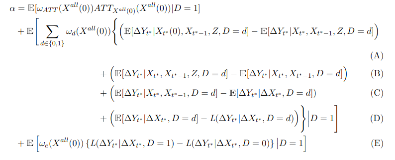

# Introduction


$$\newcommand{\E}{\mathbb{E}}
\newcommand{\E}{\mathbb{E}}
\newcommand{\var}{\mathrm{var}}
\newcommand{\cov}{\mathrm{cov}}
\newcommand{\Var}{\mathrm{var}}
\newcommand{\Cov}{\mathrm{cov}}
\newcommand{\Corr}{\mathrm{corr}}
\newcommand{\corr}{\mathrm{corr}}
\newcommand{\L}{\mathrm{L}}
\renewcommand{\P}{\mathrm{P}}
\newcommand{\independent}{{\perp\!\!\!\perp}}$$


<style type="text/css">

border-top: 80px solid #BA0C2F;

.inverse {
  background-color: #BA0C2F;
}

.alert {
    font-weight:bold; 
    color: #BA0C2F;
}

.alert-blue {
    font-weight: bold;
    color: blue;
}

.remark-slide-content {
    font-size: 23px;
    padding: 1em 4em 1em 4em;
}

.highlight-red {
 background-color:red;
 padding:0.1em 0.2em;
}

.assumption-box {
    background-color: rgba(222,222,222,.5);
    font-size: x-large;
    padding: 10px; 
    border: 10px solid lightgray; 
    margin: 10px;
}

.assumption-title {
    font-size: x-large;
    font-weight: bold;
    display: block;
    margin: 10px;
    text-decoration: underline;
    color: #BA0C2F;
}
</style>


```{r echo=FALSE}
step_by_step_eq <- function(eqlist, before="", after="", title=" ") {
  
  # drop slide pauses in before content
  before_inner <- gsub("--", "", before)
  
  for (i in 2:length(eqlist)) {
    eqlist[i] <- paste0(eqlist[i-1],"\\\\\n",eqlist[i])
  }

  out <- ""
  for (i in 1:length(eqlist)) {
    if (i > 1) out <- paste0(out, "count:false", "\n")
    out <- paste0(out, "# ", title, "\n") # print title
    # print before content
    if (i == 1) out <- paste0(out, before, "\n") else out <- paste0(out, before_inner, "\n") 
    out <- paste0(out, "$$\n\\begin{aligned}\n",eqlist[[i]],"\n\\end{aligned}\n$$\n\n") # print equation
    if (i < length(eqlist)) out <- paste0(out, "---\n\n")
  }
  out <- paste0(out, after, "\n") # print after content
  out <- paste0(out, "---\n")
  cat(out)
}
```

There has been a lot of recent work/interest in DID!

--

A number of papers have <span class="alert">diagnosed</span> issues with very commonly used two-way fixed effects (TWFE) regressions to implement DID identification strategies:

$$Y_{it} = \theta_t + \eta_i + \alpha D_{it} + v_{it}$$

<!-- * de Chaisemartin and d'Haultfoueille (2020), Borusyak, Jaravel, and Spiess (2021) Goodman-Bacon (2021), Sun and Abraham (2021)-->

--

Summary of Issues:

* With (i) multiple periods and (ii) variation in treatment timing, <span class="alert">treatment effect heterogeneity</span> can lead to poor estimates of treatment effects

<!--* Weights on underlying parameters are driven by estimation method -->

There have also been a number of papers <span class="alert">fixing</span> these issues


---

# Introduction

We consider the case where the <span class="alert">parallel trends assumption holds after conditioning on covariates</span> 

--

Including covariates in the parallel trends assumption can often make DID identification strategies more plausible (Heckman, Ichimura, Todd (1997), Abadie (2005))

--

We consider some empirically relevant cases where:

1. Both time-varying and time-invariant covariates
    
2. For the time-varying covariates, we'll consider cases where

   * They evolve exogenously with respect to the treatment
   
   * They can be affected by the treatment ("bad controls")

---

# Examples

**Covariates Evolving Exogenously:** Stand-your-ground laws (Cheng and Hoekstra (2013))

* State-level data
    
* Time-varying covariates include population, demographics, median income

--
    
**Covariates Affected by Treatment:** Job Displacement

* Paths of earnings (in absence of job displacement) likely depend on occupation, industry, union status
    
* But all of these are likely affected by job displacement (i.e., often thought of as "bad controls")

<!--


**Example 3:** Job displacement

* Occupation, industry, and union status are often thought of as "bad controls" in this literature.

-->

---


# Introduction

This is a setting where empirical work has traditionally run the TWFE regression:

$$Y_{it} = \theta_t + \eta_i + \alpha D_{it} + X_{it}'\beta + v_{it}$$

--

In contrast, work in econometrics literature on DID typically *only* includes either 

* Time invariant covariates 
    
* "Pre-treatment" values of time-varying covariates

--

We show a number of issues related to using TWFE regressions in this context 

- These show up even in "friendly" settings for TWFE such as 

    (i) The "textbook" case with only two time periods 
    
    (ii) The case where covariates are not affected by the treatment

---

# Introduction 

We also propose alternative (and simple) approaches can be used to get around these issues:

--

* They can side-step "functional form" issues with the TWFE regression

--

* Under additional assumptions that effectively treat time-varying covariates in a dual role as an "outcome" and a covariate:

   * Provide sufficient conditions for the "econometrics" strategy of conditioning only on "pre-treatment" time-varying covariates 
   
   * Provide alternative strategies in other cases
   
   * This part can allow for the time-varying covariates to be themselves affected by the treatment
    
---


# Related Work

**Sequential ignorability:** Robins (1997), Robins, Hernan, and Brumback (2000), many others

**Mediation analysis:** Huber (2020), many others

**Covariates affected by treatment:** Rosenbaum (1984), Lechner (2008), Flores and Flores-Lagunes (2009), Zeldow and Hatfield (2021)

**Interpreting regressions:**

* Unconfoundedness: Angrist (1998), Aronow and Samii (2016), Sloczynski (2020), Goldsmith-Pinkham, Hull, and Kolesar (2021), Ishimaru (2021), Chattopadhyay and Zubizaretta (2022)

* TWFE: Goodman-Bacon (2021), de Chaisemartin and D'Haultfoeuille (2020), Ishimaru (2022), others

---

# Outline

<br> <br> <br>

1. Time-Varying Covariates that Evolve Exogenously

2. Time-Varying Covariates that Can Be Affected by the Treatment

3. Limitations of TWFE Regressions

4. Alternative Approaches


---
class: inverse, middle, center
count: false

# Time-Varying Covariates that Evolve Exogenously


---


# Notation

Potential outcomes notation

* Two time periods: $t^*$ and $t^*-1$
  
  * No one treated until period $t^*$
    
  * Some units remain untreated in period $t^*$
  
* Treatment indicator: $D_i$

* Potential outcomes: $Y_{it^*}(1)$ and $Y_{it^*}(0)$

* Observed outcomes: $Y_{it^*}$ and $Y_{it^*-1}$

  $$Y_{it^*}=D_i Y_{it^*}(1) + (1-D_i) Y_{it^*}(0) \quad \textrm{and} \quad Y_{it^*-1}=Y_{it^*-1}(0)$$
---

# Notation for Covariates

* Potential covariates: $X_{it^*}(1)$ and $X_{it^*}(0)$ (for today: scalar)

* Observed covariates: $X_{it^*}$ and $X_{it^*-1}$

  $$X_{it^*}=D_i X_{it^*}(1) + (1-D_i)X_{it^*}(0) \quad \textrm{and} \quad X_{it^*-1}=X_{it^*-1}(0)$$
* We'll also sometimes include time-invariant covariates: $Z_i$

---

# Parameters of Interest

Like most work on DID, we'll target identifying the Average Treatment Effect on the Treated (ATT):

$$ATT := \E[Y_{t^*}(1) - Y_{t^*}(0) | D=1]$$
---

# Parallel Trends Assumption

<div class="assumption-box"> <span class="assumption-title">Parallel Trends Assumption</span>

<p style="text-align:center">
\(\E[\Delta Y_{t^*}(0) | X_{t^*}(0), X_{t^*-1}, Z, D=1] = \E[\Delta Y_{t^*}(0) | X_{t^*}(0), X_{t^*-1}, Z,D=0]\)
</p>

</div>

--

**Intuition:** Path of untreated potential outcomes the same on average for the treated and untreated groups among those that: (i) have the same $Z$ and $X_{t^*-1}$, and (ii) have the same $X_{t^*}(0)$.

--

**Usefulness:** The term on the LHS does not have an observed analogue, but the term on the RHS does

---

# Dealing with $X_{t^*}(0)$

<div class="assumption-box"> <span class="assumption-title">Assumption: Covariate Exogeneity</span>
  <p style="text-align:center">
  \( (X_{t^*}(0) | X_{t^*-1}, Z, D=1) \sim (X_{t^*}(1) | X_{t^*-1}, Z, D=1 )\) 
  </p>
</div>

--

**Intuition:** Participating in the treatment does not change the (conditional) distribution of $X_{t^*}(0)$.  

* Leading example: $X_{it^*}(0) = X_{it^*}(1) = X_{it^*}$

--

$\implies$ we can re-write parallel trends as

$$\E[\Delta Y_{t^*}(0) | X_{t^*}, X_{t^*-1}, Z, D=1] = \E[\Delta Y_{t^*}(0) | X_{t^*}, X_{t^*-1}, Z,D=0]$$


---

```{r echo=FALSE, results="asis"}

title <- "Identifying ATT under Cov-Exogeneity"

before <- ""

eqlist <- list("ATT &= \\E[\\Delta Y_{t^*} | D=1] - \\E[\\Delta Y_{t^*}(0) | D=1] \\hspace{150pt}",
               "&= \\E[\\Delta Y_{t^*} | D=1] - \\E\\Big[\\E[\\Delta Y_{t^*}(0) | X_{t^*}, X_{t^*-1}, Z, D=1] \\Big| D=1 \\Big]",
               "&= \\E[\\Delta Y_{t^*} | D=1] - \\E\\Big[\\E[\\Delta Y_{t^*}(0) | X_{t^*}, X_{t^*-1}, Z, D=0] \\Big| D=1 \\Big]")

after <- "

--

$\\E[\\Delta Y_{t^*}(0) | X_{t^*}, X_{t^*-1}, Z, D=0]$ is identified and is a function of $X_{t^*}$, $X_{t^*-1}$, and $Z$

--

This is exactly what you would expect

To recover the ATT, take the path of outcomes experienced by the treated group relative to the path of outcomes experienced by the untreated group accounting for differences in the distributions of $X_{t^*}$, $X_{t^*-1}$, and $Z$.

This might be challenging to estimate in practice, but we'll return to that issue later."

step_by_step_eq(eqlist=eqlist,
                before=before,
                after=after,
                title=title)
```

class: inverse, middle, center
count: false

# Time-Varying Covariates that Can Be Affected by the Treatment

---

# Issues in this case

The same sort of arguments as before imply that

$$ATT = \E[\Delta Y_{t^*} | D=1] - \E\Big[\E[\Delta Y_{t^*}(0) | X_{t^*}(0), X_{t^*-1}, Z, D=0] \Big| D=1 \Big]$$

--

But here $X_{it^*}(0)$ is not observed for the treated group, so it is not feasible to average the inside term over the distribution of $(X_{t^*}(0), X_{t^*-1}, Z) | D=1$.

--

It is not clear what to do here, but notice that it is not sufficient to just omit $X_{t}$.

---

# Dealing with $X_{t^*}(0)$ (cont'd)

<div class="assumption-box"> <span class="assumption-title">Assumption: Covariate Unconfoundedness</span>
  <p style="text-align:center">
  \( X_{t^*}(0) \independent D | X_{t^*-1}, W_{t^*-1}, Z \)
  </p>
</div>

where $W_{t^*-1}$ is a vector of pre-treatment variables 

--

* Leading cases: (i) $W_{t^*-1} = \varnothing$ and (ii) $W_{t^*-1}$ includes something else (e.g., $W_{t^*-1} = Y_{t^*-1}$)

--

**Intuition:** For the treated group, the time-varying covariate would have evolved the same way as it actually did for the untreated group, conditional on $X_{t^*-1}$, $W_{t^*-1}$, and $Z$

--

* This case allows for $X_{t^*}$ to be a ''bad control'', but for it to still be included in the parallel trends assumption

* Note: this assumption could hold *in addition to* Cov-Exogeneity

---

# Identifying ATT under Cov-Unc. (cont'd)

First, consider the general case, we show that

$$\hspace{-10pt} ATT = \E[\Delta Y_{t^*} | D=1] - \E\Big[\E\big[\E[\Delta Y_{t^*}(0) | X_{t^*}, X_{t^*-1}, Z, D=0] \big| X_{t^*-1}, W_{t^*-1}, Z, D=0\big] \Big| D=1 \Big]$$

--

**Intuition:** inside expectation is conditional path of outcomes for the treated group, next expectation allows distribution of $X_{t^*}(0)$ to be different across groups (but same conditional on $X_{t^*-1}$, $W_{t^*-1}$, and $Z$), and outside expectation accounts for different distributions of $X_{t^*-1}$, $W_{t^*-1}$, and $Z$ across groups.

--

**Interestingly:** When $W_{t^*-1}=Y_{t^*-1}$

* A number of papers explore including lagged outcomes in DID setups (e.g., Chabe-Ferret (2017), Imai, Kim, and Wang (2018), Zeldow and Hatfield (2021))

* This gives an explicit justification (and way) to include lagged outcomes

---

# Identifying ATT under Cov-Unc.

Now consider the case where $W_{t^*-1}=\varnothing$, we show that

$$ATT = \E[\Delta Y_{t^*} | D=1] - \E\Big[\E[\Delta Y_{t^*}(0) | X_{t^*-1}, Z, D=0] \Big| D=1 \Big]$$

--

**Intuition:** If $X_{t^*}(0)$ is evolving the same way for the treated group and the untreated group (conditional on $X_{t^*-1}$ and $Z$), then we only need to account for differences in the distribution of $X_{t^*-1}$ and $Z$ across groups

--

This gives a formal justification for the practice in the econometrics literature of conditioning on pre-treatment values of time-varying covariates.

---

# Additional Comments

* The above discussion shows that $ATT$ can be identified even when time-varying covariates may be affected by the treatment 

    * This required imposing additional assumptions on how $X_{t^*}(0)$ would have evolved in the absence of participating in the treatment
    
    * $X_{t^*}(0)$ is effectively dealt with like an "outcome" but also continues to play a role as a covariate

--

* Could you make parallel trends assumptions for the time-varying covariates?  

    * Sort of, but above arguments require identifying entire conditional distribution of $X_{t^*}(0)$ which is more challenging/ambitious that typical DID
    
--

* Neither Cov-Exogeneity nor Cov-Unconfoundedness are directly testable, but Cov-Unconfoundedness can be pre-tested

---

class: inverse, middle, center

count: false

# Interpreting TWFE Regressions

---

name: twfe

# TWFE Regressions

When parallel trends assumptions hold conditional on covariates, we consider the following TWFE regression that is very popular in empirical work:

$$Y_{it} = \theta_t + \eta_i + \alpha D_{it} + X_{it}'\beta + v_{it}$$

where $Y_{it}$ is the outcome for unit $i$ in period $t$, $D_{it}$ is a binary treatment indicator, $X_{it}$ is a vector of time-varying covariates

[[details](#twfe-details)]

---

# TWFE Decomposition

In the paper, we show that $\alpha$ from the TWFE regression can be decomposed as follows

<center></center>

which amounts to a weighted average conditional $ATT$'s along with a number of additional bias terms

---

# Issues with TWFE Regressions

We show a number of weaknesses of this sort of TWFE regression (even in the case with only two time periods!):

--

**Issue 1:** Not robust to multiple periods and variation in treatment timing under treatment effect heterogeneity

* Goodman-Bacon (2021), de Chaisemartin and d'Haultfoeuille (2020), and Ishimaru (2022) all have results along these lines
   
* Even if you make strong functional form assumptions; these issues are similar to the ones discussed earlier
   
* For this reason, I am mainly going to focus on the case with two time periods

---

# Issues with TWFE Regressions

We show a number of weaknesses of this sort of TWFE regression (even in the case with only two time periods!):


**Issue 2:** Not robust to time-varying covariates being themselves affected by the treatment

* This is the "bad control" problem discussed earlier
    
* Most empirical research drops these sorts of covariates
    
* But, in this case (i.e., under the parallel trends assumption), there are additional bias terms that show up whether or not one includes these covariates in the TWFE regression

---

# Issues with TWFE Regressions

We show a number of weaknesses of this sort of TWFE regression (even in the case with only two time periods!):


**Issue 3:** Sensitive to (potentially strong) functional form assumptions that include

* Violations of linearity of conditional expectations 

    * $\implies$ "Hidden linearity:" The parallel trends assumption and conditional ATTs only depend on the change in covariates over time (rather than, e.g., their level)
    
    * e.g., $\E[\Delta Y_{t^*}(0) | X_{t^*}(0), X_{t^*-1}, D=d] = \Delta X_{t^*}(0)'\delta$

--

* Linearity of the propensity score (the probability of participating in the treatment conditional on covariates) in the change in covariates over time

    * These conditions seem substantially less likely to hold in the DID context than for cross-sectional data under unconfoundedness (e.g., fully saturated model)

---

# Issues with TWFE Regressions

We show a number of weaknesses of this sort of TWFE regression (even in the case with only two time periods!):

**Issue 4:** Not robust to parallel trends assumptions and conditional ATTs depending on time-invariant covariates

* These do not show up in the TWFE regression at all

* Could potentially side-step this issue by including time-invariant covariates with time-varying coefficients

    * But would likely also need to include interactions with treatment as well to allow for heterogeneous effects (along the lines of Wooldridge (2021))

---

# Issues with TWFE Regressions

We show a number of weaknesses of this sort of TWFE regression (even in the case with only two time periods!):

**Issue 5:** Even if none of the four previous issues hold, TWFE regressions are still hard to interpret

* TWFE regressions deliver a weighted average of underlying conditional ATTs, but the weights have a "weight reversal" property 

    * This is similar to what is pointed out in Sloczynski (2020) in the context of interpreting regressions under unconfoundedness
    
    * conditional ATTs for values of the covariates that are uncommon for the treated group relative to the untreated group get lots of weight
    
    * the opposite happens for relatively common values of the covariates
    
---

name: twfe-discussion

# How much do these bias terms matter?

Instead of trying to estimate the bias terms directly (which is likely to be challenging in many realistic applications), we propose a simpler approach to quantitatively assess how much the implicit linearity assumptions matter

* for simplicity, we'll impose covariate exogeneity here

--

Under the conditional parallel trends assumption, if we could come up with "balancing weights",  $\vartheta_0$, then we could recover

$$\E[\Delta Y_{t^*}(0) | D=1] = \E[\vartheta_0(X_{t^*},X_{t^*-1},Z) \Delta Y_{t^*}(0)|D=0]$$
as well as $$ATT = \E[\Delta Y_{t^*}|D=1] - \E[\vartheta_0(X_{t^*},X_{t^*-1},Z) \Delta Y_{t^*}|D=0]$$

--

This is essentially the idea of propensity score re-weighting, entropy balancing, other approaches that "balance" distributions of covariates.

---

# How much do these bias terms matter?

Moreover, these balancing weights will balance functions of $X_{t^*},X_{t^*-1},Z$ across groups, e.g.:

$$\E[\vartheta_0(X_{t^*},X_{t^*-1},Z) g(X_{t^*},X_{t^*-1},Z)|D=0] = \E[g(X_{t^*},X_{t^*-1},Z) | D=1]$$

and this is something that can be checked in data (and is often used as a model specification test in re-weighting papers)

--

Using FWL type arguments (Aronow and Samii (2016), Chattopadhyay and Zubizaretta (2022)), can also show that $\alpha$ from the TWFE regression can be recast as
$$\alpha = \E[\vartheta_1^{TWFE}(\Delta X_{t^*}) \Delta Y_{t^*} | D=1] - \E[\vartheta_0^{TWFE}(\Delta X_{t^*}) \Delta Y_{t^*} | D=0]$$

these weights only depend on $\Delta X_{t^*}$ and we propose checking balance based on these weights

* Intuitively: (1) balancing $\Delta X_{t^*}$ may not balance the levels of $X$ (or $Z$), (2) large differences in the re-weighted levels of $X$ across groups indicates that results are "sensitive" to violations of hidden linearity

---

# Balancing weights in application

Recall the application on stand your ground laws.

* This slide: very simplified version with only two periods, 50 states, only covariate is population, computing weights only (so outcomes don't matter)

--

Step 1: Run TWFE regression of $\log(homicides)$ on $population$ (in millions)

--

Step 2: Compute implicit regression weights from previous slide

--

Step 3: Compare balance of (i) change in population, (ii) levels of population, (iii) region of country, using regression weights

---

# Balance Table


|              | &nbsp; &nbsp; Treated &nbsp; &nbsp; | &nbsp; &nbsp; Untreated &nbsp; &nbsp; | &nbsp; &nbsp; Wtd. Treated &nbsp; &nbsp; | &nbsp; &nbsp; Wtd. Untreated &nbsp; &nbsp; |
|:------------|:------------:|:--------------:|:-----------------------:|:-----------------------:|
| $\Delta$ pop | 0.76         | 0.59   | 0.65        | 0.65                    |
| pop 2000     | 5.53         | 5.41    | 5.11       | 5.95                    |
| pop 2010     | 6.30         | 6.00    | 5.76       | 6.60                    |
| North        | 0.00         | 0.31    | 0.00       | 0.30                    |
| South        | 0.52         | 0.17    | 0.51       | 0.18                    |
| Midwest      | 0.33         | 0.17    | 0.35       | 0.17                    |
| West         | 0.14         | 0.35    | 0.15       | 0.36                    |


--

(arguably) $\implies$ worse balance due to TWFE regression with covariates than including no covariates at all $\implies$ linearity assumptions likely "bite" in meaningful way

---

# Discussion

This section has shown that there are a number of important weaknesses of TWFE regressions even in cases that are typically thought to be favorable (two periods).

--

This is sort of similar to well-known results on interpreting TWFE regressions with multiple periods / variation in treatment timing

--

* The "parsimonious" TWFE regression (implicitly) embeds a bunch of extra assumptions that most researchers probably do not think that they are making

--

We'll show next that it is possible to get around these extra assumptions fairly easily

---


class: inverse, middle, center

count: false

# Estimation Strategies

---

# Our Approaches

We provide two alternative approaches:

--

**Strategy 1:** Provide a doubly robust estimand

* This is broadly similar to Callaway and Sant'Anna (2021), Sant'Anna and Zhao (2020), and Callaway and Li (2021)
    
--

**Strategy 2:** Provide a regression adjustment / "imputation" approach

* This is broadly similar to Liu, Wang, and Xu (2021), Gardner (2021), Borusyak, Jaravel, and Spiess (2021)
   
* Relative to 1, this involves some extra functional form assumptions, but is very simple to implement (not much harder than a TWFE regression) 

---

# Our Approaches (cont'd)

Both of these can:

--

* Allow for multiple time periods and variation in treatment timing (Issue 1)

--

* Allow for time-varying covariates being affected by the treatment (Issue 2)

--

* Do not require functional form assumptions for the propensity score (part of Issue 3); doubly robust can potentially circumvent any strong functional form assumption (all of Issue 3)

--

* Allow for conditional ATTs and/or parallel trends to depend on time invariant covariates (Issue 4)

--

* Directly estimate $ATT$ (Issue 5)

---


# Strategy 1: Doubly Robust

Consider the case where covariates evolve exogenously with respect to the treatment. Similar to existing work on double robustness (e.g., Robins, Rotnitzky, and Zhao (1994), Scharfstein, Rotnitzky, and Robins (1999), Sloczynski and Wooldridge (2018), and Sant'Anna and Zhao (2020)), we show that

--

$$ATT = \E\left[ \left( \frac{D}{\E[D]} - \frac{p(X_{t^*},X_{t^*-1},Z) (1-D)}{\E[D](1-p(X_{t^*},X_{t^*-1},Z))} \right) \left( \Delta Y_{t^*} - \E[\Delta Y_{t^*} | X_{t^*}, X_{t^*-1}, Z, D=0]\right) \right]$$

--

This is doubly robust in the sense that its sample analogue gives consistent estimates of $ATT$ if either the propensity score model or the outcome regression model is correctly specified

---

# Doubly Robust (cont'd)

Double robustness is also closely related to the literature on double/de-biased machine learning (e.g., Chernozhukov et al. (2018) and Chang (2020)).  Using cross-fitting, etc., one can use machine learning for the propensity score and outcome regression model.

--

This is particularly attractive here especially in cases (which are likely to be common) where the functional forms are unknown and $X_{t^*}$ and $X_{t^*-1}$ are highly correlated

---

# Strategy 2: Imputation

There is a close connection between unconditional parallel trends and the following model for untreated potential outcomes (e.g., Blundell and Costa Dias (2009), Gardner (2021), Borusyak, Jaravel, and Spiess (2021)):

$$Y_{it}(0) = \theta_t + \eta_i + v_{it}$$

--

**Step 1:** Estimate $\Delta Y_{it^*}(0) = \tilde{\theta}_{t^*} + \Delta v_{it^*}$ using untreated observations only

$\rightarrow$ recover estimates $\hat{\tilde{\theta}}_{t^*}$

--

**Step 2:** Impute $\widehat{\Delta Y}_{it^*}(0) = \hat{\tilde{\theta}}_{t^*}$ for the treated group

--

**Step 3:** Estimate $\widehat{ATT} = \frac{1}{n_1}\sum_{i=1}^n D_i (\Delta Y_{it^*} - \widehat{\Delta Y}_{it^*}(0))$ where $n_1$ is the number of treated observations

---

# Imputation (cont'd)

Likewise, there is a close connection between conditional parallel trends w/ time-invariant covariates and the following model for untreated potential outcomes (e.g., Heckman, Ichimura, and Todd (1997)):

$$Y_{it}(0) = g_t(Z_i) + \eta_i + v_{it}$$
--

The natural way to parameterize this model is:

$$Y_{it}(0) = Z_i'\delta_t + \eta_i + v_{it}$$

--

And can follow similar imputation strategy as above

---

# Imputation (cont'd)

The previous discussion suggests that the natural model for untreated potential outcomes with time-varying covariates that can be affected by the treatment is

$$Y_{it}(0) = g_t(Z_i,X_{it}(0)) + \eta_i + v_{it}$$

--

and parameterizing it by

$$Y_{it}(0) = Z_i'\delta_t + X_{it}(0)\beta_t + \eta_i + v_{it}$$

--

In the case with two time periods, after taking first differences, this amounts to

$$\Delta Y_{it^*}(0) = Z_i\tilde{\delta}_{t^*} + \Delta X_{it^*}(0)\beta_{t^*} + X_{it^*-1}\tilde{\beta}_{t^*} + \Delta v_{it^*}$$

--

In my view, this is an attractive parametric specification as it involves both the pre-treatment level of the time-varying covariate (which is similar to the "econometrics" approach) as well as the change in the covariate over time.

---


# Imputation (cont'd)

The main remaining issue with the previous strategy is how to deal with $\Delta X_{it^*}(0)$.  

--

**Under Cov-Exogeneity:** Can use $\Delta X_{it^*}(0) = \Delta X_{it^*}$ $\implies$ just use observed change in covariates over time

--

**Under Cov-Unconfoundedness** (and under additional linearity assumption), can impute $\Delta X_{it}(0)$ for the treated group

--

Interestingly, because of the additional linearity assumption in the model for $Y_{it}(0)$, it is also possible to make parallel trends assumptions for $X_{it}(0)$ in this case and recover ATT

---

# Conclusion

Including time-varying covariates in DID setups under conditional parallel trends assumptions is very common in applied work

--

We pointed out a number of weaknesses of the standard approach of using TWFE regressions in this context (even in the favorable setting with only two periods)

--

We provided alternative estimation strategies that are able to avoid essentially all of the issues with TWFE regressions and are not much more complicated to implement

--

* <mark>Link to paper:</mark> [https://arxiv.org/abs/2202.02903](https://arxiv.org/abs/2202.02903)

* <mark>Other Summaries:</mark> &nbsp; [Five minute summary](https://bcallaway11.github.io/posts/fms-did-time-varying-covariates) 

* <mark>Comments welcome:</mark> [brantly.callaway@uga.edu](mailto:brantly.callaway@uga.edu)

* <mark>Code:</mark> in progress

---

class: inverse, middle, center
count: false

# Additional Slides

---


count: false
name: twfe-details

# TWFE Regression

Consider the TWFE regression:  &nbsp; &nbsp; [back](#twfe)

$$Y_{it} = \theta_t + \eta_i + \alpha D_{it} + X_{it}'\beta + v_{it}$$

where

* $\theta_t$ is a time fixed effect

* $\eta_i$ is a unit fixed effect

* $D_{it}$ is a binary treatment indicator

* $X_{it}$ are time-varying covariates

* $v_{it}$ are idiosyncratic time-varying unobservables

* $\alpha$ is the coefficient that a researcher is going to report and potentially interpret as some kind of causal effect

---

count: false

# TWFE Regression (cont'd)

Even under strong assumptions about the time-varying covariates, $\alpha$ is going to be hard to interpret in cases with multiple periods and variation in treatment timing (under treatment effect heterogeneity); Goodman-Bacon (2021), de Chaisemartin and D'Haultfoeuille (2020), Ishimaru (2022)

--

For this reason, we'll focus on the case with two time periods, which is a case where TWFE does work well under unconditional parallel trends.  We'll continue to make the same parallel trends assumption as before.

--

In this framework, the TWFE regression is exactly equivalent to 

$$\Delta Y_{it^*} = \alpha D_i + \Delta X_{it^*}'\beta + \Delta v_{it^*}$$

using a slight abuse of notation where $\Delta X_{it^*}$ includes an intercept (for the time fixed effect).

---

count: false

# Interpreting TWFE

We show that $\alpha$ is equal to a "weighted average" of 6 different terms.  

--

**Additional Notation:** 

--

* $\L(\Delta Y_{t^*}|\Delta X_{t^*})$ denotes (population version of) the linear projection of $\Delta Y_{t^*}$ on $\Delta X_{t^*}$ <!--and let $e := \Delta Y_{t^*} - \L(\Delta Y_{t^*}|\Delta X_{t^*})$.  -->

--

* Shorthand notation: $X^{all}(0) = (X_{t^*}(0), X_{t^*-1}, Z)$

--

* Propensity score: $p(X^{all}(0)) := \P(D=1|X^{all}(0))$

--

Broadly, arguments here based on Frisch-Waugh types of arguments

---

count: false

# Term 1

The first term that shows up in $\alpha$ is

$$\E[\omega_{ATT}(X^{all}(0)) ATT_{X^{all}(0)}(X^{all}(0)) | D=1]$$

--

which is essentially a weighted average of conditional ATTs, and where 

$$\omega_{ATT}(X^{all}(0)) := \frac{1-p(X^{all}(0))}{\E[(1-\L(D|\Delta X_{t^*}))|D=1]}$$

--

* In general, $\E[\omega_{ATT}(X^{all}(0))|D=1] \neq 1$ (so this is not exactly a weighted average), but likely to be fairly close to 1.

--

* $\E[\omega_{ATT}(X^{all}(0))|D=1]$ does equal one when $p(X^{all}(0)) = \L(D|\Delta X_{t^*})$ (more on this condition later...)

--

* Out of the 6 terms, this is the best one, but it still suffers from the "weight reversal" issue

---

name: bias-terms
count: false

# Terms 2-5 Bias Terms

"weighted averages" of bias arising from :

1. time-varying covariates being affected by the treatment

2. parallel trends / conditional ATTs depending on time-invariant covariates

3. parallel trends / conditional ATTs depending on levels of time-varying covariates (rather than changes only)

4. nonlinearity of conditional expectations


---


count: false
name: term-2

# Term 2 - Bias Term

The second term that shows up in $\alpha$ is

$$\E\Bigg[ \omega_1(X^{all}(0)) \Big( \E[\Delta Y_{t^*} | X_{t^*}(0), X_{t^*-1}, Z, D=1] - \E[\Delta Y_{t^*} | X_{t^*}, X_{t^*-1}, Z, D=1] \Big)\Bigg]$$
where

$$\omega_d(X^{all}(0)) := \frac{d\, p(X^{all}(0)) + (1-d)(1-p(X^{all}(0)))}{\E[\P(D=1|\Delta X_{t^*})(1-\L(D|\Delta X_{t^*}))]}$$

--

This is a bias term that is not generally equal to 0 *unless the time-varying covariate is not affected by the treatment*

---

count: false

# Term 3 - Bias Term

The third term that shows up in $\alpha$ is

$$\begin{aligned}
& \E\Bigg[\omega_1(X^{all}(0))\Big(\E[\Delta Y_{t^*} | X_{t^*}, X_{t^*-1}, Z, D=1] - \E[\Delta Y_{t^*} | X_{t^*}, X_{t^*-1}, D=1] \Big)\Bigg] \\
& \hspace{10pt} + \E\Bigg[\omega_0(X^{all}(0))\Big(\E[\Delta Y_{t^*} | X_{t^*}, X_{t^*-1}, Z, D=0] - \E[\Delta Y_{t^*} | X_{t^*}, X_{t^*-1}, D=0] \Big)\Bigg] \end{aligned}$$

--

The second term is equal to 0 under the conditions that (i) time-varying covariates are not affected by the treatment, and (ii) parallel trends does not depend on time-invariant covariates.  

--

The first term additionally requires that conditional ATTs do not depend on time-invariant covariates

---

count: false

# Term 4 - Bias Term

The fourth term that shows up in $\alpha$ is

$$\begin{aligned}
& \E\Bigg[\omega_1(X^{all}(0))\Big(\E[\Delta Y_{t^*} | X_{t^*}, X_{t^*-1}, D=1] - \E[\Delta Y_{t^*} | \Delta X_{t^*}, D=1] \Big)\Bigg] \\
& \hspace{10pt} + \E\Bigg[\omega_0(X^{all}(0))\Big(\E[\Delta Y_{t^*} | X_{t^*}, X_{t^*-1}, D=0] - \E[\Delta Y_{t^*} | \Delta X_{t^*}, D=0] \Big)\Bigg] \end{aligned}$$

--

The second term is equal to 0 under all previous conditions plus conditional parallel trends only depends on change in time-varying covariates over time

--

The first term is equal to 0 under the additional condition that conditional ATTs only depend on change in time-varying covariates over time

---

count: false

# Term 5 - Bias Term

The fifth term that shows up in $\alpha$ is

$$\begin{aligned}
& \E\Bigg[\omega_1(X^{all}(0))\Big(\E[\Delta Y_{t^*} | \Delta X_{t^*}, D=1] - \L(\Delta Y_{t^*} | \Delta X_{t^*}, D=1) \Big)\Bigg] \\
& \hspace{10pt} + \E\Bigg[\omega_0(X^{all}(0))\Big(\E[\Delta Y_{t^*} | \Delta X_{t^*}, D=0] - \L(\Delta Y_{t^*} | \Delta X_{t^*}, D=0) \Big)\Bigg] \end{aligned}$$

--

These are equal to 0 under all previous assumptions plus linearity of the conditional expectation functions.

---

count: false

# Term 6 - Leftover Term

The sixth (and last) term that shows up in $\alpha$ is

$$\E\left[ \omega_e(X^{all}(0)) \left\{ \L(\Delta Y_{t^*} | \Delta X_{t^*}, D=1) - \L(\Delta Y_{t^*} | \Delta X_{t^*}, D=0)\right\} \big| D=1\right]$$

where

$$\omega_e(X^{all}(0)) := \frac{ (p(X^{all}(0)) - \L(D|\Delta X_{t^*}))}{\E[\P(D=1|\Delta X_{t^*})(1-\L(D|\Delta X_{t^*}))]}$$

--

This term is conceptually different from the others; in some sense, it is a leftover term.

--

Under the additional condition that

$$p(X^{all}(0)) = \P(D=1|\Delta X_{t^*}) = \L(D|\Delta X_{t^*})$$

(which involves covariates not being affected by the treatment, and "functional form" assumptions), then this term is equal to 0.  This sort of condition is very common in the literature on interpreting regressions under unconfoundedness (e.g., Sloczynski (2020)), but it is much less plausible here &nbsp; &nbsp; [[back](#twfe)]


---

name: example
count: false

# Example

A natural question is: how much does this actually matter in practice?

--

We do not have a full answer on this, but we are working on it.  Here is an example about the implicit functional form assumption that parallel trends only depends on the change in covariates over time.

--

* Suppose you have county-level data and are interested in the effect of a policy implemented in Georgia and want to use counties in Tennessee as the comparison group.

--

* Further suppose that the only county-level covariate you use is population

--

* If you use a TWFE regression, you are implicitly (up to functional form assumptions) comparing counties in Georgia with counties in Tennessee that experienced the same change in population over time.

---

count: false

# Example (cont'd)

* I live in Oconee County, Georgia.  From 2010-2021, its population increased from about 33,000 to about 42,000

--

* The county in Tennessee with the most similar population change is Sevier County which increased from about 90,000 to 99,000

    * But this is probably not what we have in mind for a good comparison county
    
--

* The county in Tennessee with the second most similar population change is Shelby County (this is Memphis!) which increased 928,500 to 938,500

   * These are not anything alike in terms of population...

[[Back](#twfe-discussion)]
